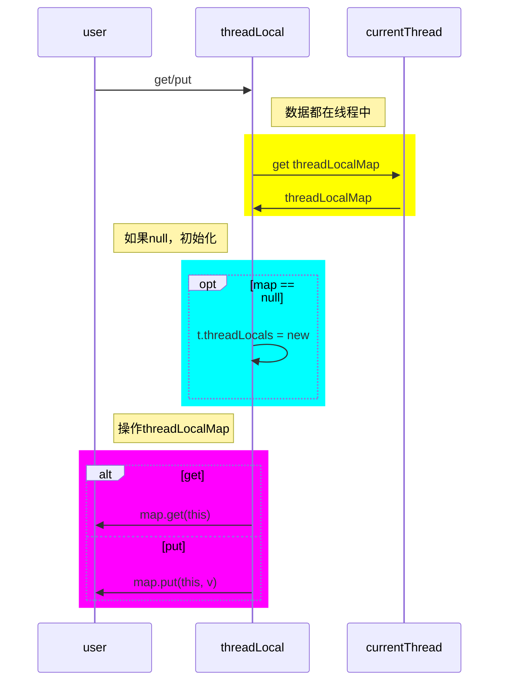
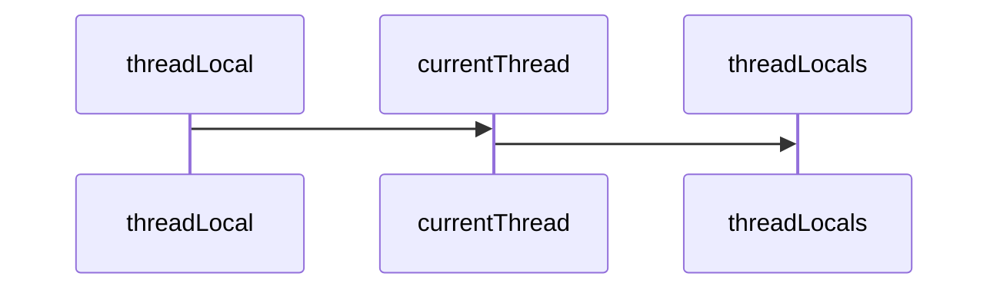
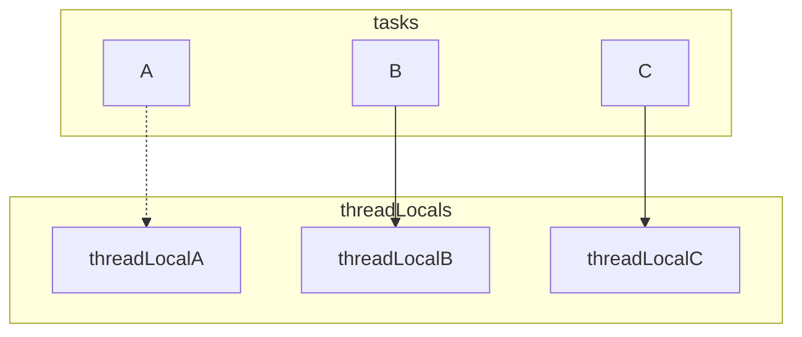

# 实现原理




忽略掉中间关系，将操作拉平

```java
// get
Thread.currentThread.threadLocals.get(threadLocal);
// put
Thread.currentThread.threadLocals.put(threadLocal, value)
```

# 执行环境

## 环境和任务

- 任务
  - 线程主任务：线程的主要任务，任务完毕，线程关闭
  - 线程子任务：线程主要任务的部分任务，子任务完成继续下一个子任务
- 环境
  - 线程环境：线程自身的环境变量，提供线程主任务运行需求
  - 闭包环境：子任务闭包环境，外部无法访问

> 子任务可以同时访问自身的闭包环境和线程环境。

## 线程的区分

对于同类的子任务，它们总是通过共享的闭包环境进行数据交流，完成自身独立的上下文交互。

但是，如果子任务涉及并非原子隔离，多线程环境下，执行中的任务状态会相互影响。

因此，某些场景下，子任务有必要在线程中记录自身运行信息，而非在闭包主环境中记录。

> 单线程环境中，任务串行执行，不必考虑并发情况下线程内私有环境的异常。

## 领域的隔离

上述需求，对于其他不同的任务都可能存在。

因此，有必要使用使用一种标识来隔离不同任务之间的私有信息，同时使得同种任务具有一定关联。

| same threadLocal | same thread | same data |
| ---------------- | ----------- | --------- |
| ``false``        | ``false``   | ``false`` |
| ``false``        | ``true``    | ``false`` |
| ``true``         | ``false``   | ``false`` |
| ``true``         | ``true``    | ``true``  |

这样就能够使得相同线程下的相同任务具有私密的小空间，而大环境不变。

# 内存泄漏

## 泄漏定义

>  内存泄漏：指程序中已动态分配的堆内存由于某种原因程序未释放或无法释放。

在``java``中，造成内存泄漏的原因大致如下

- 未释放
  - 异常导致释放失败
  - 未进行释放
- 引用不合理
  - 长生命对象引用短生命对象

## 风险分析



整个链条都是强引用，并且似乎没有毛病？

> <font color='red'>同线程同类型的任务的子任务存在线程级别的私有数据区域，当指定任务完成，这部分区域需要销毁。</font>



当``A``任务完成以后，对于``threadLocalA``应当及时的移除，否则就会出现<font color='red'>引用无用数据，造成内存泄漏。</font>

```java
Thread.currentThread().threadLocals.remove(threadLocal);
```

## 泄漏避免

```java
        static class Entry extends WeakReference<ThreadLocal<?>> {
            Object value;
            Entry(ThreadLocal<?> k, Object v) {
                super(k);
                value = v;
            }
        }
```

``ThreadLocalMap``中，使用的是``Entry``同时存储的键值对，并且继承自弱引用

| 引用类型 | 回收条件       |
| -------- | -------------- |
| 强引用   | 不回收         |
| 软引用   | 内存不足时回收 |
| 弱引用   | ``gc``时回收   |
| 虚引用   | ``unknow``     |

当``A``在外不存在任何强引用的时候，``gc``到来时回收``threalocal``，下次``get``、``set``、``remove``的时候，就会顺便清理``value``。

也就是完成指定``entry``的删除操作，修复内存泄漏问题。

> <font color='red'>在``gc``到来删除``entry``前，依然存在内存泄漏问题。</font>

## 完美解决

上述操作是底层用来避免内存泄漏的，但是并非完美解决，特殊场景下还会引发新问题

- 内存泄漏
  - 如果不触发底层删除``entry``的方法，即使``key``回收了，强引用``value``也会一直存在，导致内存泄漏。
- 数据失效
  - 如果任务跨``gc``，前面``put``后面``get``，就会一直拿不到数据，破坏业务逻辑。(``final``保证``key``强引用即可。)

<font color='red'>因此，最完美的解决办法，还是在业务完成以后进行``remove``操作，底层保护机制并不完善。</font>