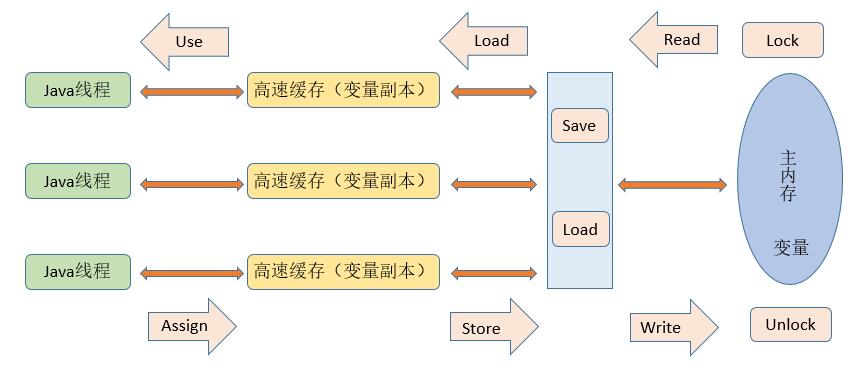

# 数据管理

| 操作       | 作用对象 | 说明                                        |
| ---------- | -------- | ------------------------------------------- |
| ``lock``   | 主存变量 | 标记线程独占                                |
| ``unlock`` | 主存变量 | 释放独占，释放的变量才能被其他线程占用      |
| ``read``   | 主存变量 | 将变量值传输到达线程缓存，供``load``使用    |
| ``load``   | 缓存变量 | 将``load``传输的值放入线程缓存              |
| ``use``    | 缓存变量 | 把线程缓存的变量值传递给执行引擎            |
| ``assign`` | 缓存变量 | 将执行引擎传递的值赋给线程缓存变量          |
| ``store``  | 缓存变量 | 将线程缓存变量值传输给主存，供``write``操作 |
| ``write``  | 缓存变量 | 接收``store``传入的值，写入主存中           |

## 数据变更

每条线程都是自带缓存的，读写数据时都是利用自身缓存，然后异步的同步到主内存中。

因此，对于每条线程而言，对于主内存的数据变更是不敏感的。

当多条线程对同一变量进行变更时，被缓存阻断，并不会达到理想的相互影响的效果。

## 内存屏障

为了避免这种问题，``JAVA``提供内存屏障来解决这种问题。

| Barriers       | Description                        |
| -------------- | ---------------------------------- |
| ``LoadLoad``   | 先加载主存到缓存，再从缓存中加载   |
| ``LoadStore``  | 先缓存同步到主存，再从缓存中加载   |
| ``StoreLoad``  | 先加载主存到缓存，再进行写缓存操作 |
| ``StoreStore`` | 先缓存同步到主存，再进行写缓存操作 |

只要保证每次数据操作都保证与主存同步，就能够达到线程间无误差通信了。

## Unsafe

| fence          | barriers                          | description                 |
| -------------- | --------------------------------- | --------------------------- |
| ``loadFence``  | ``LoadLoad`` ``LoadStore``   | (屏障同步)->load->屏障同步  |
| ``storeFence`` | ``StoreLoad`` ``StoreStore`` | (屏障同步)->store->屏障同步 |
| ``fullFence``  |                                   | (屏障同步)->???->屏障同步   |

# volatile

| ops       | fence          | description      |
| --------- | -------------- | ---------------- |
| ``read``  | ``loadFence``  | 保证读前同步主存 |
| ``write`` | ``storeFence`` | 保证写后同步主存 |

因此，``volatile``变量在线程之间具有可见性，如果你不想使用这个修饰符，可以手动设置屏障。