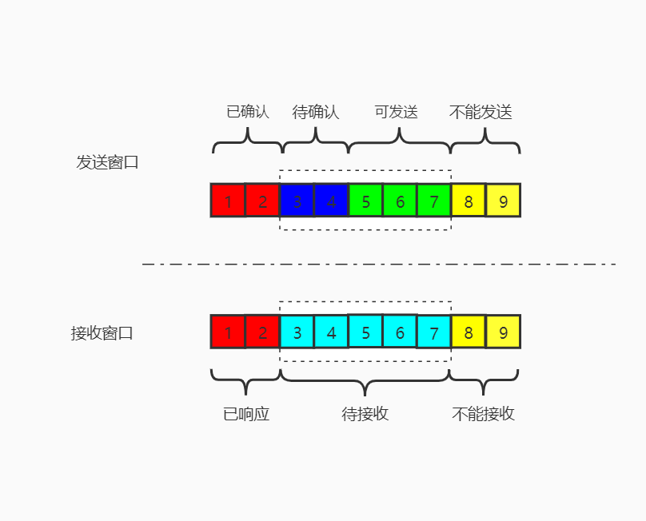

# 滑动窗口

## 发送窗口

| 数据段   | 说明                       |
| -------- | -------------------------- |
| 已确认   | 已经发送，却已经确认       |
| 待确认   | 已经发送，还未确认         |
| 可发送   | 可以发送，但不一定全部发出 |
| 不能发送 | 窗口以外，不能发送         |

> 发送窗口大小：待确认+可发送

| 特点     | 说明                                                         |
| -------- | ------------------------------------------------------------ |
| 非阻塞   | 如果每个数据都需要``ACK``才能继续发送，浪费资源 滑动窗口作为缓冲，可以发送多个数据，逐渐确认 |
| 超时重传 | 发送以后启动超时监听，超时未确认，触发数据重传               |
| 流量控制 | 1. 前面数据未确认，窗口不滑动 2. 响应中解析接收窗口，调整发送数据量 3. 接收窗口为0，停止发送，周期检测接收窗口大小 |

## 接收窗口

| 数据段   | 说明                                     |
| -------- | ---------------------------------------- |
| 已响应   | 接收，并且已经响应                       |
| 待接收   | 等待接收中，详细可分为未接收和接收未响应 |
| 不能接收 | 窗口外数据，不关注                       |

> 接收窗口大小：待接收

# 糊涂窗口综合征

- 当接收缓冲区满了，接收端通知发送端接收窗口为0，接收端停止发送
- 应用程序处理一字节数据，此时接收缓冲区有一字节的余裕，通知发送端发送数据
- 发送段检测接收缓冲区窗口，为一字节，于是发送一字节数据
- ...

循环往复，导致每次数据发送报文只有一个字节的有效数据，降低发送效率还阻塞传输通道。

## Nagle

> Nagle：针对服务端，任意时刻，只能存在最多未被确认的小段(小于MSS)数据块。

| 发送条件                                                   | 功能说明                           |
| ---------------------------------------------------------- | ---------------------------------- |
| 如果包达到``MSS``，允许发送                                | 最优化发送方式                     |
| 如果包含``FIN``，允许发送                                  | 分手包，独立成包，不能阻塞         |
| 如果设置了``TCP_NODELAY``，允许发送                        | 强制不允许延时阻塞                 |
| 未设置``TCP_CORK``，且发出的小数据包都已经被确认，允许发送 | 不能强制阻塞，尽量确保有足够的确认 |
| 超时``200ms``，允许发送                                    | 超时发送，避免传输终端             |

