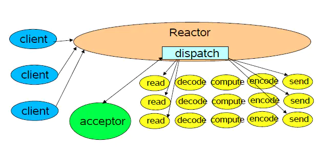

# reactor




| 高效点       | 说明                                                         |
| ------------ | ------------------------------------------------------------ |
| ``acceptor`` | 连接过程消耗较少，独立接收相当于异步非阻塞，提升连接效率<br />多路复用非阻塞，但是激活任务顺序执行，连接任务放进去会被阻塞<br />多路复用应该监听多路，少量监听消耗大 |
| ``NIO``      | 同步非阻塞，可以使用多路复用                                 |
| 多路复用     | 单线程监听多路``IO``，非阻塞，节约更多资源进行任务处理       |
| 事件驱动     | 事件监听驱动，降低额外损耗                                   |
| ``handler``  | 自包含任务调度，状态变更直接回调                             |

# epoll空轮询

```java
void listen(){
    while(true){
        selector.select(); // 空轮询导致这里不阻塞
        Iterator it = selector.selectKeys().iterator();
        while(it.hasNext()){ // 无满足数据返回，处理不执行
            // do something
        }
    }
}
```

==解决办法==

空轮询到达一定次数，全部转移``selector``。``Netty``中的解决办法在``io.netty.channel.nio.NioEventLoop``中。