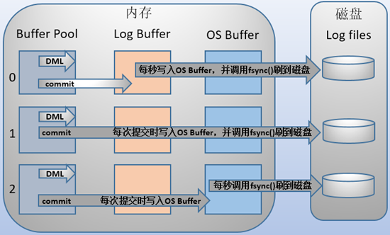

# BIN

``bin-log``以二进制信息记录数据库执行的数据修改操作，``mysql``不论选用哪种存储引擎，都会记录``bin-log``日志。

## 使用场景

| 场景     | 说明                                                         |
| -------- | ------------------------------------------------------------ |
| 主从复制 | 1. ``master``产生``bin-log`` 2. ``bin-log``传输到``slave`` 3. ``slave``回放``bin-log`` |
| 数据恢复 | 直接回放``bin-log``恢复数据                                  |

## 刷盘时机

> 通过``sync_binlog``控制``bin-log``刷盘

| sync_binlog | description        |
| ----------- | ------------------ |
| ``0``       | 系统控制           |
| ``1``       | 每次提交都需要刷盘 |
| ``n``       | 每``n``个事务刷盘  |

## 日志格式

| 格式          | 说明       | 优点                                                         | 缺点                              |
| ------------- | ---------- | ------------------------------------------------------------ | --------------------------------- |
| ``STATEMENT`` | 命令记录   | 命令级别，降低日志量，节约``IO``                             | ``sysdata()``等命令导致数据不一致 |
| ``ROW``       | 行数据记录 | 精确数据，严格一致                                           | 针对每一行数据，数据量太大        |
| ``MIXED``     | 混合记录   | 默认``STATEMENT``，会产生不一致数据的命令采用``ROW`` 取长补短 |                                   |

# REDO

| 名词    | 解析                                       |
| ------- | ------------------------------------------ |
| 持久性  | 为了保证``持久性``，每次数据修改都应该记录 |
| ``WAL`` | ``Write Ahead Logging``，先写日志后落盘。  |

## buffer

- ​	先写``buffer``
  - 如果每次数据变更都要直接刷新磁盘，``IO``消耗太大
  - 单个事务可能涉及多个数据页，物理不连续，随机``IO``写入性能差
- 用户空间数据刷盘，需要先复制到内核空间缓冲区，再刷写到系统磁盘上

## 文件同步

> 通过``innodb_flush_log_at_trx_commit``控制``os-buffer``同步到文件。

| innodb_flush_log_at_trx_commit | description                                                  |
| ------------------------------ | ------------------------------------------------------------ |
| 0(延迟写)                      | 每秒由``redo log buffer``写入``os buffer``，并``fsync()``刷入``redo log file`` |
| 1(实时写，实时刷)              | 每次提交，都直接写入``os buffer``，并立即``fsync()``同步到日志文件 |
| 2(实时写，延迟刷)              | 每次提交直接写入``os buffer``，每秒``fsync()``同步日志文件   |

## 文件格式

具体数据记录还是在于磁盘落库，``redo log``是为了防止服务器宕机而先行的日志记录，因此采用的是循环写入。

| 名词                         | 解释                    |
| ---------------------------- | ----------------------- |
| ``LSN(log sequence number)`` | 日志逻辑序列号          |
| ``check point``              | 日志落盘后对应的``LSN`` |
| ``write pos``                | 当前日志对应的``LSN``   |

数据区间

| from            | to              | description          |
| --------------- | --------------- | -------------------- |
| ``check point`` | ``write pos``   | 待文件同步的日志数据 |
| ``write pos``   | ``check point`` | 新日志数据记录空间   |

## redo和bin

|          | redo               | bin                                            |
| -------- | ------------------ | ---------------------------------------------- |
| 文件大小 | 固定文件大小       | ``max_binlog_size``控制文件``bin-log``文件大小 |
| 实现方式 | ``InnoDB``引擎特有 | ``MySQL``服务层共有，与存储引擎无关            |
| 记录方式 | 循环写，不更换文件 | 追加写，到达限制新建文件                       |
| 适用场景 | 用于崩溃恢复       | 主从复制和数据恢复                             |

# UNDO

记录命令的相反操作，用于``rollback``时候抹平命令影响，保证事务原子性。

