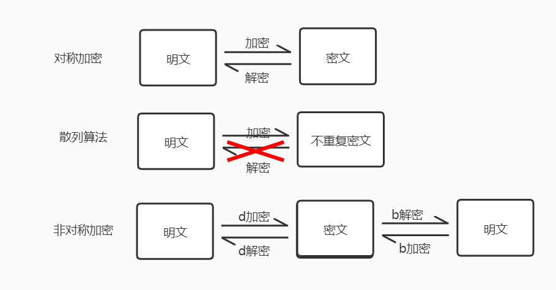

#  加密方式

| 加密算法   | 加密方式                 | 解密方式                       | 密文类型                                             | 使用场景      |
| ---------- | ------------------------ | ------------------------------ | ---------------------------------------------------- | ------------- |
| 对称加密   | ``A``加密                | ``A``解密                      | 同种加密方式结果一样 不同解密方式结果不一       |               |
| 散列算法   | ``A``加密                | 无解密                         | 相同内容相同字符 不同内容不同结果               | 摘要算法(MD5) |
| 非对称加密 | ``d``加密 ``b``加密 | ``b``解``d`` ``d``解``b`` | 单边仅能用作加密或者解密 另一半对应解密或者加密 | 数字签名(RSA) |

