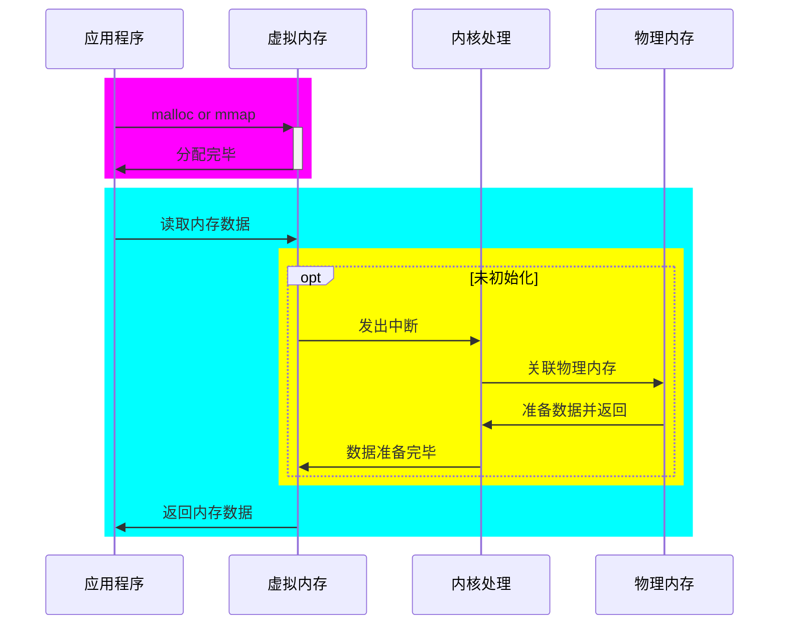

# 缺页异常

# 中断操作

1. 保存``CPU``现场
2. 分析中断原因
3. 执行对应中断逻辑
4. 恢复``CPU``现场，继续程序执行

> 缺页异常也是一种中断，还是硬件中断。

# 中断类型

| 中断类型        | 举个例子                 |
| --------------- | ------------------------ |
| ``CPU``外部中断 | ``IO``中断 时钟中断 |
| ``CPU``内部中断 | 非法操作 地址越界   |
| 系统调用        |                          |