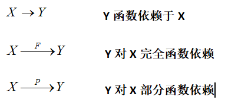
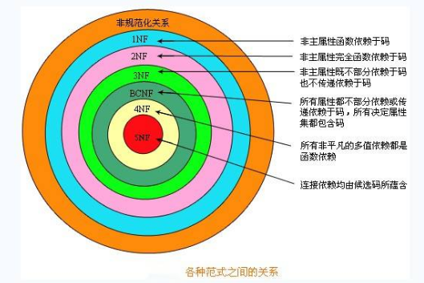

# 名词解析

| 名词   | 解析                                                         | 例子                                      |
| ------ | ------------------------------------------------------------ | ----------------------------------------- |
| 候选码 | 能够唯一标识数据行的属性                                     | ``id`` 性别会重复，不能唯一标识      |
| 主属性 | 完全依赖：全体``X``映射全体``Y`` 部分依赖：部分``X``映射全体``Y`` 传递依赖：``X -> Y, Y->Z ==> X -> Z`` |  |

# 范式

| 范式          | 说明                                   | 例子                                                         | 依赖                                         |
| ------------- | -------------------------------------- | ------------------------------------------------------------ | -------------------------------------------- |
| 第一范式      | 每个属性都是原子属性                   | 地址=省+市+县+街+门牌号 地址不能作为单一属性，需要拆解到原子 | 属性原子                                     |
| 第二范式      | 非主属性必须完全依赖主属性             | 相同``name``，但是``id``不一，主键可以作为数据唯一区分       | 属性全依赖主码                               |
| 第三范式      | 非主属性不能依赖其他非主属性           | 项目-员工-部门，员工和部门有新耦合关系，应该独立成表         | 剔除非主码依赖                               |
| 巴斯-科德范式 | 非主属性不能依赖主码子集，保证唯一查找 | 学号->学生，班级->学生 => 班级->学生->学号，存在主属性关系传递 | 主码只能依赖主码 不能依赖依赖主码的属性 |
| 第四范式      | 属性之间不允许有多值依赖               | 学生-爱好-课程，爱好一个，课程多个 第二条课程相关就会重复存储爱好 | 剔除无关重复关系                             |
| 第五范式      | 纯主键关联表                           | 学号-课程号-老师号，详细信息成表存储                         | 纯主键关联 独立信息成表                 |

