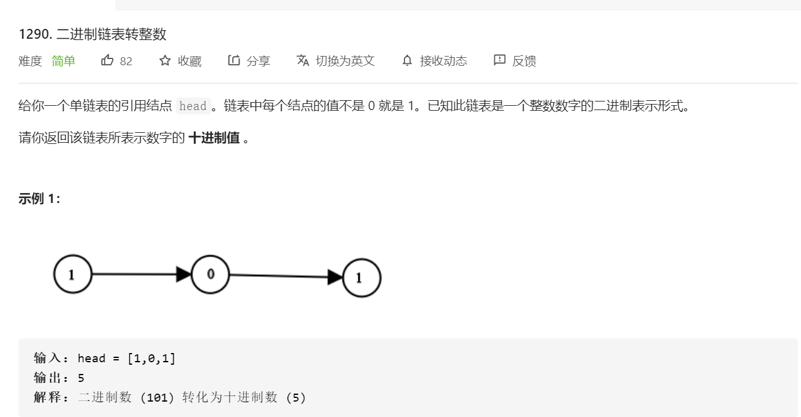

# [题目](https://leetcode-cn.com/problems/convert-binary-number-in-a-linked-list-to-integer/)



# 累加

> 反正不就是2^n

```java
// time: O(n)
// space: O(1)
class Solution {
    public int getDecimalValue(ListNode head) {
        int res = 0;
        for(ListNode cursor = head; cursor != null; cursor = cursor.next, res *= 2){
            res += cursor.val;
        }
        return res / 2;
    }
}
```

# 位运算

- ``x * 2 = x << 1``
- 左移后低位为``0``，不管是加1还是0，直接``|``即可

```java
// time: O(n)
// space: O(1)
class Solution {
    public int getDecimalValue(ListNode head) {
        int res = 0;
        for(ListNode cursor = head; cursor != null; cursor = cursor.next){
            res = (res << 1) | cursor.val;
        }
        return res;
    }
}
```

