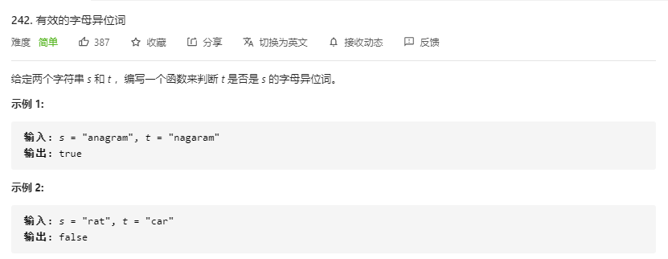

# [题目](https://leetcode-cn.com/problems/valid-anagram/)



- 长度相等
  - 不等直接``false``
- 组成相等
  - 直接相等
  - 元素计数相等

# 计数

- ``map``
- ``int[255]``
- ``int[26]``

```java
// time: O(S + T)
// space: O(1)
class Solution {
    public boolean isAnagram(String s, String t) {
        if(s.length() != t.length()) return false;
        if(s.equals(t)) return true;
        int[] count = new int[26];
        for(int i = 0; i < s.length(); i++){
            count[s.charAt(i) - 'a'] += 1;
        }
        for(int i = 0; i < t.length(); i++){
            count[t.charAt(i) - 'a'] -= 1;
        }
        for (int value : count) {
            if (value != 0) return false;
        }
        return true;
    }
}
```


