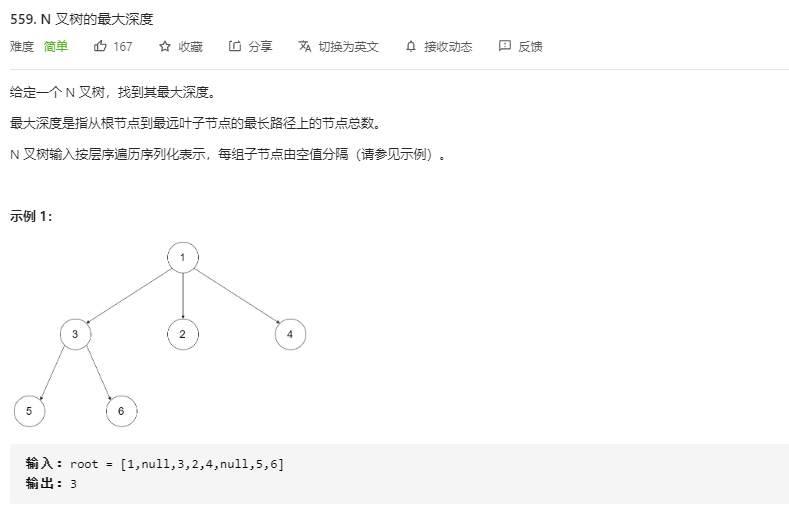

# [题目](https://leetcode-cn.com/problems/maximum-depth-of-n-ary-tree/)



# 递归

- 最大子节点深度+1

```java
// time: O(n)
// space: O(n)
class Solution {
    public int maxDepth(Node root) {
        if(root == null) return 0;
        if(root.children == null || root.children.isEmpty()) return 1;
        int maxChildDepth = 0;
        for(Node node: root.children){
            maxChildDepth = Math.max(maxChildDepth, maxDepth(node));
        }
        return maxChildDepth + 1;
    }
}
```

## 尾递归

> 递归有递有归，回溯没有必要。使用尾递归判断快速一些。

```java
// time: O(n)
// space: O(n) 递归压栈
class Solution {
    int res = 0;
    public int maxDepth(Node root) {
        maxDepth(root, 0);
        return res;
    }

    public void maxDepth(Node root, int depth){
        if(root == null) {
            res = Math.max(res, depth);
        } else if(root.children == null || root.children.isEmpty()){
            res = Math.max(res, depth + 1);
        } else {
            for(Node node: root.children){
                maxDepth(node, depth + 1);
            }
        }
    }
}
```

# 广度遍历

> 前面两种其实都是深度遍历，还可以采用广度遍历的方式。

```java
// time: O(n)
// space: O(n)
class Solution {
    public int maxDepth(Node root) {
        if(root == null) return 0;
        return maxDepth(Collections.singletonList(root), 0);
    }

    public int maxDepth(List<Node> nodes, int depth){
        if(nodes.isEmpty()) return depth;
        List<Node> nextLine = new LinkedList<>();
        for(Node node: nodes){
            nextLine.addAll(node.children);
        }
        return maxDepth(nextLine, depth+1);
    }
}
```

## 广度迭代

> 迭代写法

```java
// time: O(n)
// space: O(n)
class Solution {
    public int maxDepth(Node root) {
        if(root == null) return 0;
        List<Node> currentLine = new LinkedList<>();
        List<Node> nextLine = new LinkedList<>(), t;
        currentLine.add(root);

        int res = 0;
        while (!currentLine.isEmpty()){
            res += 1;
            nextLine.clear();
            for(Node node: currentLine){
                nextLine.addAll(node.children);
            }
            // 重复使用，避免重新创建
            t = currentLine;
            currentLine = nextLine;
            nextLine = t;
        }
        return res;
    }
}
```

