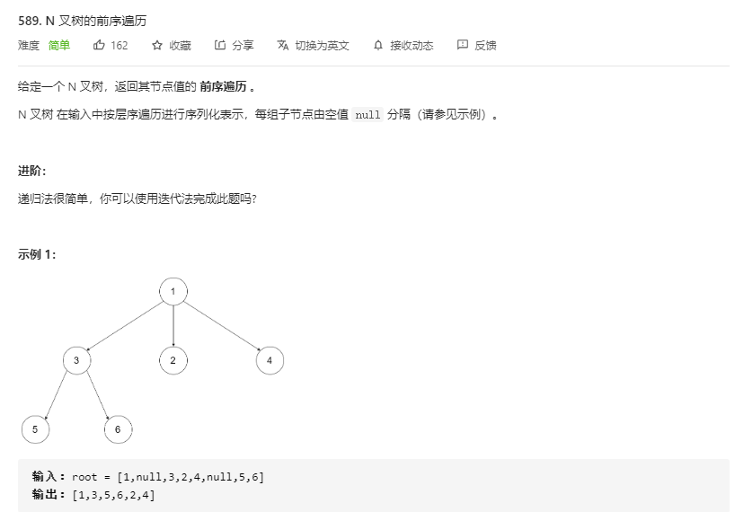

# [题目](https://leetcode-cn.com/problems/n-ary-tree-preorder-traversal/)



# 递归

```java
// time: O(n)
// space: O(n) 压栈
class Solution {
    public List<Integer> preorder(Node root) {
        List<Integer> res = new LinkedList<>();
        if(root == null) return res;
        res.add(root.val);
        for(Node child: root.children){
            res.addAll(preorder(child));
        }
        return res;
    }
}
```

# 尾递归

```java
// time: O(n)
// space: O(n)
class Solution {
    List<Integer> res = new LinkedList<>();
    public List<Integer> preorder(Node root) {
        dfs(root);
        return res;
    }

    public void dfs(Node root){
        if(root == null) return;
        res.add(root.val);
        for(Node node: root.children){
            dfs(node);
        }
    }
}
```