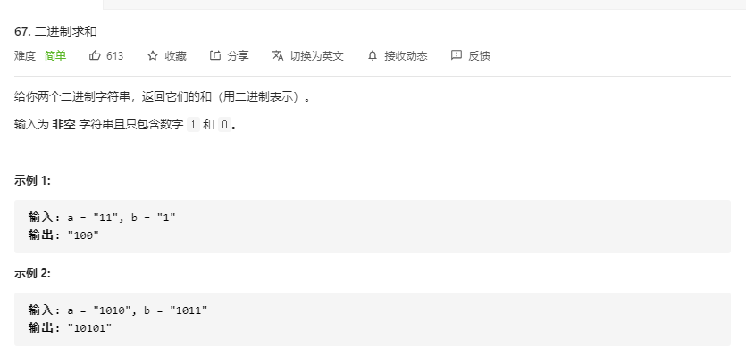

# [题目](https://leetcode-cn.com/problems/add-binary/)



- 注意进位
- 最高位可能进位
- 字符串长度不一

> 最大的障碍是字符串位数不对齐，可以使用字符串补齐或者设置默认值等方式。

# 迭代

```java
// time: O(m + n)
// space: O(1)
class Solution {
    public String addBinary(String a, String b) {
        int ai = a.length() - 1, bi = b.length() - 1;
        int bingo = 0, x, y, sum;
        StringBuilder res = new StringBuilder();
        while (ai > -1 || bi > -1 || bingo > 0){
            x = ai > -1 ? a.charAt(ai) - '0' : 0;
            y = bi > -1 ? b.charAt(bi) - '0' : 0;
            sum = x + y + bingo;
            res.append(sum % 2);
            bingo = sum / 2;
            ai -= 1;
            bi -= 1;
        }
        return res.reverse().toString();
    }
}
```

# 位操作

- ``sum % 2 = sum & 1``
- ``sum / 2 = sum >> 1``

