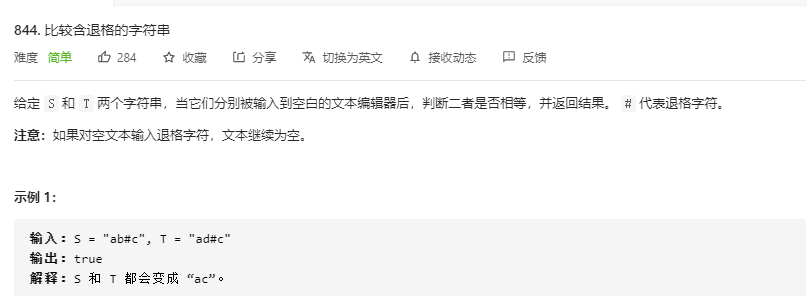

# [题目](https://leetcode-cn.com/problems/backspace-string-compare/)



# 压栈

```java
// time: O(S+T)
// space: O(S+T)
class Solution {
    public boolean backspaceCompare(String s, String t) {
        Stack<Character> ss = getStack(s);
        Stack<Character> ts = getStack(t);
        if(ss.size() != ts.size()) return false;
        while (!ss.isEmpty()){
            if(ss.pop() != ts.pop()){
                return false;
            }
        }
        return true;
    }

    public Stack<Character> getStack(String s){
        Stack<Character> stack = new Stack<>();
        for(int i = 0; i < s.length(); i++){
            char ch = s.charAt(i);
            if(ch == '#'){
                if(!stack.isEmpty()){
                    stack.pop();
                }
            } else {
                stack.push(ch);
            }
        }
        return stack;
    }
}
```

# 定位对比

> 如果是无删除的情况，直接对比即可，想办法跳过删除字符，直接对比。

```java
// time: O(S + T)
// space: O(1)
class Solution {
    public boolean backspaceCompare(String s, String t) {
        int si = s.length() - 1, ti = t.length() - 1;
        int sd = 0, td = 0;
        boolean delete;
        while(si > -1 || ti > -1){
            while(si > -1 && ((delete = s.charAt(si) == '#') || sd > 0)){
                sd += delete ? 1 : -1;
                si -= 1;
            }
            while(ti > -1 && ((delete = t.charAt(ti) == '#') || td > 0)){
                td += delete ? 1 : -1;
                ti -= 1;
            }
            if(si > -1 && ti > -1 && s.charAt(si--) != t.charAt(ti--)) return false;
        }
        return si == ti;
    }
}
```

