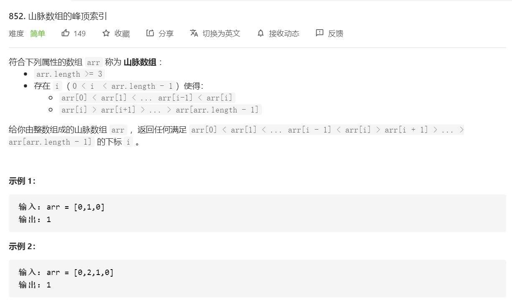

# [题目](https://leetcode-cn.com/problems/peak-index-in-a-mountain-array/)



# 直接检测

```java
// time: O(n)
// space: O(1)
class Solution {
    public int peakIndexInMountainArray(int[] arr) {
        for(int i = 1; i < arr.length - 1; i++){
            if(isMountain(arr, i)){
                return i;
            }
        }
        return -1;
    }
    boolean isMountain(int[] arr, int index){
        return arr[index-1] < arr[index] && arr[index] > arr[index+1];
    }
}
```

# 二分查找

> 顺序检测太浪费计算资源，可以二分查找

```java
// time: O(logn)
// space: O(1)
class Solution {
    public int peakIndexInMountainArray(int[] arr) {
        int left = 1, right = arr.length - 2, mid;
        while(left <= right){
            if(isMountain(arr, left)) return left;
            if(isMountain(arr, right)) return right;
            mid = left + (right - left) / 2;
            if(isMountain(arr, mid)) return mid;
            if(arr[mid] > arr[mid + 1]){
                left += 1;
                right = mid - 1;
            } else {
                right -= 1;
                left = mid + 1;
            }
        }
        return -1;
    }

    boolean isMountain(int[] arr, int index){
        return arr[index-1] < arr[index] && arr[index] > arr[index+1];
    }
}
```

# 单边检测

> 不要直接判断，判断一半效率更高

```java
// time: O(n)
// space: O(1)
class Solution {
    public int peakIndexInMountainArray(int[] arr) {
        int index = 0;
        while(arr[index] < arr[index+1]) index++;
        return index;
    }
}
```

# 单边二分

```java
// time: O(logn)
// space: O(1)
class Solution {
    public int peakIndexInMountainArray(int[] arr) {
       int left = 0, right = arr.length - 1, mid;
       while(left != right){
           mid = left + (right - left) / 2;
           if(arr[mid] < arr[mid+1]){
               left = mid + 1;
           } else {
               right = mid;
           }
       }
        return left;
    }
}
```

