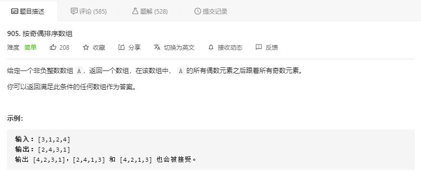

# [题目](https://leetcode-cn.com/problems/sort-array-by-parity/)



# 两次扫描

> 两遍扫描，分别检索奇偶数

```java
// time: O(n) 遍历两遍
// space: O(n) 新开内存
class Solution {
    public int[] sortArrayByParity(int[] A) {
        int[] res = new int[A.length];
        int i = 0;
        for (int a : A) {
            if ((a & 1) == 0) {
                res[i++] = a;
            }
        }
        for (int a : A) {
            if ((a & 1) == 1) {
                res[i++] = a;
            }
        }
        return res;
    }
}
```

# 双指针交换

```java
// time: O(n)
// space: O(1)
class Solution {
    public int[] sortArrayByParity(int[] A) {
        int left = 0, right = A.length - 1;
        while(left < right){
            while (left < right && (A[left] & 1) == 0) left++;
            while (left < right && (A[right] &1) == 1) right--;
            swap(A, left++, right--);
        }
        return A;
    }

    public void swap(int[] N, int a, int b){
        int t = N[a];
        N[a] = N[b];
        N[b] = t;
    }
}
```

