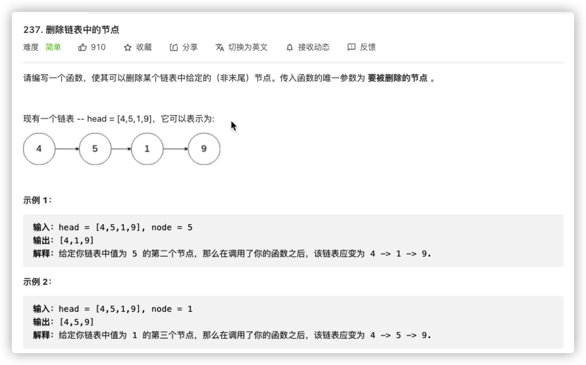
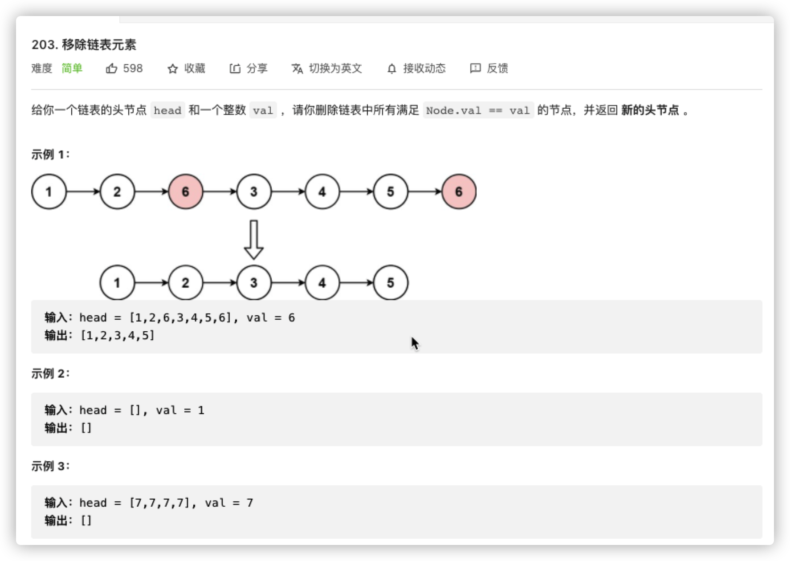
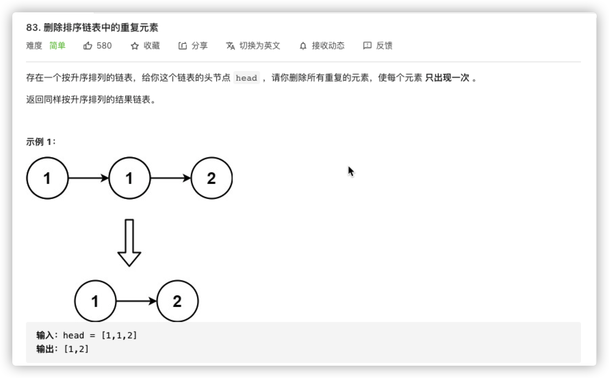
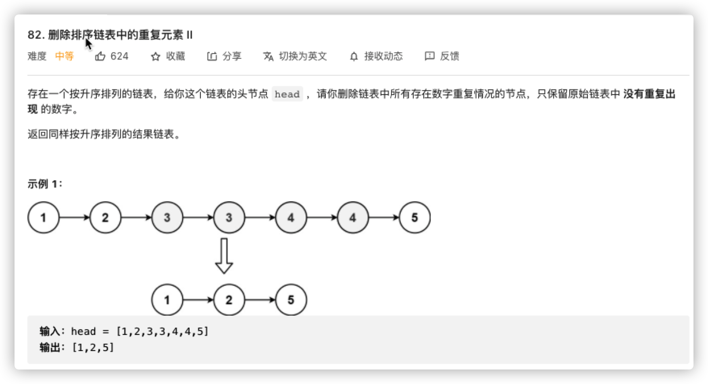
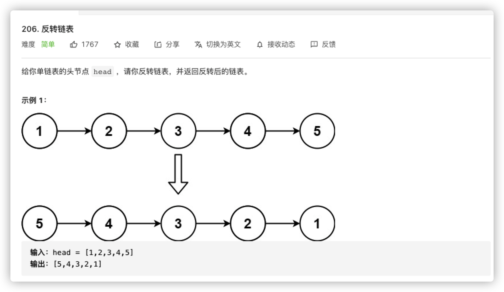
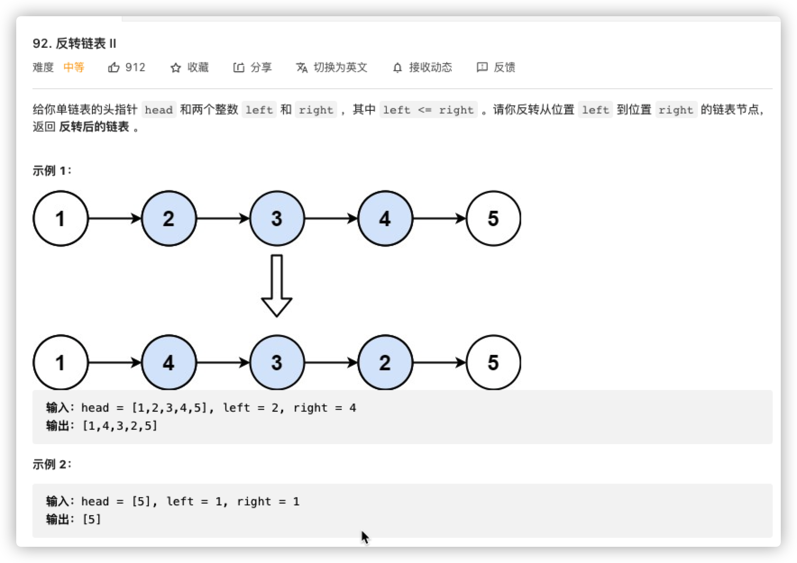
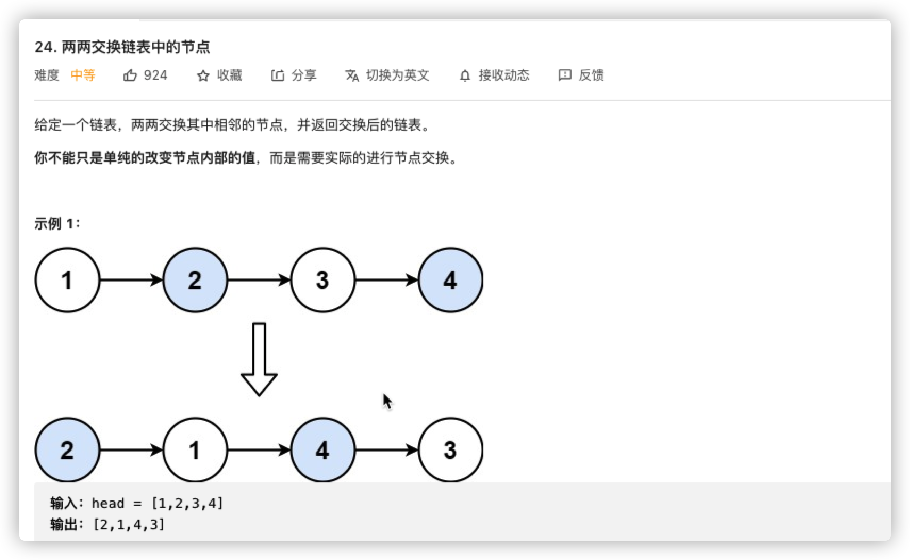
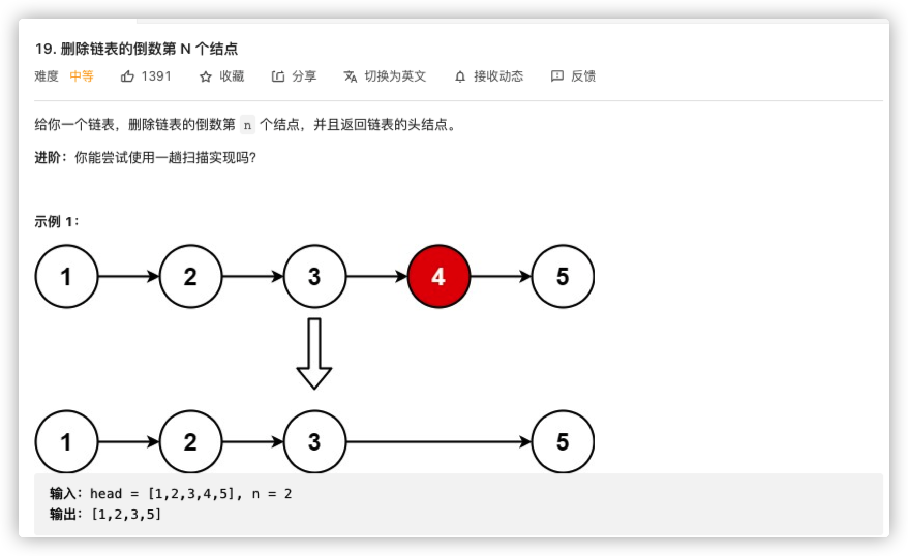
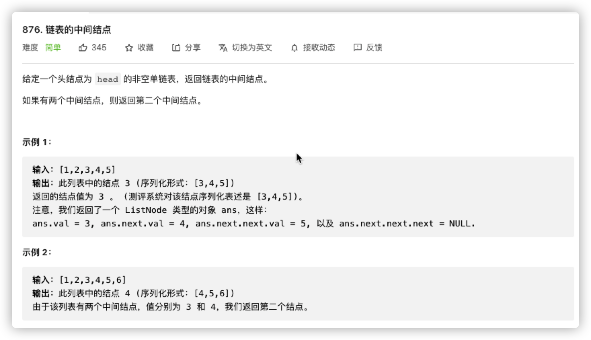

# 链表专题

## 链表特性

```java
public class ListNode {
   int val;
   ListNode next;
}

```

| 特点       | 细节                                                         | 利用                                                         |
| ---------- | ------------------------------------------------------------ | ------------------------------------------------------------ |
| 单向       | 链表都存在方向，只能够沿着方向前进                           | 1. 只能感知相对位置，整体位置需额外变量维护<br />2. 无删减操作下，相对位置保持不变，方向不计<br />3. 每个节点有``next``，可以进行头插或者尾插<br />4. 头插可以模拟尾插的操作<br />5. 维护多指针关系，经由头结点或尾节点定位中间位置 |
| 覆盖       | ``java``赋值特性，变量的重复赋值总是保留最新的               | 重复赋值可以替代删除操作                                     |
| 滚动       | 遍历必然替换对象，遍历过的数据必然需要额外变量保存           | 链表操作中往往伴随多指针，或者滚动，或者寄存                 |
| 相似       | ``next``本身是变量，可能是``null``，也可能是长串<br />节点即链表，两者操作无差异 | 无需考虑链表长度<br />子链表归为单一节点即可                 |
| 部分即整体 | 单向路由，部分关系维护，整体关系确定                         | 使用游标调节局部关系即整体管理，问题分解                     |


## 节点删除



```java
class Solution {
  	// 覆盖即删除
    public void deleteNode(ListNode node) {
        node.val = node.next.val;
      	node.next = node.next.next;
    }
}
```



```java
class Solution {
    public ListNode removeElements(ListNode head, int val) {
      // 1. 可能是头结点，伪造头结点归一化问题
      // 2. 涉及遍历，必定有游标
			ListNode dummyHead = new ListNode(-1, head), cursor = dummyHead;
      while(cursor != null){
        // 覆盖即删除
        while(cursor.next != null && cursor.next.val == val) cursor.next = cursor.next.next;
        cursor = cursor.next;
      }
      return dummyHead.next;
    }
}
```



```java
class Solution {
    public ListNode deleteDuplicates(ListNode head) {
      // 1. 头结点无替换风险
      // 2. 遍历要游标
			ListNode cursor = head;
      while(cursor != null){
        // 替换即删除 
        while(cursor.next != null && cursor.val == cursor.next.val) cursor.next = cursor.next.next;
        cursor.next;
      }
      return head;
    }
}
```



```java
class Solution {
    public ListNode deleteDuplicates(ListNode head) {
      if(head == null) return null;
      // 1. 有被替换风险
			ListNode dummyHead = new ListNode(-1, head), cursor = dummyHead;
      while(cursor.next != null && cursor.next.next != null){
       	if(cursor.next.val == cursor.next.next.val){
          int sign = cursor.next.val;
          // 去掉单一重复
          while(cursor.next != null && cursor.next.val == sign){
            cursor.next = cursor.next.next;
          }
        } else { // 因为存在连环重复，因此并非每次都要替换
          cursor = cursor.next;
        }
      }
      return dummyHead.next;
    }
}
```


## 头插倒序



```java

class Solution {
    public ListNode reverseList(ListNode head) {
      // dummyHead寄存+位置，temp作为交换变量
			ListNode dummyHead = null, temp;
      while(head != null){
        temp = head.next;
        // 寄存节点，头插倒序
        head.next = dummyHead;
        dummyHead = head;
        // 原始节点正序遍历
        head = temp;
      } 
      return dummyHead.next;
    }
}
```



```java
class Solution {
    public ListNode reverseBetween(ListNode head, int left, int right) {
			if(left == right) return head;
      // 1. 操作中常涉及头结点，为了统一问题，伪造头结点将问题统一为节点内元素
      // 2. 遍历操作，需要滑动变量
      ListNode dummyHead = new ListNode(-1, head), cursor = dummyHead;
      // 区间锁定，额外变量维护位置关系
      int pos = 0;
    	while(pos + 1 < left){
        cursor = cursor.next;
        pos += 1;
      }
      // 因为单向链表不存在回溯，有明确后项替换，都需要记录前驱节点
      ListNode prev = cursor;
      // 子反转链表维护
      ListNode reverseHead = null, reverseTail = null, temp;
      reverseHead = reverseTail = cursor = cursor.next;
      // 前面已经挪动了一位，直接判断减少一次计算开销
      while(pos < right){
        temp = cursor.next;
        cursor.next = reverseHead;
        reverseHead = cursor;
        cursor = temp;
        pos += 1;
      }
      // 首尾中间插入
      prev.next = reverseHead;
      reverseTail.next = cursor;
      return dummyHead.next;
    }
}
```



```java
class Solution {
    public ListNode swapPairs(ListNode head) {
      // 1. 头结点有替换风险
      // 2. 遍历游标s
			ListNode dummyHead = new ListNode(-1, head), cursor = dummyHead;
      ListNode reverseHead, reverseTail;
      while(cursor.next != null && cursor.next.next != null){
        reverseTail = cursor.next;
        reverseHead = cursor.next.next;
        reverseTail.next = reverseHead.next;
        reverseHead.next = reverseTail;
        cursor.next = reverseHead;	
        cursor = cursor.next.next;
      }
      return dummyHead.next;
    }
}
```

## 位置判断

> 所谓头插，本身采用的就是默认的``next``相对位置，也就是``+1``，参考前面[83题](https://leetcode-cn.com/problems/remove-duplicates-from-sorted-list/).

在此之前，随便写一个删除正数第``n``个节点

```java
ListNode removeNth(ListNode head, int n){
  ListNode dummyHead = new ListNode(-1, head), cursor = dummyHead;
  for(int i = 1, i < n; i++){
    cursor = cursor.next;
  }
  cursor = cursor.next.next;
  return dummyHead.next;
}
```

为什么这么简单呢，因为头结点不用找，直接给出了，但是对于需要手动找的尾节点，这个关系就需要我们维护。



```java
class Solution {
    public ListNode removeNthFromEnd(ListNode head, int n) {
			ListNode dummyHead = new ListNode(-1, head), prevN = dummyHead, nextN = dummyHead;
      // 维护相对位置
      for(int i = 0; i < n; i++){
        nextN = nextN.next;
      }
      // 找到尾节点
      while(nextN.next != null){
        nextN = nextN.next;
        prevN = prev.next;
      }
      // 逆推关系，锁定位置
      prevN.next = prevN.next.next;
      return dummyHead.next;
    }
}
```



```java
class Solution {
    public ListNode middleNode(ListNode head) {
      // v_f : v_s = s_f : s_s = 2 : 1
      // 相对位置可以是具体长度，也可以是倍数关系
      ListNode fast = dummyHead, slow = dummyHead;
      while(fast != null && fast.next != null){
        fast = fast.next.next;
        slow = slow.next;
      }
      return slow;
    }
}
```

