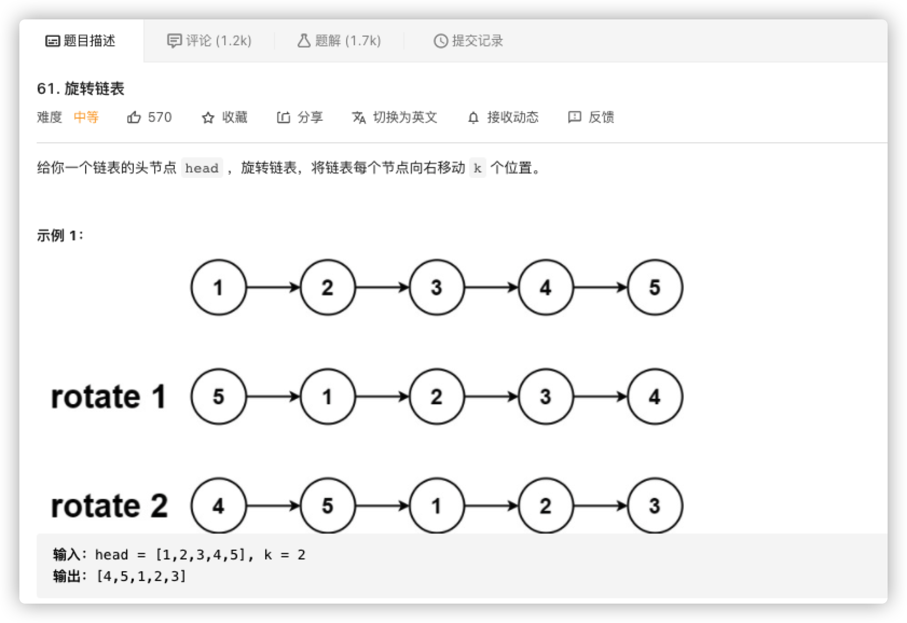
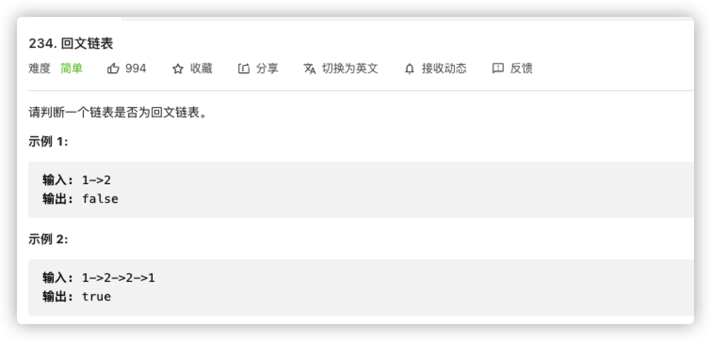
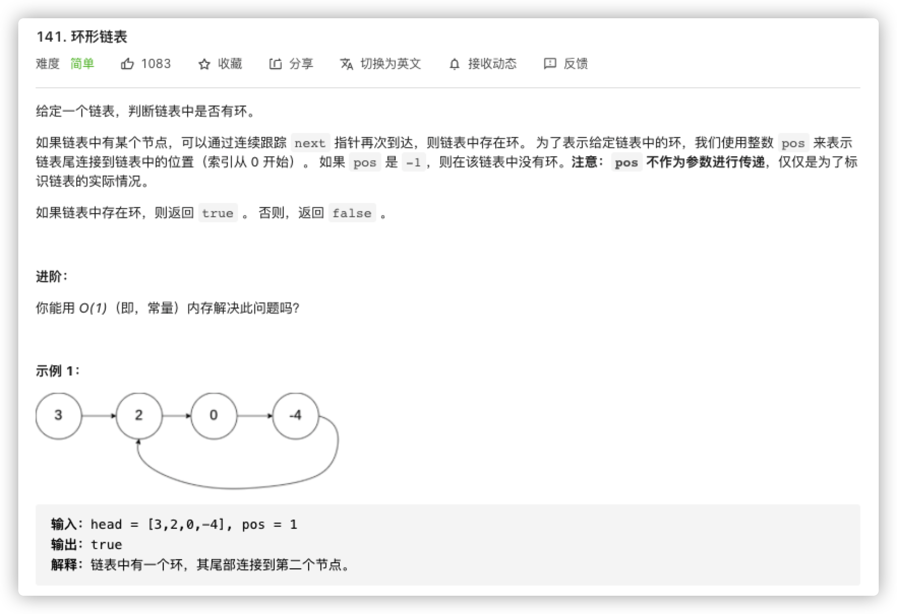
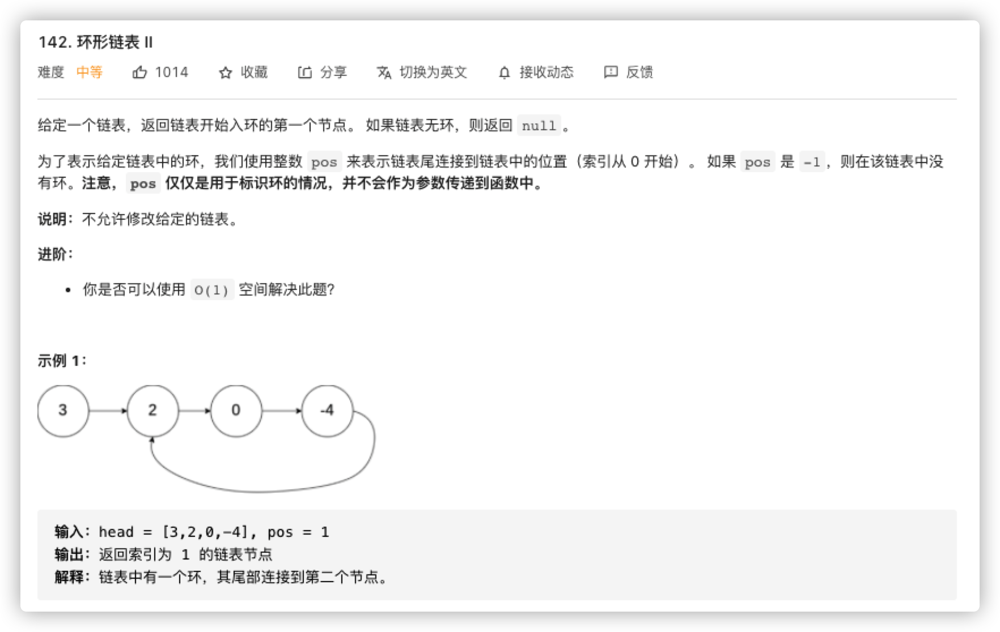
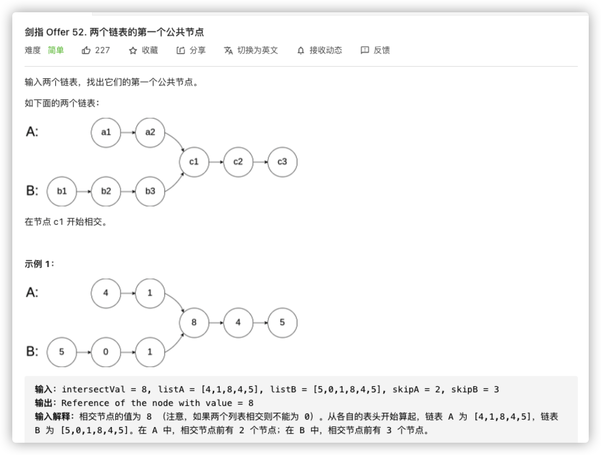
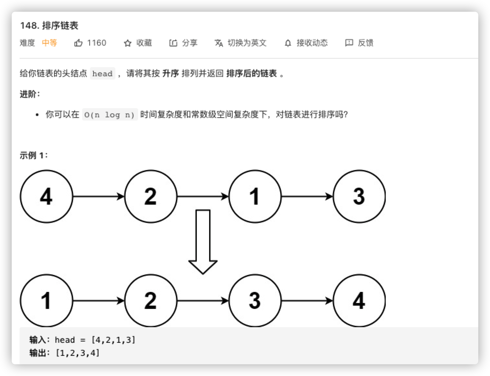
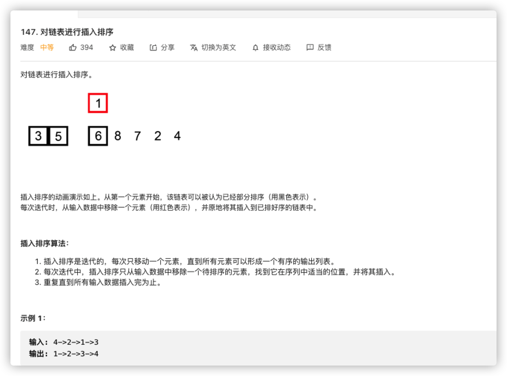
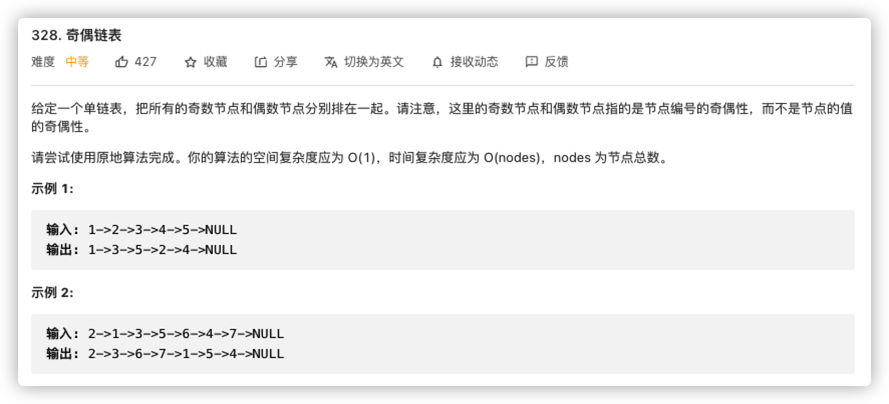
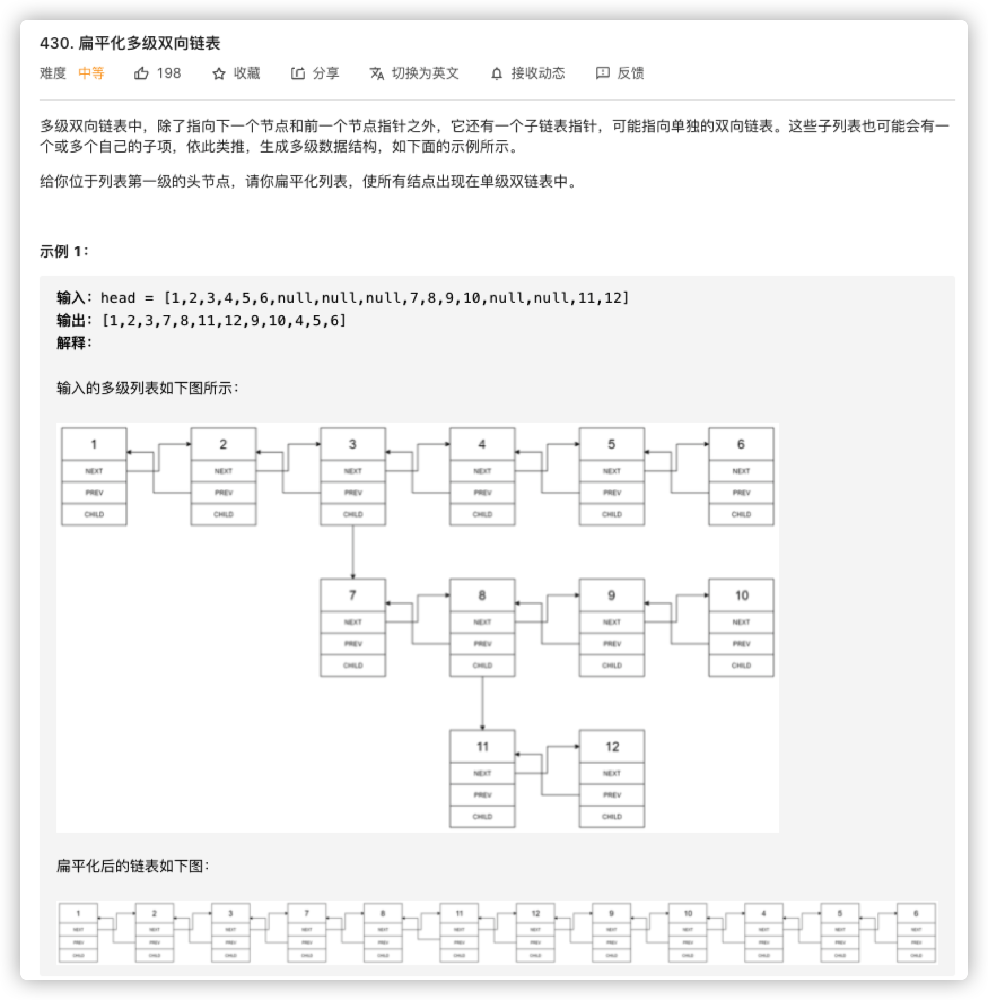
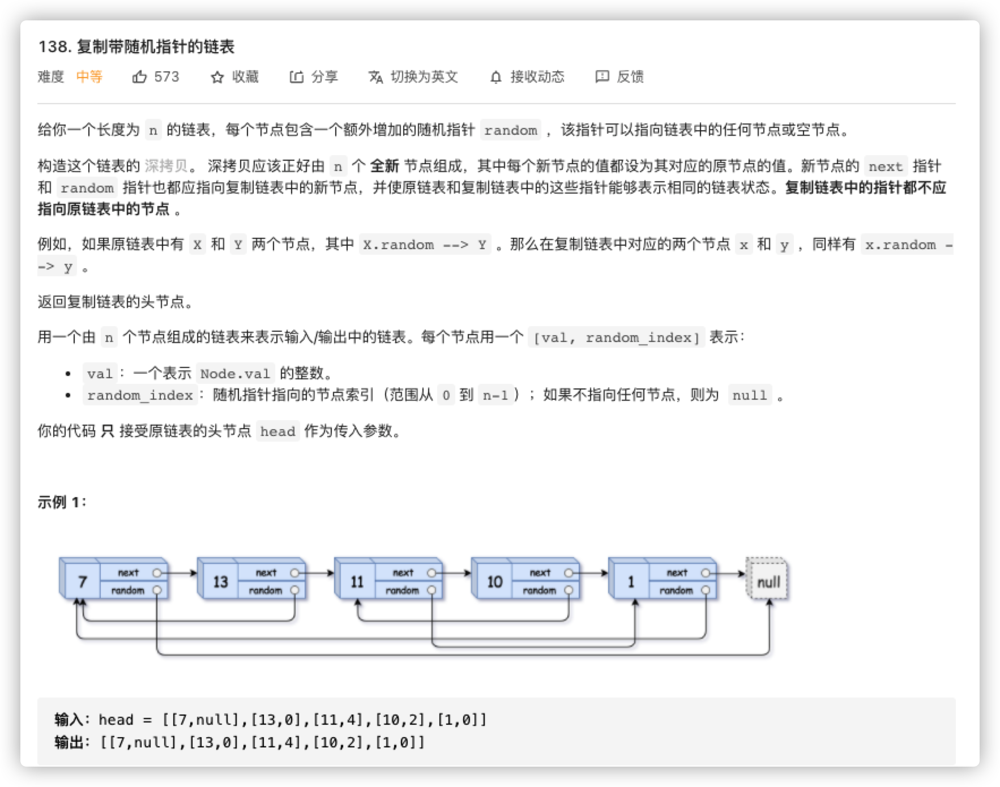

# 链表专题

## 链表特性

```java
public class ListNode {
   int val;
   ListNode next;
}

```

| 特点       | 细节                                                         | 利用                                                         |
| ---------- | ------------------------------------------------------------ | ------------------------------------------------------------ |
| 单向       | 链表都存在方向，只能够沿着方向前进                           | 1. 只能感知相对位置，整体位置需额外变量维护<br />2. 无删减操作下，相对位置保持不变，方向不计<br />3. 每个节点有``next``，可以进行头插或者尾插<br />4. 头插可以模拟尾插的操作<br />5. 维护多指针关系，经由头结点或尾节点定位中间位置 |
| 覆盖       | ``java``赋值特性，变量的重复赋值总是保留最新的               | 重复赋值可以替代删除操作                                     |
| 滚动       | 遍历必然替换对象，遍历过的数据必然需要额外变量保存           | 链表操作中往往伴随多指针，或者滚动，或者寄存                 |
| 相似       | ``next``本身是变量，可能是``null``，也可能是长串<br />节点即链表，两者操作无差异 | 无需考虑链表长度<br />子链表归为单一节点即可                 |
| 部分即整体 | 单向路由，部分关系维护，整体关系确定                         | 使用游标调节局部关系即整体管理，问题分解                     |


## 节点删除


```java
// time: O(1)
class Solution {
  	// 覆盖即删除
    public void deleteNode(ListNode node) {
        node.val = node.next.val;
      	node.next = node.next.next;
    }
}
```


```java
// time: O(n)
// space: O(1)
class Solution {
    public ListNode rotateRight(ListNode head, int k) {
			if(k == 0 || head == null) return head;
      ListNode dummyHead = head;
      int length = 1;
      while(dummyHead.next != null){
      	dummyHead = dummyHead.next;
        length += 1;
      }
      k = k % length;
      dummyHead.next = head;
      for(int i = 0; i < length - k; i++){
        dummyHead = dummyHead.next;
      }
      head = dummyHead.next;
      dummyHead.next = null;
      return head;
    }
}
```


```java
// time: O(n)
// space: O(1)
class Solution {
    public ListNode removeElements(ListNode head, int val) {
			ListNode dummyHead = new ListNode(-1, head), cursor = dummyHead;
      while(cursor != null){
        // 覆盖即删除
        while(cursor.next != null && cursor.next.val == val) cursor.next = cursor.next.next;
        cursor = cursor.next;
      }
      return dummyHead.next;
    }
}
```


```java
// time: O(n)
// space : O(1)
class Solution {
    public ListNode deleteDuplicates(ListNode head) {
			ListNode cursor = head;
      while(cursor != null){
        // 替换即删除 
        while(cursor.next != null && cursor.val == cursor.next.val) cursor.next = cursor.next.next;
        cursor.next;
      }
      return head;
    }
}
```


```java
// time: O(n)
// spae: O(1)
class Solution {
    public ListNode deleteDuplicates(ListNode head) {
      if(head == null) return null;
      // 1. 有被替换风险
			ListNode dummyHead = new ListNode(-1, head), cursor = dummyHead;
      while(cursor.next != null && cursor.next.next != null){
       	if(cursor.next.val == cursor.next.next.val){
          int sign = cursor.next.val;
          // 去掉单一重复
          while(cursor.next != null && cursor.next.val == sign){
            cursor.next = cursor.next.next;
          }
        } else { // 因为存在连环重复，因此并非每次都要替换
          cursor = cursor.next;
        }
      }
      return dummyHead.next;
    }
}
```


## 头插倒序


```java
// time: O(n)
// time: O(1)
class Solution {
    public ListNode reverseList(ListNode head) {
      // dummyHead寄存+位置，temp作为交换变量
			ListNode dummyHead = null, temp;
      while(head != null){
        temp = head.next;
        // 寄存节点，头插倒序
        head.next = dummyHead;
        dummyHead = head;
        // 原始节点正序遍历
        head = temp;
      } 
      return dummyHead.next;
    }
}
```


```java
// time: O(n)
// space: O(1)
class Solution {
    public ListNode reverseBetween(ListNode head, int left, int right) {
			if(left == right) return head;
      // 1. 操作中常涉及头结点，为了统一问题，伪造头结点将问题统一为节点内元素
      // 2. 遍历操作，需要滑动变量
      ListNode dummyHead = new ListNode(-1, head), cursor = dummyHead;
      // 区间锁定，额外变量维护位置关系
      int pos = 0;
    	while(pos + 1 < left){
        cursor = cursor.next;
        pos += 1;
      }
      // 因为单向链表不存在回溯，有明确后项替换，都需要记录前驱节点
      ListNode prev = cursor;
      // 子反转链表维护
      ListNode reverseHead = null, reverseTail = null, temp;
      reverseHead = reverseTail = cursor = cursor.next;
      // 前面已经挪动了一位，直接判断减少一次计算开销
      while(pos < right){
        temp = cursor.next;
        cursor.next = reverseHead;
        reverseHead = cursor;
        cursor = temp;
        pos += 1;
      }
      // 首尾中间插入
      prev.next = reverseHead;
      reverseTail.next = cursor;
      return dummyHead.next;
    }
}
```


```java
// time: O(n)
// space: O(1)
class Solution {
    public ListNode swapPairs(ListNode head) {
      // 1. 头结点有替换风险
      // 2. 遍历游标s
			ListNode dummyHead = new ListNode(-1, head), cursor = dummyHead;
      ListNode reverseHead, reverseTail;
      while(cursor.next != null && cursor.next.next != null){
        reverseTail = cursor.next;
        reverseHead = cursor.next.next;
        reverseTail.next = reverseHead.next;
        reverseHead.next = reverseTail;
        cursor.next = reverseHead;	
        cursor = cursor.next.next;
      }
      return dummyHead.next;
    }
}
```

## 位置判断

> 所谓头插，本身采用的就是默认的``next``相对位置，也就是``+1``，参考前面[83题](https://leetcode-cn.com/problems/remove-duplicates-from-sorted-list/).

在此之前，随便写一个删除正数第``n``个节点

```java
// time: O(n)
// space: O(1)
ListNode removeNth(ListNode head, int n){
  ListNode dummyHead = new ListNode(-1, head), cursor = dummyHead;
  for(int i = 1, i < n; i++){
    cursor = cursor.next;
  }
  cursor = cursor.next.next;
  return dummyHead.next;
}
```

为什么这么简单呢，因为头结点不用找，直接给出了，但是对于需要手动找的尾节点，这个关系就需要我们维护。


```java
// time: O(n)
// space: O(1)
class Solution {
    public ListNode removeNthFromEnd(ListNode head, int n) {
			ListNode dummyHead = new ListNode(-1, head), prevN = dummyHead, nextN = dummyHead;
      // 维护相对位置
      for(int i = 0; i < n; i++){
        nextN = nextN.next;
      }
      // 找到尾节点
      while(nextN.next != null){
        nextN = nextN.next;
        prevN = prev.next;
      }
      // 逆推关系，锁定位置
      prevN.next = prevN.next.next;
      return dummyHead.next;
    }
}
```


```java
// time: O(n)
// space: O(1)
class Solution {
    public ListNode middleNode(ListNode head) {
      // v_f : v_s = s_f : s_s = 2 : 1
      // 相对位置可以是具体长度，也可以是倍数关系
      ListNode fast = dummyHead, slow = dummyHead;
      while(fast != null && fast.next != null){
        fast = fast.next.next;
        slow = slow.next;
      }
      return slow;
    }
}
```



```java
// time: O(n)
// space: O(1)
class Solution {
    public boolean isPalindrome(ListNode head) {
      if(head == null || head.next == null) return true;
      // 头插模拟压栈
	  	ListNode prevReverse = null, temp;
      // 二倍速分段
      ListNode slow = head, fast = head;
      while(fast != null && fast.next != null){
        fast = fast.next.next;
        temp = slow.next;
        slow.next = prevReverse;
        prevReverse = slow;
        slow = temp;
      }
      // 奇数长度忽略重心
      if(fast != null) slow = slow.next;
      // 两端对比
      while(slow != null){
        if(slow.val != prevReverse.val) return false;
        prevReverse = prevReverse.next;
        slow = slow.next;
      }
      return true;
    }
}
```

## 位置计算

针对环形链表的问题，使用``hash``是一种无可厚非的最简方法，不过耗费内存，且适用面狭窄。

使用双指针维护相对位置，更有扩展空间。

对于环形链表，我们把头结点、入环节点、碰撞点分别记作$a,b,c$。

它的直部长度、环部长度、入环点到碰撞点的偏移长度分别记作$s_l = b - c, s_c, \triangle s = c - b$。

使用$v_1 : v_2 = 1: 2$的两个指针进行滑动，同频时钟或者周期内$s_1 : s_2 = v_1 t : v_2 t = v_1 : v_2 = 1: 2$。

因此，对于环形链表，必然存在碰撞，并且
$$
s_1 = s_l + \triangle s + m\times s_c \\
s_2 = s_l + \triangle s + n\times s_c
$$




```java
// time: O(n)
// space: O(1)
public class Solution {
    public boolean hasCycle(ListNode head) {
      if(head == null || head.next == null) return false;
    	ListNode slow = head.next, fast = head.next.next;
      while(fast != null && fast.next != null){
        fast = fast.next.next;
        slow = slow.next;
        if(fast == slow) return true;
      }
      return false;
    }
}
```

$$
\begin{aligned}
2s_1 &= s-2 \\
2s_l + 2\triangle s + 2ms_c &= s_l + \triangle s + ns_c \\
\Rightarrow s_l &= (n-2m)s_c - \triangle s \\
\Rightarrow s_l &= \eta s_c - \triangle s
\end{aligned}
$$

也就是说，直部长度为环部的整数倍后撤$\triangle s$。

代换过来，就是以碰撞点$c$为起点，在某一次到达入环点的长度即为$s_l$。

更直接的办法，就是让两个指针分别以头结点、碰撞点，以同频方式移动，第一次碰撞点即为入环点。



```java
// time: O(n)
// space: O(1)
public class Solution {
    public ListNode detectCycle(ListNode head) {
    	if(head == null || head.next == null) return null;
      ListNode slow = head.next, fast = head.next.next;
      while(fast != null && fast.next != null && fast != slow){
        slow = slow.next;
        fast = fast.next.next;
      }
      if(fast == null || fast.next == null) return null;
      while(head != slow){
      	head = head.next;
        slow = slow.next;
      }
      return head;
    }
}
```

根据速度和路程的关系，我们还可以构造更有意思的场景



将``A``独有长度、``B``独有长度、公共长度分别记作$s_a, s_b, s_c$
$$
S_a = s_a + s_c \\
S_b = s_b + s_c
$$
拼接两个链表
$$
\begin{aligned}
S_a + S_b &= S_b + S_a \\
s_a + s_c + s_b + s_c &= s_b + s_c + s_a + s_c
\end{aligned}
$$
可以看到，无论拼接先后，它总会出现相等的碰撞点

- 有环：$s_a + s_c + s_b = s_b + s_c + s_a$
- 无环: ``null == null``

```java
// time: O(n)
// space: O(1)
public class Solution {
    public ListNode getIntersectionNode(ListNode headA, ListNode headB) {
    	ListNode cursorA = headA, cursorB = headB;
    	while(cursorA != cursorB){
        cursorA = cursorA == null?headB:cursorA.next;
        cursorB = cursorB == null?headA:cursorB.next;
      }
      return cursorA;
    }
}
```

## 局部即整体

> 维护局部关系即使维护整体关系



```java
// time: O(n)
// space: O(1)
class Solution {
    public ListNode sortList(ListNode head) {
      if(head == null) return null;
			ListNode dummyHead = new ListNode(-1, head), cursor = head;
      while(cursor.next != null){
        while(cursor.next != null && cursor.next.val > cursor.val){
          cursor = cursor.next;
        }
        if(cursor.next != null) insertNode(dummyHead, alertNext(cursor));
      }
      return dummyHead.next;
    }
  
  	ListNode alertNext(ListNode node){
      ListNode next = node.next;
      node.next = next.next;
      next.next = null;
      return next;
    }
  
  	void insertNode(ListNode head, ListNode node){
      while(head.next.val < node.val) head = head.next;
      node.next = head.next;
      head.next = node;
    }
  	
}
```



```java
// time: O(n)
// space: O(1)
class Solution {
    public ListNode insertionSortList(ListNode head) {
      if(head == null) return null;
			ListNode dummyHead = new ListNode(-1, head), cursor = head;
      while(cursor.next != null){
        while(cursor.next != null && cursor.next.val > cursor.val){
          cursor = cursor.next;
        }
        if(cursor.next != null) insertNode(dummyHead, alertNext(cursor));
      }
      return dummyHead.next;
    }
  
  	ListNode alertNext(ListNode node){
      ListNode next = node.next;
      node.next = next.next;
      next.next = null;
      return next;
    }
  
  	void insertNode(ListNode head, ListNode node){
      while(head.next.val < node.val) head = head.next;
      node.next = head.next;
      head.next = node;
    }
  	
}
```



```java
// time : O(n)
// space: O(1)
class Solution {
    public ListNode oddEvenList(ListNode head) {
      if(head == null) return null;
			ListNode even = new ListNode(), evenTail = even, oddCursor = head;
      while(oddCursor.next != null){
        evenTail.next = alertNext(oddCursor);
        evenTail = evenTail.next;
        if(oddCursor.next != null) oddCursor = oddCursor.next;
      }
      oddCursor.next = even.next;
      return head;
    }
    ListNode alertNext(ListNode node){
      ListNode next = node.next;
      node.next = next.next;
      next.next = null;
      return next;
    }
}
```

## 递归

> 递归过程中，还是会用到部分即整体等技巧



```java
// time: O(n)
// space: O(n)
class Solution {
    public Node flatten(Node head) {
        return head == null ? null: f(head)[0];
    }
  	Node[] f(Node node){
      Node head = node;
      while(node.next != null && node.child == null){
        node = node.next;
      }
      if(node.child == null) return new Node[]{head, node};
      Node child = node.child, next = node.next;
      node.child = null;
      Node[] flattenChild = f(child);
      node.next = flattenChild[0];
      flattenChild[0].prev = node;
      if(next == null) return new Node[]{head, flattenChild[1]};
      Node[] flattenNext = f(next);
      flattenChild[1].next = flattenNext[0];
      flattenNext[0].prev = flattenChild[1];
      return new Node[]{head, flattenNext[1]};
    }
}
```



```java
class Node {
    int val;
    Node next;
    Node random;

    public Node(int val) {
        this.val = val;
        this.next = null;
        this.random = null;
    }
}
// time: O(n)
// space: O(n)
class Solution {
    Map<Node, Node> cache = new HashMap<>();
    public Node copyRandomList(Node head) {
        if(head == null) return null;
        if(cache.containsKey(head)) return cache.get(head);
        Node node = new Node(head.val);
      	// 可能递归嵌套，需要先缓存
        cache.put(head, node);
        node.next = copyRandomList(head.next);
        node.random = copyRandomList(head.random);
        return node;
    }
}
```

