# 树特点

```java
public class TreeNode {
    int val;
    TreeNode left;
    TreeNode right;
}

```

| 特点       | 描述                          | 利用                                                         |
| ---------- | ----------------------------- | ------------------------------------------------------------ |
| 子结构相似 | ``C(p) ~ C(l) ~ C(r)``        | 天然递归，只考虑当前节点处理<br />分支，二叉总是对半分       |
| 有序性     | 针对``p、l、r``，不同处理方式 | 递归中自动嵌套，一级排布即可                                 |
| 回溯       | 深度递归自动回溯              | 利用回溯时，隐形堆栈结构清晰<br />每次处理简单，无需额外维护 |
| 广度       | 广度遍历需要手动维护          | 操作层级关系、维护层级关系                                   |

# 递归遍历

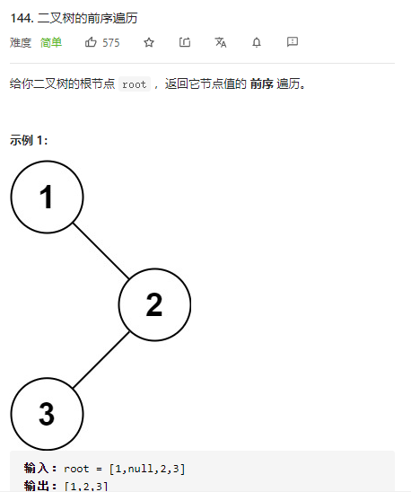

```java
// time: O(n)
// space: O(n)
class Solution {
    public List<Integer> preorderTraversal(TreeNode root) {
		List<Integer>  res = new LinkedList();
        if(root == null) return res;
        res.add(root.val);
        res.addAll(preorderTraversal(root.left));
        res.addAll(preorderTraversal(root.right));
        return res;
    }
}
```

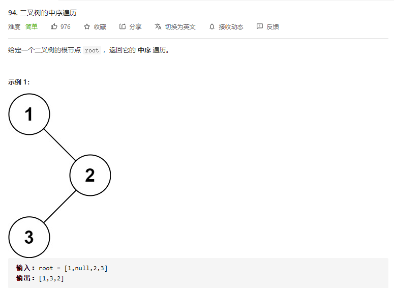

```java
// time: O(n)
// space: O(n)
class Solution {
    public List<Integer> inorderTraversal(TreeNode root) {
		List<Integer>  res = new LinkedList();
        if(root == null) return res;
        res.addAll(inorderTraversal(root.left));
        res.add(root.val);
        res.addAll(inorderTraversal(root.right));
        return res;
    }
}
```

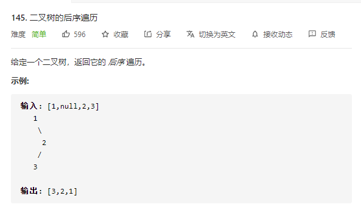

```java
// time: O(n)
// space: O(n)
class Solution {
    public List<Integer> postorderTraversal(TreeNode root) {
		List<Integer>  res = new LinkedList();
        if(root == null) return res;
        res.addAll(postorderTraversal(root.left));
        res.addAll(postorderTraversal(root.right));
        res.add(root.val);
        return res;
    }
}
```

# 迭代遍历

> 递归蕴含着回溯，而迭代过程中，上下文是全局的，需要手动进行维护。
>
> 虽然递归子问题无法统一上下文，但在树中，利用末端的尾指针可以达到子问题上下文自维护的效果。

针对前序遍历，展示一下两种办法

- 外部堆栈
- ``mirrors``

```java
// time: O(n)
// space: O(n)
class Solution {
    public List<Integer> preorderTraversal(TreeNode root) {
        List<Integer> res = new ArrayList<Integer>();
        if (root == null) {
            return res;
        }

        Stack<TreeNode> stack = new Stack<TreeNode>();
        TreeNode node = root;
        while (!stack.isEmpty() || node != null) {
            while (node != null) {
                res.add(node.val);
                stack.push(node);
                node = node.left;
            }
            node = stack.pop();
            node = node.right;
        }
        return res;
    }
}
```

```java
// time: O(n)
// space: O(1)
class Solution {
    public List<Integer> preorderTraversal(TreeNode root) {
        List<Integer> res = new ArrayList<Integer>();
        if (root == null) {
            return res;
        }

        TreeNode p1 = root, p2 = null;

        while (p1 != null) {
            p2 = p1.left;
            if (p2 != null) {
                while (p2.right != null && p2.right != p1) {
                    p2 = p2.right;
                }
                if (p2.right == null) {
                    res.add(p1.val);
                    p2.right = p1;
                    p1 = p1.left;
                    continue;
                } else {
                    p2.right = null;
                }
            } else {
                res.add(p1.val);
            }
            p1 = p1.right;
        }
        return res;
    }
}
```

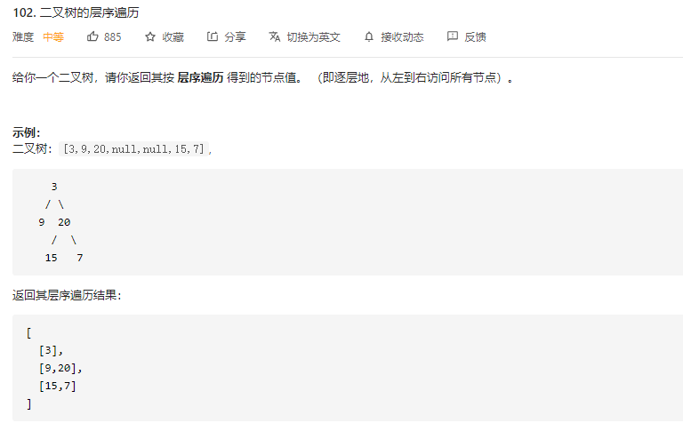

```java
// time: O(n)
// space: O(n)
class Solution {
    public List<List<Integer>> levelOrder(TreeNode root) {
        List<List<Integer>> ret = new ArrayList<List<Integer>>();
        if (root == null) {
            return ret;
        }
        Queue<TreeNode> queue = new LinkedList<TreeNode>();
        queue.offer(root);
        while (!queue.isEmpty()) {
            List<Integer> level = new ArrayList<Integer>();
            int currentLevelSize = queue.size();
            for (int i = 1; i <= currentLevelSize; ++i) {
                TreeNode node = queue.poll();
                level.add(node.val);
                if (node.left != null) {
                    queue.offer(node.left);
                }
                if (node.right != null) {
                    queue.offer(node.right);
                }
            }
            ret.add(level);
        }
        
        return ret;
    }
}
```

# 二叉构造

> 不同顺序遍历，顺序不同，但是对于节点的遍历值，都是相同的。
>
> 不同遍历之间可以恢复原始数据全貌。

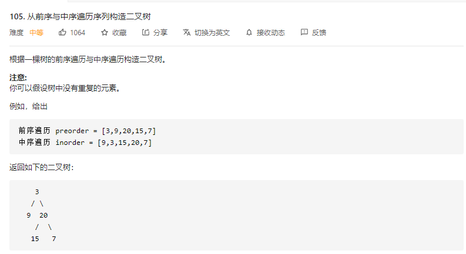

```java
// time: O(n)
// space: O(n)
class Solution {
    private Map<Integer, Integer> indexMap;
    int[] preorder;
    int[] inorder;
    public TreeNode buildTree(int[] preorder, int[] inorder) {
        this.preorder = preorder;
        this.inorder = inorder;
        int n = preorder.length;
        // 快速定位，免查找
        indexMap = new HashMap<>();
        for (int i = 0; i < n; i++) {
            indexMap.put(inorder[i], i);
        }
        return myBuildTree(0, n - 1, 0, n - 1);
    }
    // 元素区间分割，层级递归
    public TreeNode myBuildTree(int preorder_left, int preorder_right, int inorder_left, int inorder_right) {
        if (preorder_left > preorder_right) return null;
        int inorder_root = indexMap.get(preorder[preorder_left]);
        TreeNode root = new TreeNode(preorder[preorder_left]);
        int left_length = inorder_root - inorder_left;
        root.left = myBuildTree(preorder_left + 1, preorder_left + left_length, inorder_left, inorder_root - 1);
        root.right = myBuildTree(preorder_left + left_length + 1, preorder_right, inorder_root + 1, inorder_right);
        return root;
    }
}
```

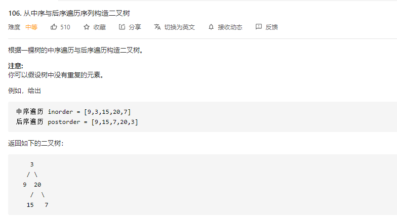

```java
// time: O(n)
// space: O(n)
class Solution {
    Map<Integer, Integer> inorderIndexMap;
    int[] inorder;
    int[] postorder;
    public TreeNode buildTree(int[] inorder, int[] postorder) {
        this.inorder = inorder;
        this.postorder = postorder;
        inorderIndexMap = new HashMap<>();
        for(int index = 0; index < inorder.length; index++){
            inorderIndexMap.put(inorder[index], index);
        }
        return buildTree(0, inorder.length -1, 0, postorder.length - 1);
    }
    public TreeNode buildTree(int inorderLeft, int inorderRight, int postOrderLeft, int postOrderRight){
        if(inorderLeft > inorderRight || postOrderLeft > postOrderRight) return null;
        int rootValue = postorder[postOrderRight];
        int inorderRootIndex = inorderIndexMap.get(rootValue);
        int leftMembersCount = inorderRootIndex - inorderLeft;
        TreeNode treeNode = new TreeNode(rootValue);
        treeNode.left = buildTree(inorderLeft, inorderRootIndex-1, postOrderLeft, postOrderLeft+leftMembersCount-1);
        treeNode.right = buildTree(inorderRootIndex+1, inorderRight, postOrderLeft+leftMembersCount, postOrderRight-1);
        return treeNode;
    }
}
```

# 二叉性质

> $$
> \text{left.v} \lt \text{root.v} \lt \text{right.v}
> $$
>
> 
>
> 将数值从下往上看，并且设置边界，泛化以后得到
> $$
> \min \lt \text{left.v} \lt \text{root.v} \lt \text{right.v} \lt \max
> $$
> 因此，针对每一个节点数据，我们总能够得到
> $$
> \min \lt \text{node.v} \lt \max
> $$

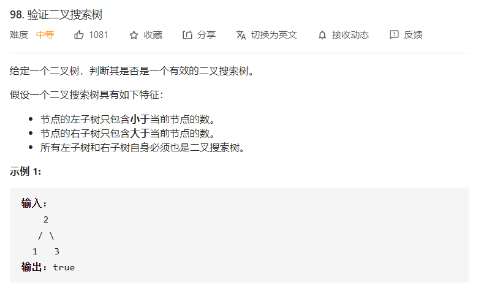

```java
// 直接中序遍历进行检查也可以
// time: O(n)
// space: O(n)
class Solution {
    public boolean isValidBST(TreeNode root) {
        return isValidBST(root, Long.MIN_VALUE, Long.MAX_VALUE);
    }
    public boolean isValidBST(TreeNode root, long min, long max){
        if(root == null) return true;
        return (min < root.val && root.val < max) &&
            isValidBST(root.left, min, root.val) &&
            isValidBST(root.right, root.val, max);
    }
}
```


```java
// 还可以使用大顶堆，但是针对有序数据，直接效果更佳
// time: O(n)
// space: O(1)
public class Solution {
    int order = 0, k, last= Integer.MIN_VALUE;
    int target;
    public int kthSmallest(TreeNode root, int k) {
        this.k = k;
        dfs(root);
        return target;
    }
    public void dfs(TreeNode root){
        if(root == null) return;
        dfs(root.left);
        if(root.val > last){
            order += 1;
        }
        if(order == k){
            target = root.val;
            return;
        }
        if(order < k){
            dfs(root.right);
        }
    }
}
```


> 同递推生成类似，先进行基础环境的生成，然后基于前面的信息进行当前的计算，并为下一次计算准备。

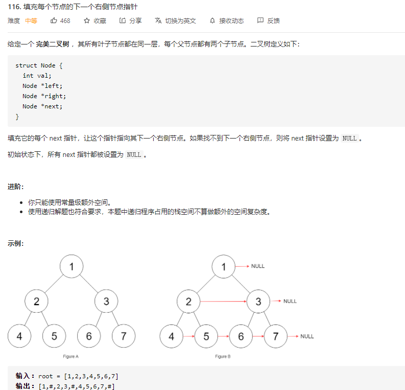

```java
// 上层为下层铺垫，拉平操作链
// time: O(n)
// space: O(1)
class Solution {
    public Node connect(Node root) {
        if(root == null) return null;
   		Node left = root, cursor;
        while(left.left != null){
            cursor = left;
            while(cursor != null){
                cursor.left.next = cursor.right;
                if(cursor.next != null) 
                    cursor.right.next = cursor.next.left;
                cursor = cursor.next;
            }
            left = left.left;
        }
        return root;
    }
}
```

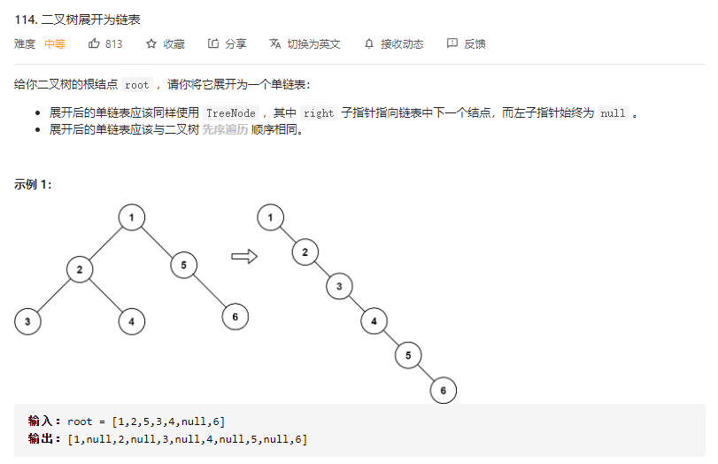

> 先序遍历：父节点 -> 左节点 -> 右节点
>
> 为了满足先序遍历，只需要将右节点挂在左节点最右节点后即可。
>
> 为了满足题目要求，并将左节点替换右节点

```java
// time: O(n)
// space: O(1)
class Solution {
    public void flatten(TreeNode root) {
		TreeNode cursor = root, left, mostRight;
        while(cursor != null){
            if(cursor.left != null){
                mostRight = cursor.left;
                while(mostRight.right != null) mostRight = left.right;
                mostRight.right = cursor.right;
                cursor.right = cursor.left;
                cursor.left = null;
            }
            cursor = cursor.right;
        }
        return root;
    }
}
```

# 排列组合

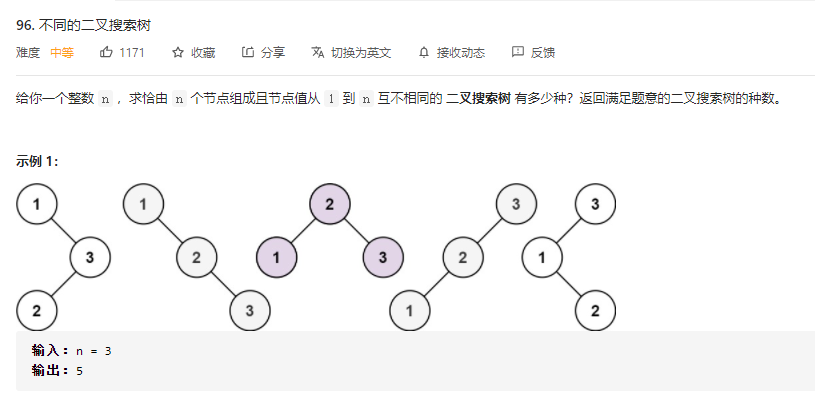

```java
// time: O(n ^ 2)
// space: O(n)
class Solution {
    public int numTrees(int n) {
        int[] G = new int[n + 1];
        G[0] = 1; G[1] = 1;
        // 1. 挑选定点
        // 2. 结果为 sum(left_i * right_i)
        for (int i = 2; i <= n; ++i) {
            for (int j = 1; j <= i; ++j) {
                G[i] += G[j - 1] * G[i - j];
            }
        }
        return G[n];
    }
}
```

# 条件检测

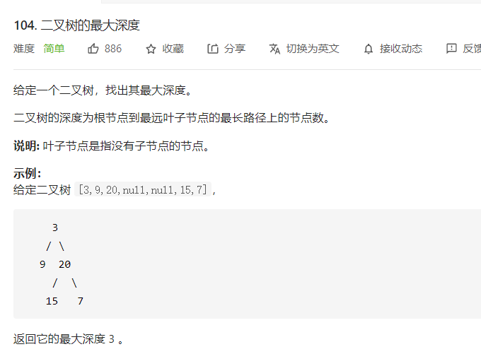

```java
// 叶子节点条件对比
// time: O(n)
// space: O(n)
class Solution {
    int maxDepth = 0;
    public int maxDepth(TreeNode root) {
		maxDepth(root, 0);
        return maxDepth;
    }
    public void maxDepth(TreeNode node, int depth){
        if(node == null){
            maxDepth = Math.max(maxDepth, depth);
        	return;
        }
        maxDepth(node.left, depth+1);
        maxDepth(node.right, depth+1);
    }
}
```

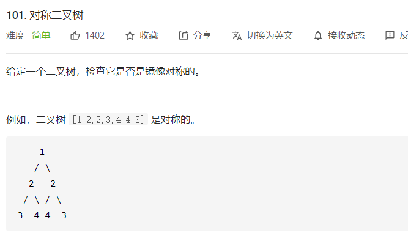

```java
// left.val == right.val && left.left == right.right && left.right == right.left
// time: O(n)
// space: O(n)
class Solution {
    public boolean isSymmetric(TreeNode root) {
		return root == null ? true : isSymmetric(root.left, root.right);
    }
    public boolean isSymmetric(TreeNode left, TreeNode right){
        if(left == null || right == null) return left == right;
        if(left.val != right.val) return false;
        return isSymmetric(left.left, right.right) && isSymmetric(left.right, right.left);
    }
}
```

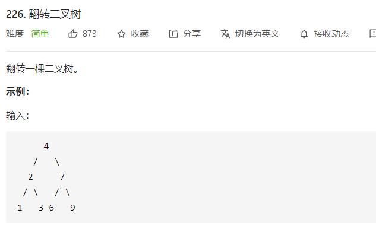

```java
// time: O(n)
// space: O(n)
class Solution {
    public TreeNode invertTree(TreeNode root) {
		if(root != null){
        	TreeNode left = root.left;
        	root.left = invertTree(root.right);
        	root.right = invertTree(left);
        }
        return root;
    }
}
```

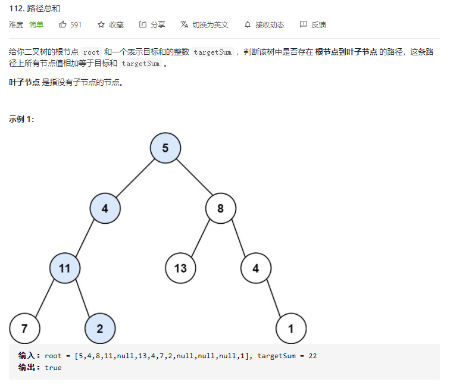

```java
// time: O(n)
// space: O(n)
class Solution {
    public boolean hasPathSum(TreeNode root, int targetSum) {
		if(root == null) return false;
        if(root.left == null && root.right == null) return root.val == targetSum;
        return hasPathSum(root.left, targetSum - root.val) ||
            hasPathSum(root.right, targetSum - root.val);
    }
}
```

# 路径收集

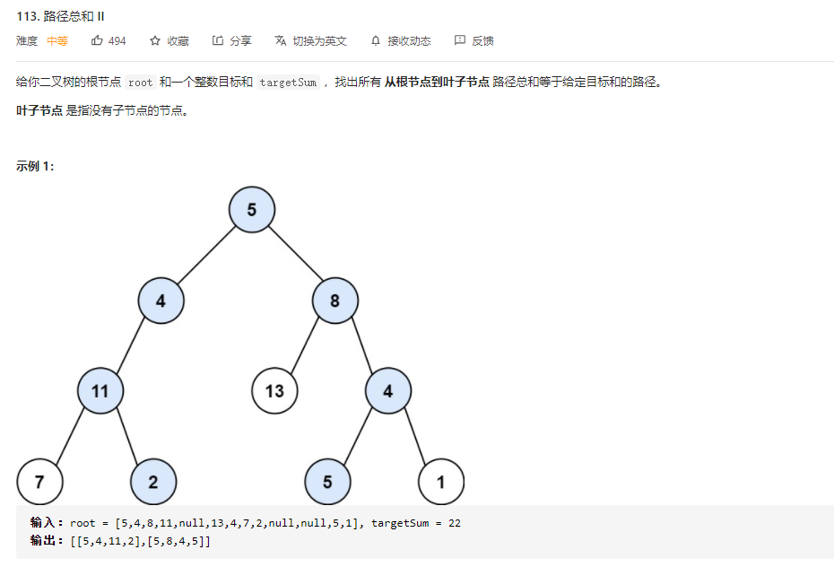

```java
// 路径手动回溯，比分支传入省内存
// time: O(n)
// space: O(n)
class Solution {
    List<List<Integer>> res = new LinkedList<>();
   	Deque<Integer> path = new LinkedList<>();
    public List<List<Integer>> pathSum(TreeNode root, int targetSum) {
		dfs(root, targetSum);
        return res;
    }
    void dfs(TreeNode node, int targetSum){
        if(node == null) return;
        path.offerLast(node.val);
        targetSum -= node.val;
        if(node.left == null && node.right == null && targetSum == 0){
            res.add(new LinkedList<Integer>(path));
        }
        dfs(node.left, targetSum);
        dfs(node.right, targetSum);
        path.pollLast();
    }
}
```