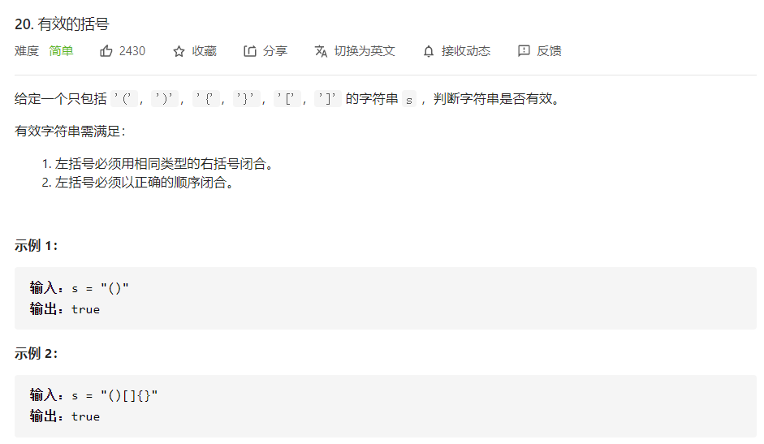
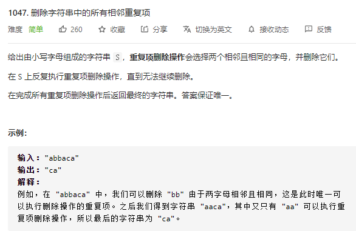
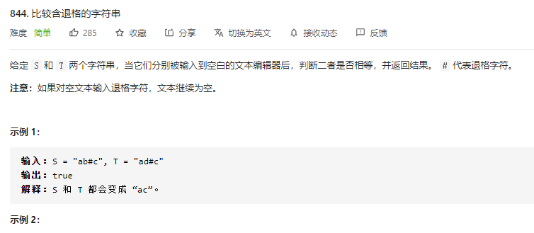
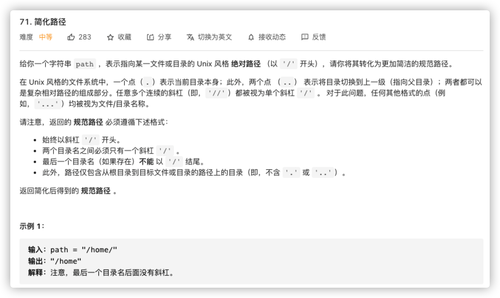
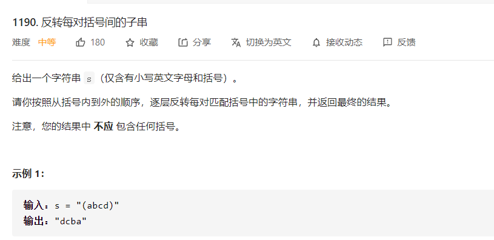
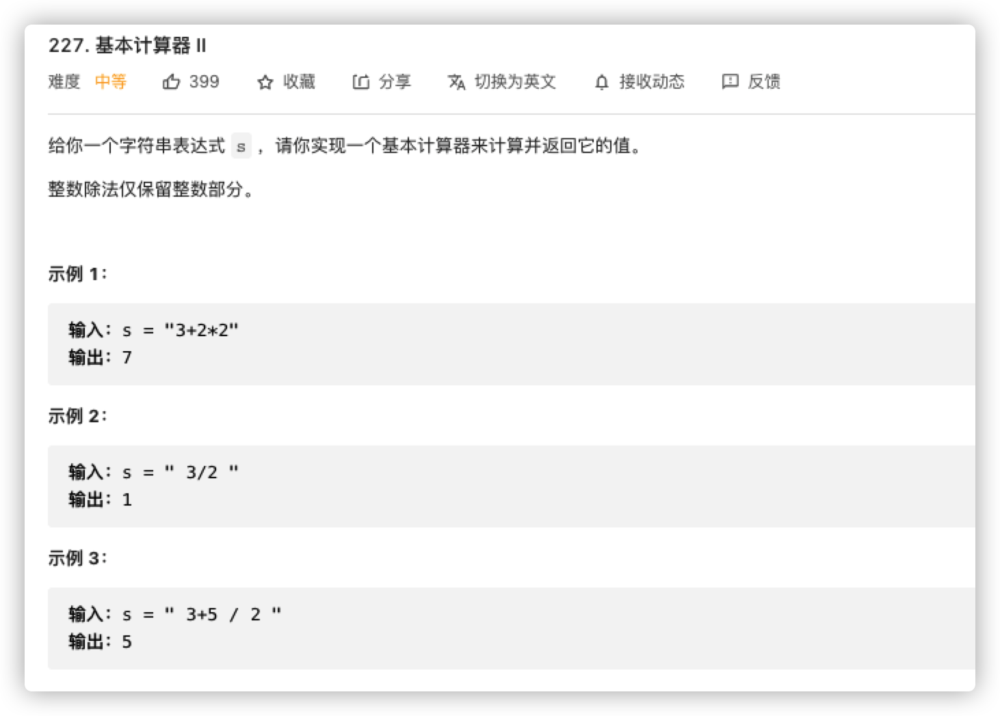
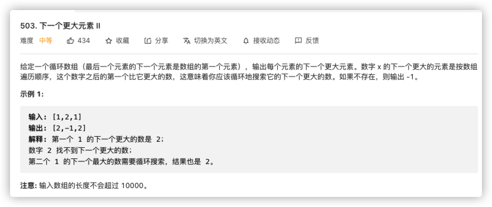
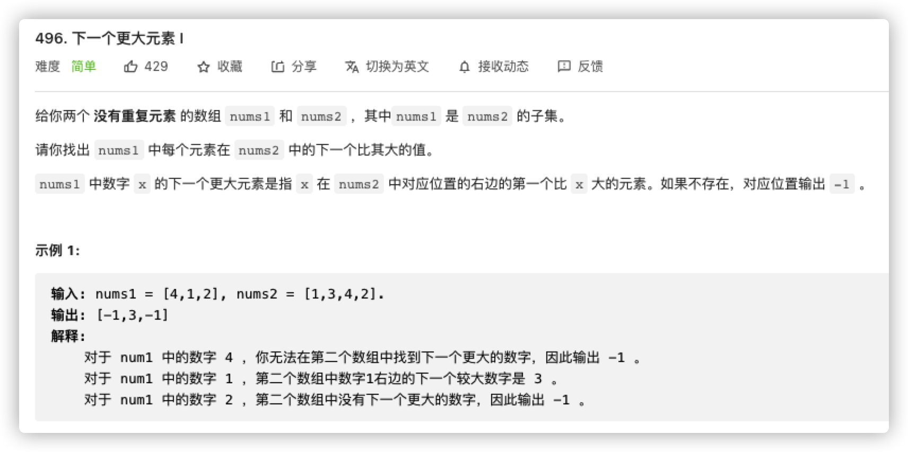
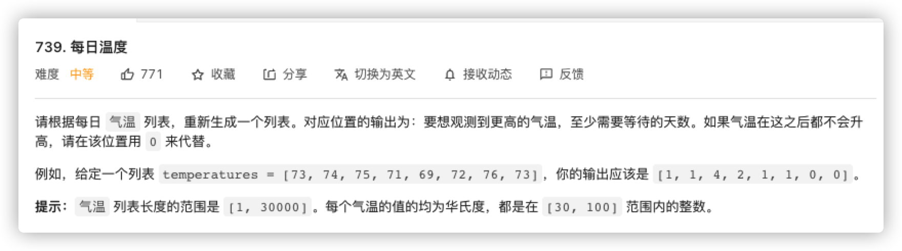
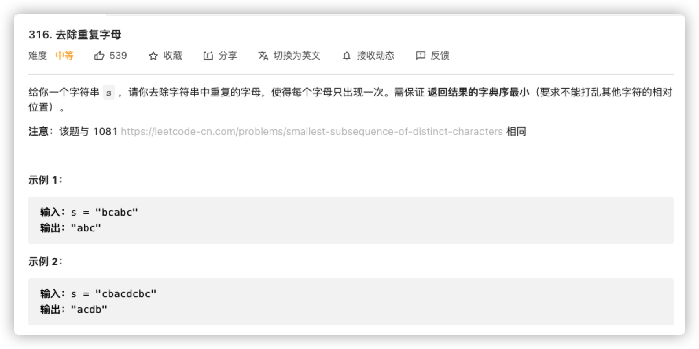

# 栈

| 特点 | 描述               | 利用                                       |
| ---- | ------------------ | ------------------------------------------ |
| 倒序 | 后进先出           | 全部压栈然后弹出                           |
| 缓冲 | 压栈不出，当做存储 | 标识压入，数据缓冲<br />标识弹出，数据处理 |

# 基础使用



```java
// time: O(n)
// stace: O(n)
class Solution {
    Map<Character, Character> match = new HashMap<>(){
        {
            put(']', '[');
            put('}', '{');
            put(')', '(');
        }
    };
    public boolean isValid(String s) {
        char ch;
         Stack<Character> stack = new Stack<>();
        for(int i = 0; i < s.length(); i++){
            ch = s.charAt(i);
            if(match.containsKey(ch)){
                if(stack.isEmpty() || stack.pop() != match.get(ch)){
                    return false;
                }
            } else {
                stack.push(ch);
            }
        }
        return stack.isEmpty();
    }
}
```



```java
class Solution {
    public String removeDuplicates(String s) {
		Stack<Character> stack = new Stack<>();
        char ch;
        for(int i = 0; i < s.length(); i++){
            ch = s.charAt(i);
            if(stack.isEmpty() || stack.peek() != ch){
                stack.push(ch);
            } else {
                stack.pop();
            }
        }
        StringBuilder sb = new StringBuilder();
        while(!stack.isEmpty()){
            sb.append(stack.pop());
        }
        return sb.reverse().toString();
    }
}
```



```java
class Solution {
    public boolean backspaceCompare(String s, String t) {
		Stack<Character> ss = toStack(s);
        Stack<Character> ts = toStack(t);
        if(ss.size() != ts.size()) return false;
        while(!ss.isEmpty()){
            if(ss.pop() != ts.pop()) return false;
        }
        return true;
    }
    
    public Stack<Character> toStack(String s){
        Stack<Character> stack = new Stack<>();
        char ch;
        for(int i = 0; i < s.length(); i++){
            ch = s.charAt(i);
            if('#' == ch){
                if(!stack.isEmpty()){
                    stack.pop();
                }
            } else {
                stack.push(ch);
            }
        }
        return stack;
    }
}
```



```java
// time: O(n)
// stace: O(n)
class Solution {
    public String simplifyPath(String path) {
        String[] dirs = path.split("/");
        Deque<String> deque = new LinkedList<>();
        for(String dir: dirs){
            if("".equals(dir) || ".".equals(dir)) continue;
            if("..".equals(dir)){
                if(!deque.isEmpty()){
                    deque.pollLast();
                }
            } else {
                deque.offerLast(dir);
            }
        }
        if(deque.isEmpty()) return "/";
        StringBuilder sb = new StringBuilder();
        while(!deque.isEmpty()){
            sb.append("/").append(deque.pollFirst());
        }
        return sb.toString();
    }
}
```

# 缓冲区间



```java
// 这里主要演示stack的缓冲作用，但是toCharArray以后，使用指针操作会更方便
// time : O(n)
// space: O(n)
class Solution {
    public String reverseParentheses(String s) {
        Stack<Character> stack = new Stack<>();
        Deque<Character> deque = new LinkedList<>();
        char c;
        for(int i =0 ; i < s.length(); i++){
            c = s.charAt(i);
            if(c == ')'){
                deque.clear();
                while('(' != (c = stack.pop())){
                    deque.addLast(c);
                }
                while(!deque.isEmpty()){
                    stack.push(deque.pollFirst());
                }
            } else {
                stack.push(c);
            }
        }
        StringBuilder sb = new StringBuilder();
        while(!stack.isEmpty()){
            sb.append(stack.pop());
        }
        return sb.reverse().toString();
    }
}
```



```java
// time: O(n)
// stack: O(n)
class Solution {
    public int calculate(String s) {
        Stack<Integer> stack = new Stack<>();
        int value = 0;
        char lastOp = '+';
      	// 防止最后一个数据不入栈
        for(char ch: (s+"+").toCharArray()){
            if(ch == ' ') continue;;
            if(Character.isDigit(ch)){
                value = value * 10 + ch - '0';
            } else {
                switch (lastOp){
                    case '+': stack.push(value);break;
                    case '-': stack.push(-value);break;
                    case '*': stack.push(stack.pop()* value); break;
                    case '/': stack.push(stack.pop() / value); break;
                }
                value = 0;
                lastOp = ch;
            }
        }
        int sum = 0;
        while(stack.isEmpty()){
            sum += stack.pop();
        }
        return sum;
    }
}
```

# 特殊压栈

> 每次压栈并非一定压原数据，构造特殊元素压栈，更容易解决问题



```java
// time: O(n)
// space: O(n)
class Solution {
    public int[] nextGreaterElements(int[] nums) {
      int length = nums.length;
			int[] res = new int[length];
      Arrays.fill(res, -1);
      Stack<Integer> stack = new Stack<>();
      for(int i = 0, j; i < 2 * length; i++){
        j = i % length;
        while(!stack.isEmpty() && nums[stack.peek()] < nums[j]){
          res[stack.pop()] = nums[j];
        }
        stack.push(j);
      }
      return res;
    }
}
```



```java
// time: O(n)
// space: O(n)
class Solution {
    public int[] nextGreaterElement(int[] nums1, int[] nums2) {
        Map<Integer, Integer> idx = new HashMap<>();
        for(int i = 0; i < nums2.length; i++){
            idx.put(nums2[i], i);
        }
        int[] nums2NextGreater = nextGreaterElements(nums2);
        for(int i = 0; i < nums1.length; i++){
            nums1[i] = nums2NextGreater[idx.get(nums1[i])];
        }
        return nums1;
    }
    public int[] nextGreaterElements(int[] nums) {
      int length = nums.length;
			int[] res = new int[length];
      Arrays.fill(res, -1);
      Stack<Integer> stack = new Stack<>();
      for(int i = 0; i < length; i++){
        while(!stack.isEmpty() && nums[stack.peek()] < nums[i]){
          res[stack.pop()] = nums[i];
        }
        stack.push(i);
      }
      return res;
    }
}
```



```java
// time: O(n)
// space: O(n)
class Solution {
    public int[] dailyTemperatures(int[] temperatures) {
        int length = temperatures.length;
        int[] res = new int[length];
        Stack<Integer> stack = new Stack<>();
        for(int i = 0, j; i < length; i++){
            while(!stack.isEmpty() && temperatures[stack.peek()] < temperatures[i]){
                res[(j = stack.pop())] = i - j; 
            }
            stack.push(i);
        }
        return res;
    }
}
```



```java
// time: O(n)
// space: O(1) 26字符
class Solution {
    public String removeDuplicateLetters(String s) {
        boolean[] vis = new boolean[26];
        int[] num = new int[26];
        for (int i = 0; i < s.length(); i++) {
            num[s.charAt(i) - 'a']++;
        }

        StringBuffer sb = new StringBuffer();
        for (int i = 0; i < s.length(); i++) {
            char ch = s.charAt(i);
            if (!vis[ch - 'a']) {
                while (sb.length() > 0 && sb.charAt(sb.length() - 1) > ch) {
                    if (num[sb.charAt(sb.length() - 1) - 'a'] > 0) {
                        vis[sb.charAt(sb.length() - 1) - 'a'] = false;
                        sb.deleteCharAt(sb.length() - 1);
                    } else {
                        break;
                    }
                }
                vis[ch - 'a'] = true;
                sb.append(ch);
            }
            num[ch - 'a'] -= 1;
        }
        return sb.toString();
    }
}
```

