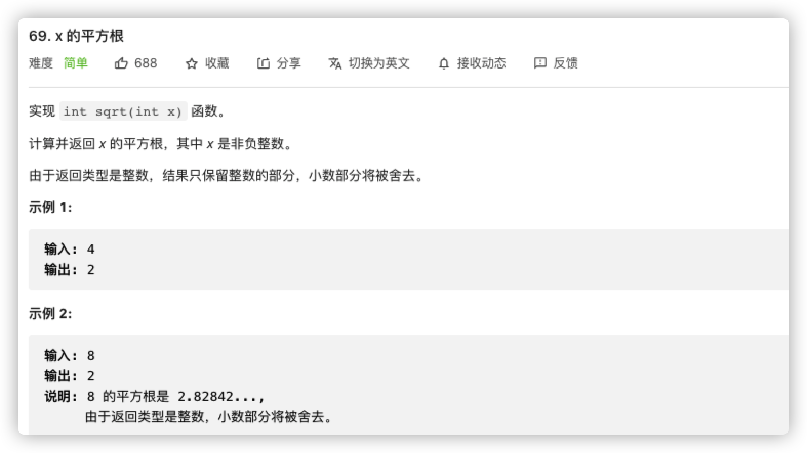

# 二分查找

| 特点     | 描述                                       | 使用                                                         |
| -------- | ------------------------------------------ | ------------------------------------------------------------ |
| 数据二分 | 对于数据集而言，每次筛查都能够屏蔽一半数据 | 更新筛查范围，``O(logn)``                                    |
| 双端边界 | 涉及区局边界的收缩，每次都会移动边界       | 大多数场景下，并不直接收缩数据集<br />经常在固定数据集上面设置边界标识，如双指针 |


```java
// time: O(logn)
// space: O(1)
class Solution {
    public int search(int[] nums, int target) {
        int left = 0, right = nums.length - 1, mid;
        while(left <= right){
            if(nums[left] == target) return left;
            if(nums[right] == target) return right;
            mid = left + (right - left) / 2;
            if(nums[mid] == target) return mid;
            if(nums[mid] > target) {
                left += 1;
                right = mid - 1;
            } else {
                right -= 1;
                left = mid + 1;
            }
        }
        return -1;
    }
}
```


```java
// time: O(logn)
// space: O(1)
class Solution {
    public int searchInsert(int[] nums, int target) {
        if(target <= nums[0]) return 0;
        int right = nums.length - 1;
        if(target > nums[right]) return right + 1;
        int left = 0, mid;
        while(nums[left] < target){
            mid = left + (right - left) / 2;
            if(nums[mid] < target){
                left = mid + 1;
            } else {
                right = mid;
            }
        }
        return left;
    }
}
```



```java
// time: O(logn)
// space: O(1)
class Solution {
    public int mySqrt(int x) {
        if(x < 2) return x;
        int left = 0, right = x / 2, mid;
        double res;
        while(left <= right){
            res = Math.pow(left, 2);
            if(res == x) return left;
            res = Math.pow(right, 2);
            if(res == x) return right;
            mid = left + (right - left) / 2;
            res = Math.pow(mid, 2);
            if(res == x) return mid;
            if(res > x){
                right = mid - 1;
            } else {
                left = mid + 1;
            }
        }
        return right;
    }
}
```

# 特殊转换

前面都是基于基础的元素二分查找，但是二分的核心含义是元素二分，而不仅是数值的二分，只要是存在二分条件都可以。

某些场景下，需要我们自己构建特殊的二分逻辑。


```java
// 对long位运算有问题
// time: O(logn)
// space: O(logn)
class Solution {
    public double myPow(double x, int n) {
        long N = n;
        return N >= 0 ? doPow(x, N) : 1.0 / doPow(x, -N);
    }

    public double doPow(double x, long N) {
        if (N == 0) {
            return 1.0;
        }
        double y = doPow(x, N / 2);
        return (N % 2) == 0 ? y * y : y * y * x;
    }
}

```


```java
// time: O(logn)
// space: O(1)
class Solution {
    public int divide(int dividend, int divisor) {
        if(dividend == Integer.MIN_VALUE && divisor == -1) return Integer.MAX_VALUE;
        long divid = (int)dividend;
        long divis = (int)divisor;

        boolean flag = true;
        long temp, result = 1, ans = 0;

        if(divid < 0 && divis > 0){
            divid = - divid; 
            flag = false;
        } else if(divid > 0 && divis < 0){
            divis = - divis;
            flag = false;
        } else if(divid < 0 && divis < 0){
            divid = - divid;
            divis = - divis;
        }
        while(divid - divis >= 0){
            temp = divis << 1;
            result = 1;
            while(divid - temp >= 0){
                result = result << 1;
                temp = temp << 1;
            }
            divid -= temp >> 1;
            ans += result;
        }
        if(flag) return (int)ans;
        return (int)-ans;
    }
}

```


```java
// 双边查找可转换为双分支的单边查找
// time: O(logn)
// space: O(logn)
public class Solution {
    public int findPeakElement(int[] nums) {
        return search(nums, 0, nums.length - 1);
    }
    public int search(int[] nums, int l, int r) {
        if (l == r)
            return l;
        int mid = (l + r) / 2;
        if (nums[mid] > nums[mid + 1])
            return search(nums, l, mid);
        return search(nums, mid + 1, r);
    }
}
```


```java
// 虽然看似旋转变难了，但是数据还是可以二分，无影响
// time: O(logn)
// space: O(1)
class Solution {
    public int search(int[] nums, int target) {
        int n = nums.length;
        if (n == 0) {
            return -1;
        }
        if (n == 1) {
            return nums[0] == target ? 0 : -1;
        }
        int l = 0, r = n - 1;
        while (l <= r) {
            int mid = (l + r) / 2;
            if (nums[mid] == target) {
                return mid;
            }
            if (nums[0] <= nums[mid]) {
                if (nums[0] <= target && target < nums[mid]) {
                    r = mid - 1;
                } else {
                    l = mid + 1;
                }
            } else {
                if (nums[mid] < target && target <= nums[n - 1]) {
                    l = mid + 1;
                } else {
                    r = mid - 1;
                }
            }
        }
        return -1;
    }
}
```


```java
// 涉及重复数据，无法纯粹二分
// time: O(n) 无法纯粹二分，全部数据相等且不为target，需要全部遍历
// space: O(1)
class Solution {
    public boolean search(int[] nums, int target) {
        int n = nums.length;
        if (n == 0) return false;
        if (n == 1) return nums[0] == target;
        int l = 0, r = n - 1, mid;
        while (l <= r) {
            mid = l + (r - l) / 2;
            if (nums[mid] == target) return true;
            if (nums[l] == nums[mid] && nums[mid] == nums[r]) {
                ++l;
                --r;
            } else if (nums[l] <= nums[mid]) {
                if (nums[l] <= target && target < nums[mid]) {
                    r = mid - 1;
                } else {
                    l = mid + 1;
                }
            } else {
                if (nums[mid] < target && target <= nums[n - 1]) {
                    l = mid + 1;
                } else {
                    r = mid - 1;
                }
            }
        }
        return false;
    }
}
```

