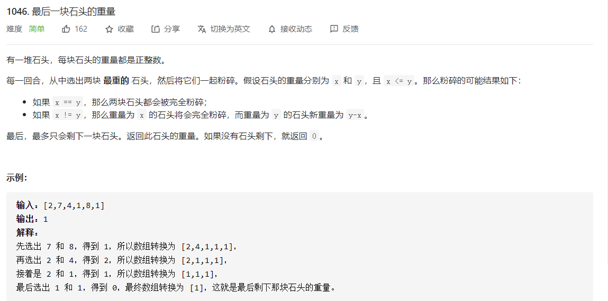
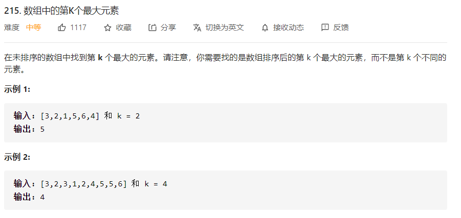
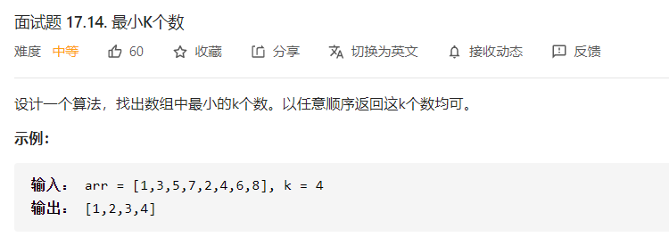
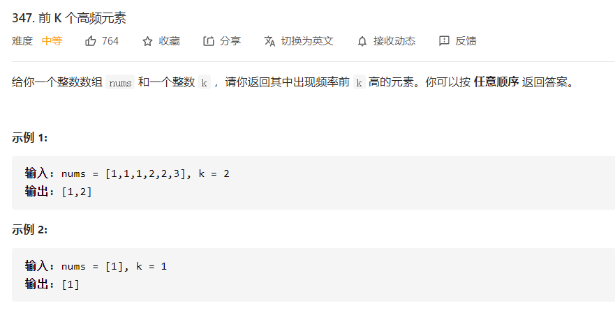
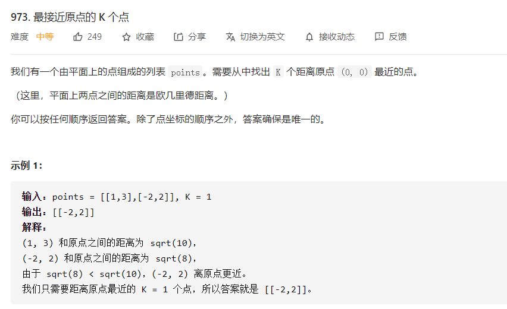
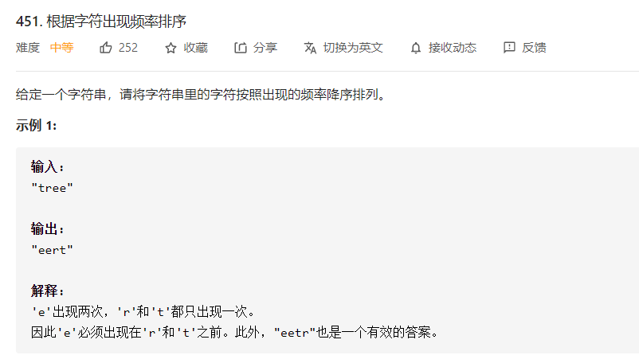

# 堆

| 特点     | 详解                                 | 利用                                                         |
| -------- | ------------------------------------ | ------------------------------------------------------------ |
| 极值顶   | 堆顶元素最大或者最小                 | 设置容量上限，取得其中最小值``O(1)``<br />流式计算过程中，相当于是第``k``大/小的值<br />空间消耗``O(k)`` |
| 单值顺序 | 内部并不维护有序集合，仅针对堆顶筛选 | 无需严格排序，节约计算消耗                                   |

# 堆顶比对



```java
// time: O(n)
// space: O(n)
class Solution {
    public int lastStoneWeight(int[] stones) {
        PriorityQueue<Integer> stoneQueue = new PriorityQueue<>(Comparator.comparingInt(a->-a));
        for(int stone: stones){
            stoneQueue.offer(stone);
        }
        int delta;
        while(stoneQueue.size() > 1){
            delta = stoneQueue.poll() - stoneQueue.poll();
            if(delta != 0) stoneQueue.offer(delta);
        }
        return stoneQueue.isEmpty() ? 0 : stoneQueue.poll();
    }
}
```

# 元素极值



```java
// 时间: O(n)
// 空间: O(k)
class Solution {
    public int findKthLargest(int[] nums, int k) {
        PriorityQueue<Integer> integers = new PriorityQueue<>();
        for(int num: nums){
            integers.add(num);
            // 需要添加k+1个元素，筛选第k个元素
            if(integers.size() > k){
                integers.poll();
            }
        }
        return integers.peek();
    }
}
```

> 不仅是第``k``个，实际上存储的是前``k``个，但并非严格有序。



```java
// time: O(n)
// space: O(1)
class Solution {
    public int[] smallestK(int[] arr, int k) {
        PriorityQueue<Integer> pq = new PriorityQueue<>(Comparator.comparingInt(a->-a));
        for(int v: arr){
            pq.offer(v);
            if(pq.size() > k) pq.poll();
        }
        int[] res = new int[pq.size()];
        for(int i = 0; !pq.isEmpty(); i++){
            res[i] = pq.poll();
        }
        return res;
    }
}
```

# 特殊值堆

并非所有时刻都是直接对数据进行判断，就和最小堆一样，有时候需要构造中间数据。



```java
// 时间: O(n)
// 空间: O(n)
class Solution {
    public int[] topKFrequent(int[] nums, int k) {
        if(nums.length == 1) return nums;
        Map<Integer, Integer> counter = new HashMap<>();
        for(int num: nums){
            counter.put(num, counter.getOrDefault(num, 0)+1);
        }
        PriorityQueue<Integer> integers = new PriorityQueue<>(Comparator.comparing(counter::get));
        for(int num: counter.keySet()){
            integers.add(num);
            if(integers.size() > k){
                integers.poll();
            }
        }
        int[] res = new int[k];
        for(int i = 0; i < k; i++){
            res[i] = integers.poll();
        }
        return  res;
    }
}
```



```java
// 时间: O(n)
// 空间: O(k)
class Solution {
    int[][] points;
    public int[][] kClosest(int[][] points, int k) {
        this.points = points;
        int[][] res = new int[k][2];
        PriorityQueue<Integer> integers = new PriorityQueue<>((a, b) -> (int) (distanceSquare(b) - distanceSquare(a)));
        for(int i = 0; i < points.length; i++){
            integers.add(i);
            if(integers.size() > k){
                integers.poll();
            }
        }
        for(int i = 0; i < k; i++){
            res[i] = points[integers.poll()];
        }
        return res;
    }
	// 更好情况下可以对数据进行归一化，避免溢出
    double distanceSquare(int index){
        int[] point = points[index];
        return Math.pow(point[0], 2) + Math.pow(point[1], 2);
    }
}
```



```java
// 时间: O(n)
// 空间: O(n)
class Solution {
    public String frequencySort(String s) {
        Map<Character, Integer> counter = new HashMap<>();
        for(int i = 0; i < s.length(); i++){
            char ch = s.charAt(i);
            counter.put(ch, counter.getOrDefault(ch, 0) + 1);
        }
        PriorityQueue<Character> characters = new PriorityQueue<>((c1, c2)-> counter.get(c2) - counter.get(c1));
        for(Character ch: counter.keySet()){
            characters.add(ch);
        }
        StringBuilder sb = new StringBuilder();
        while(!characters.isEmpty()){
            char ch = characters.poll();
            for(int i = 0; i < counter.get(ch); i++){
                sb.append(ch);
            }
        }
        return sb.toString();
    }
}
```

