# 位运算

## 真值运算

- ``and``：都为真结果为真

| a    | b    | a&b  |
| ---- | ---- | ---- |
| 0    | 0    | 0    |
| 0    | 1    | 0    |
| 1    | 0    | 0    |
| 1    | 1    | 1    |

- ``or``：其中一个为真，结果为真

| a    | b    | a\|b |
| ---- | ---- | ---- |
| 0    | 0    | 0    |
| 0    | 1    | 1    |
| 1    | 0    | 1    |
| 1    | 1    | 1    |

- ``not``：真则假，假则真

| a    | !a   |
| ---- | ---- |
| 0    | 1    |
| 1    | 0    |

- ``xor``：相同为假，相异为真

| a    | b    | a^b  |
| ---- | ---- | ---- |
| 0    | 0    | 0    |
| 0    | 1    | 1    |
| 1    | 0    | 1    |
| 1    | 1    | 0    |

## 移位运算

| operation  | equation    | description                                                  | 等效运算  |
| ---------- | ----------- | ------------------------------------------------------------ | --------- |
| 算数左移   | ``n << 1``  | 最高位符号位不动，``n``位有效移位为``n-1``位，低位补零，高位溢出丢弃 | ``2 * n`` |
| 算数右移   | ``n >> 1``  | 最高位符号位不动，``n``位有效移位为``n-1``位，高位补零，低位溢出丢弃 | ``n / 2`` |
| 无符号右移 | ``n >>> 1`` | 无符号位，``n``位有效移位为``n``位，高位补零，低位溢出丢弃   |           |

## 特殊操作

| 操作            | 结果          | 解释                                                         |
| --------------- | ------------- | ------------------------------------------------------------ |
| ``a ^ b ^ a``   | ``b``         | 同为0变为0， 同为1变为0<br />``a ^ a = 0``<br />``0 ^ b = b`` |
| ``x & (x - 1)`` | 剔除低位``1`` | 相减借位，消耗最低为1。<br />高位不变，低位情况变为``100 & 011``，低位全为0<br />如果``x & (x - 1) == 0``，仅存在唯一低位，则``x = 2 ^ n`` |
| ``x >> 1``      | ``x / 2``     |                                                              |
| ``x << 1``      | ``x * 2``     |                                                              |
| ``x & 1``       | ``x & 2``     | 二进制中，奇数只能依赖最低为补充``1``<br />如果低位为``0``，可以看作是``n << 1 = n * 2``，因此可以直接判断奇偶<br />``n % 2``：``O(logn)``<br />``n&1``：``O(1)`` |
| ``x & -x``      | 获取低位1     | 负数总是以补码形式存在，即每一取反，然后加1，``!x + 1``<br />因此，在补码``+1``的基础上再``+1``，必然会进位到最低一位<br />如果高位继续进位，则被``&``消去，最多只能保留最低一位<br />如果``x & -x == x``，说明``x``仅有一位 |

# 基础移位

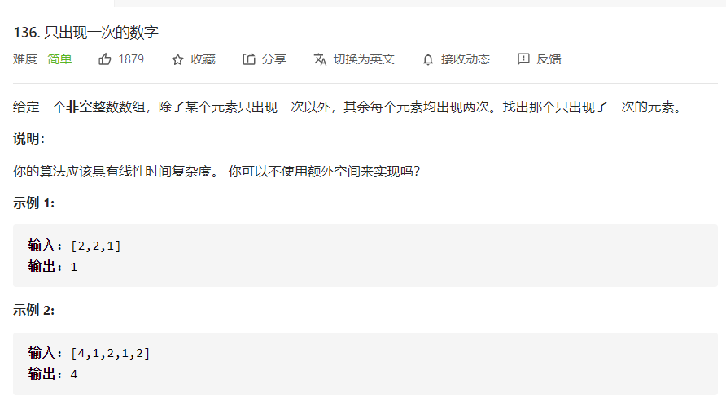

```java
// 直接利用特性
// time: O(n)
// space: O(1)
class Solution {
    public int singleNumber(int[] nums) {
        int res = 0;
        for(int num: nums){
            res = res ^ num;
        }
        return res;
    }
}
```

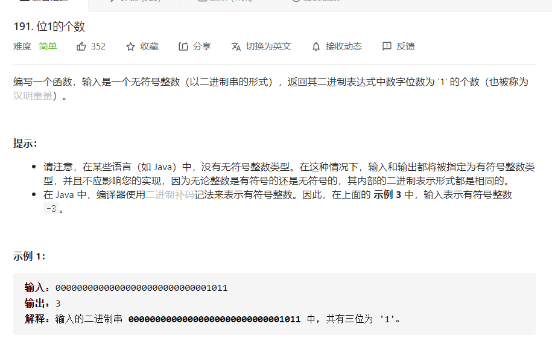

```java
// 最高位作为符号位，直观理解就是会出现+0和-0的情况，使用-0表示-2^n,因此，对于n位数据，一般的范围为[-2^n, 2^n-1]
// 当进(退)位到符号位，也就是溢出的情况下,符号位也会被消去
// 因此，不必判断正负数，通过负数溢出终止即可
// time: O(logn)
// space: O(1)
public class Solution {
    public int hammingWeight(int n) {
        int ret = 0;
        while (n != 0) {
            n &= n - 1;
            ret += 1;
           
        }
        return ret;
    }
}
```

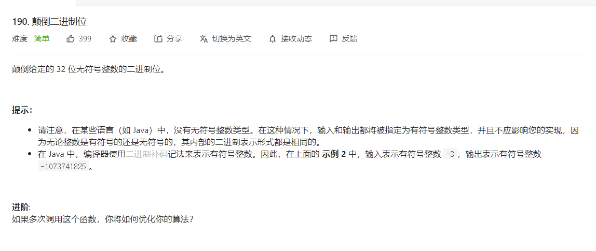

```java
// time: O(logn)
// space: O(1)
public class Solution {
    public int reverseBits(int n) {
        int rev = 0;
        for (int i = 0; i < 32 && n != 0; ++i) {
            rev |= (n & 1) << (31 - i);
            // 符号位
            n >>>= 1;
        }
        return rev;
    }
}

// f(32) => f(16) => f(8) => f(4) => f(2)
// s = l + r: reverse(s) = reverse(r) + reverse(l)
// time: O(1)
// space: O(1)
public class Solution {
    private static final int M1 = 0x55555555;  // 0101_0101_0101_0101_0101_0101_0101_0101
    private static final int M2 = 0x33333333;  // 0011_0011_0011_0011_0011_0011_0011_0011
    private static final int M4 = 0x0f0f0f0f;  // 0000_1111_0000_1111_0000_1111_0000_1111
    private static final int M8 = 0x00ff00ff;  // 0000_0000_1111_1111_0000_0000_1111_1111
    private static final int M16 = 0xffffffff; // 0111_1111_1111_1111_1111_1111_1111_1111

    public int reverseBits(int n) {
        n = n >>> 1  & M1 | (n & M1)  << 1;
        n = n >>> 2  & M2 | (n & M2)  << 2;
        n = n >>> 4  & M4 | (n & M4)  << 4;
        n = n >>> 8  & M8 | (n & M8)  << 8;
        n = n >>> 16 & M16| (n & M16) << 16;
        return n;
    }
}
```

上述操作可以结合``hash``中的扩容操作

```java
// 低位全填充1，达到+1进位的目的
// 每次移动，都是在上次基础上进行移动
static final int tableSizeFor(int cap) {
        int n = cap - 1;
        n |= n >>> 1;  // 1
        n |= n >>> 2;  // 2
        n |= n >>> 4;  // 4
        n |= n >>> 8;  // 8
        n |= n >>> 16; // 16
        return (n < 0) ? 1 : (n >= MAXIMUM_CAPACITY) ? MAXIMUM_CAPACITY : n + 1; // +1进位
}
```

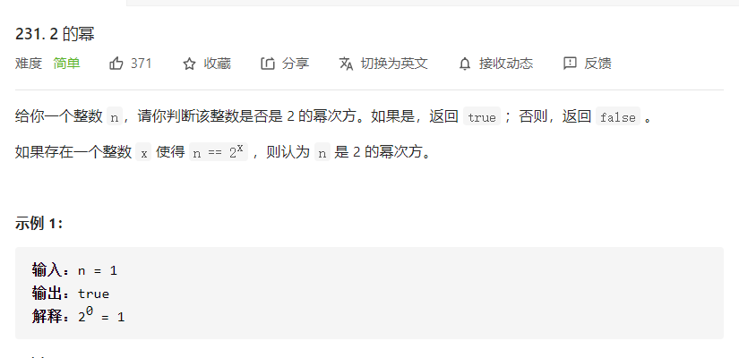

```java
// 直接判断
// time: O(1)
class Solution {
    public boolean isPowerOfTwo(int n) {
        return n > 0 ? 0 == (n & (n - 1)) : false;
    }
}
```

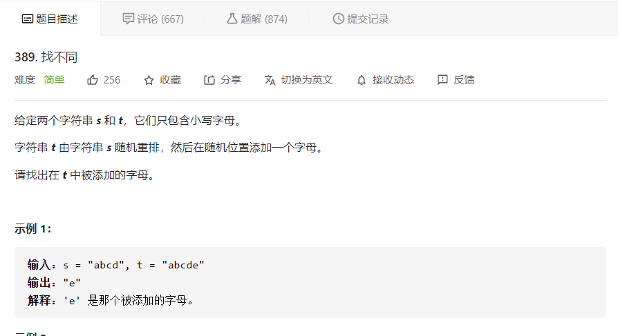

```java
// time: O(n)
// space: O(1)
class Solution {
    public char findTheDifference(String s, String t) {
        char res = 0;
        for(int i =0; i < s.length(); i++){
            res ^= s.charAt(i);
        }
        for(int i = 0; i < t.length(); i++){
            res ^= t.charAt(i);
        }
        return res;
    }
}
```

# 位运算+

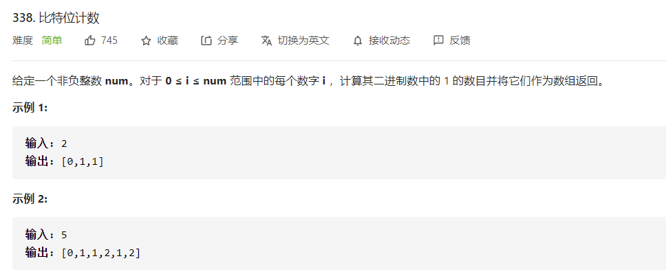

```java
// 基础的数据可以生成两个数据：2n, 2n+1
// time: O(n)
// space: O(1)
class Solution {
    public int[] countBits(int n) {
        int[] res = new int[n+1];
        for(int i = 1; i<= n; i++){
            res[i] = res[i>>1] + (i&1);
        }
        return res;
    }
}

// 还可以从最低有效位开始，当前数据一定大于剔除最低有效位的数
// time: O(n)
// space: O(1)
class Solution {
    public int[] countBits(int n) {
        int[] res = new int[n+1];
        for(int i = 1; i<= n; i++){
            res[i] = res[i &( i - 1)] + 1;
        }
        return res;
    }
}
```

> 位运算还有一个特殊功能，那就是数据缓冲，或者说类似于频分复用或者码分复用的感觉。
>
> 通过编码的混杂能够减少部分的空间占用，比如两个数据交换
>
> ```java
> public void swap(int[] arr, int a, int b){
>     arr[a] ^= arr[b]; // a = a ^ b
>     arr[b] ^= arr[a]; // b = b ^ a ^ b = a
>     arr[a] ^= arr[b]; // a = a ^ b ^ a = b
> }
> ```

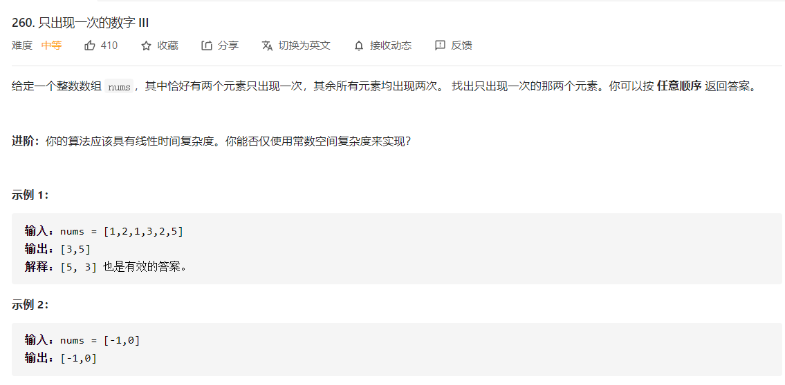

```java
// 知道 a^b的情况下，知道了其中一个，另一个就相当于知道了
// 将XOR的标志位获取，如果其中一位为1，表明存在一位二进制是不同的
// 因为其他数据都是成双成对，分组以后，相当于每组中只有一个不重复数
// time: O(n)
// space: O(1)
class Solution {
    public int[] singleNumber(int[] nums) {
        int XOR = 0;
        for(int num: nums){
            XOR ^= num;
        }
        int flag = 1;
        while((flag & XOR) == 0){
            flag = flag << 1;
        }
        int a = 0, b = 0;
        for(int num: nums){
            if((flag & num) == 0){
                a ^= num;
            } else {
                b ^= num;
            }
        }
        return new int[]{a, b};
    }
}
```

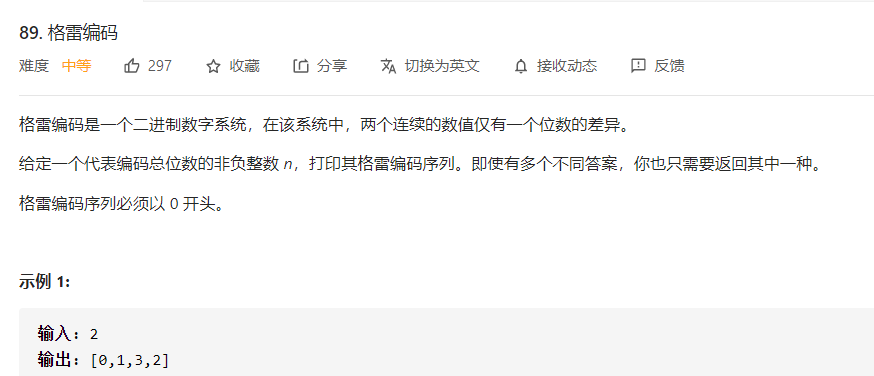

```java
// 1. 每层生成的数据，其实都是上一层最高位+1
// 2. 进位会导致数据跳变，因此每层需要颠倒顺序
// time: O(n)
// space: O(1)
class Solution {
    public List<Integer> grayCode(int n) {
        List<Integer> res = new ArrayList<Integer>() {{ add(0); }};
        int head = 1;
        for (int i = 0; i < n; i++) {
            for (int j = res.size() - 1; j >= 0; j--)
                res.add(head + res.get(j));
            head <<= 1;
        }
        return res;
    }
}
```

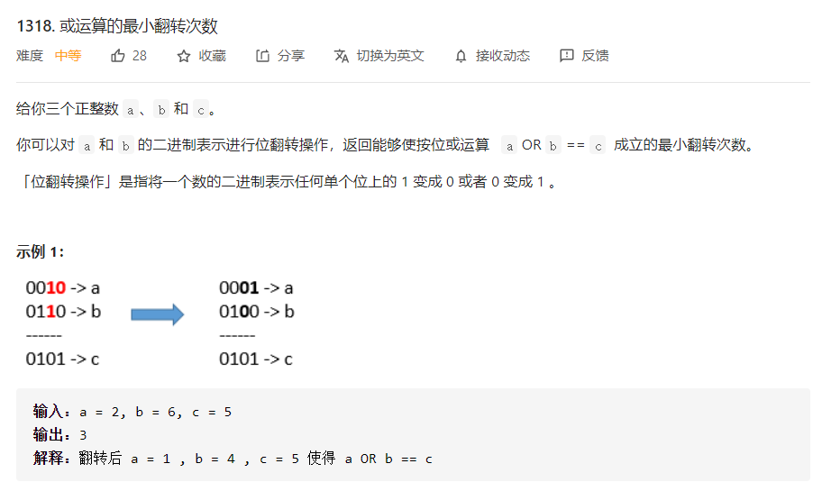

```java
// time: O(n)
// space: O(1)
class Solution {
    public int minFlips(int a, int b, int c) {
        int ans = 0;
        for (int i = 0; i < 31; ++i) {
            int bit_a = (a >>> i) & 1;
            int bit_b = (b >>> i) & 1;
            int bit_c = (c >>> i) & 1;
            if (bit_c == 0) {
                // 0不用修改， 1需要修改
                ans += bit_a + bit_b;
            } else {
                // 只有0-0情况需要修改
                ans +=  (bit_a + bit_b == 0) ? 1 : 0;
            }
        }
        return ans;
    }
}
```

# 门电路

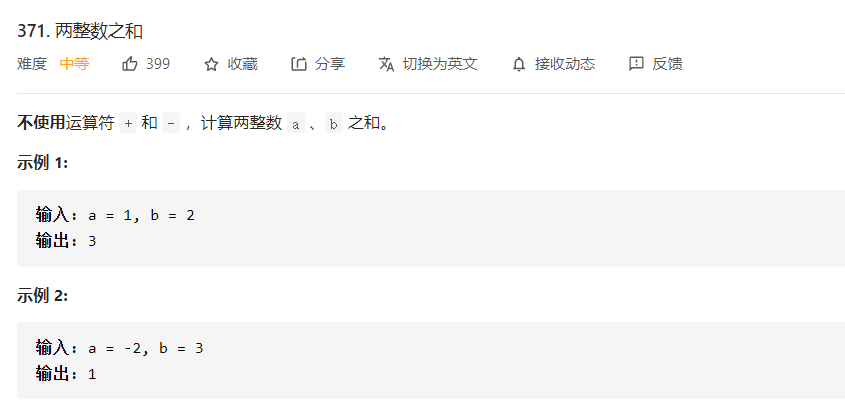

```java
// 无进位加法和进位合成
// time: O(n)
// space: (1)
class Solution {
    public int getSum(int a, int b) {
        int XOR = a ^ b;  			// 无进位加法
        int AND = (a & b) << 1; 	// 进位
        while (AND != 0) {		
            int temp = XOR & AND;	// 进位
            XOR = XOR ^ AND;		// 无进位加
            AND = temp << 1;		// 真实进位
        }
        return XOR;
    }
}

// 不带符号位的门电路
// 硬件的门电路有点坑，推荐使用dp，从抽象逻辑构建
class Solution {
    public int getSum(int a, int b) {
    	int c = 0, res = 0, detector;
        int[] sum;
        for(int i = 0; i < 31; i++){
            detector = 1 << i;
            sum = fullAddGate(a&detector, b&detector, c);
            res = res + (sum[1] << i);
            c = sum[0];
        }
        return res;
    }
    
	public int[] halfAddGate(int a, int b){
        return int[]{a&b, a^b};
    }
    
    public int[] fullAddGate(int a, int b, int c){
        int[] basic = halfAddGate(a, b);
        int[] carry = halfAddGate(basic[1], c);
        return new int[]{basic[0]|carry[0], carry[1]}
    }
}
```

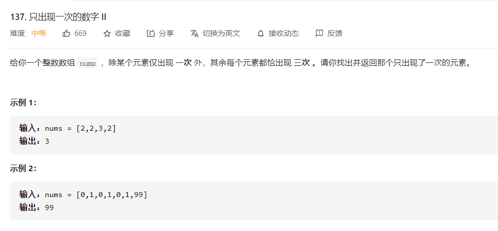

```java
// 对于每一位来说，sum%3 就是单独一次的元素的值，并不需要我们直接进行查找
// time: O(n)
// space: O(1)
class Solution {
    public int singleNumber(int[] nums) {
        int ans = 0;
        for (int i = 0; i < 32; ++i) {
            int total = 0;
            for (int num: nums) {
                total += ((num >> i) & 1);
            }
            if (total % 3 != 0) {
                ans |= (1 << i);
            }
        }
        return ans;
    }
}

// 门电路推导参考leetcode官方解释
// time: O(n)
// time: O(1)
class Solution {
    public int singleNumber(int[] nums) {
        int a = 0, b = 0;
        for (int num : nums) {
            b = ~a & (b ^ num);
            a = ~b & (a ^ num);
        }
        return b;
    }
}
```

详细门电路推到请参考[官方推导](https://leetcode-cn.com/problems/single-number-ii/solution/zhi-chu-xian-yi-ci-de-shu-zi-ii-by-leetc-23t6/)，这里只是做功能归纳。