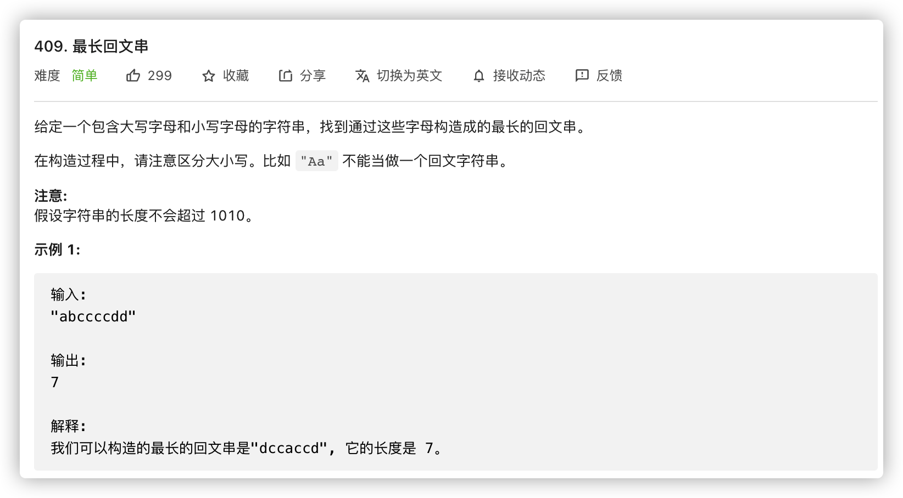
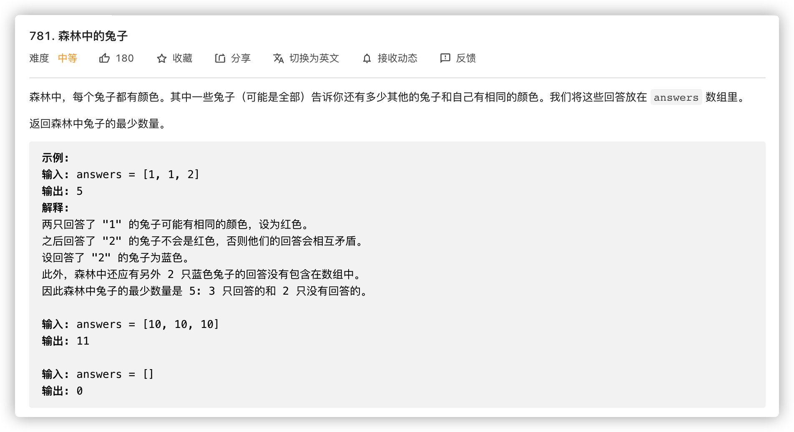
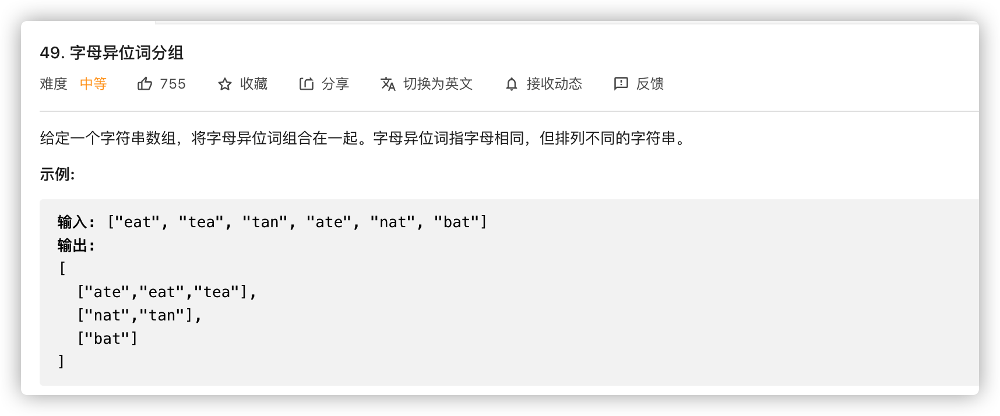
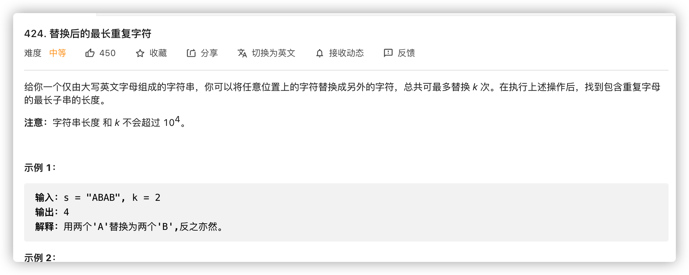

# 双指针与滑动窗口

双指针和滑动窗口，属于两种类别

| 方法     | 特征                     | 功用                                                         |
| -------- | ------------------------ | ------------------------------------------------------------ |
| 双指针   | 记录两个标记点，判断移动 | 1. 双端配合，链表快慢指针一类<br />2. 缓冲区间，回文一类，基于底层缓冲，构建``视图``<br />3. 滑动窗口，双端条件构造滑动窗口 |
| 滑动窗口 | 数据区间，条件滑动       | 1. 区间数据检测，区间长度不一定固定<br />2. 判断依据维护，区间长度不一定固定 |

# 简单窗口


```java
// 经典双指针题，核心在于滚动0，其中的0并非按照原有顺序
// time: O(n)
// space: O(1) 双指针经典样例，依赖底层数据区间，辅助空间只为记录指针
class Solution {
    public void moveZeroes(int[] nums) {
        int n = nums.length, left = 0, right = 0;
        while (right < n) {
            if (nums[right] != 0) {
                swap(nums, left, right);
                left++;
            }
            right++;
        }
    }

    public void swap(int[] nums, int left, int right) {
        int temp = nums[left];
        nums[left] = nums[right];
        nums[right] = temp;
    }
}
```


```java
// 经典双指针
// time: O(S)
// space: O(1)
class Solution {
    public boolean isPalindrome(String s) {
        int n = s.length();
        int left = 0, right = n - 1;
        while (left < right) {
            while (left < right && !Character.isLetterOrDigit(s.charAt(left))) {
                ++left;
            }
            while (left < right && !Character.isLetterOrDigit(s.charAt(right))) {
                --right;
            }
            if (left < right) {
                if (Character.toLowerCase(s.charAt(left)) != Character.toLowerCase(s.charAt(right))) {
                    return false;
                }
                ++left;
                --right;
            }
        }
        return true;
    }
}
```


```java
// 不想说话
// time: O(n)
// space: O(1)
class Solution {
    public void reverseString(char[] s) {
        int left = 0, right = s.length - 1;
        while(left < right){
            swap(s, left++, right--);
        }
    }

    public void swap(char[] chars, int a, int b){
        char ch = chars[a];
        chars[a] = chars[b];
        chars[b] = ch;
    }
}
```


```java
// 不能说毫无关系，只能说一毛一样
// time: O(n)
// space: O(1)
class Solution {
    public int removeElement(int[] nums, int val) {
        int nlength = 0, n = nums.length, left = 0, right = 0;
        while(right < n){
            if(nums[right] != val){
                nums[left++] = nums[right];
                nlength++;
            }
            right++;
        }
        return nlength;
    }
}
```


```java
// 筛选最大的逐个填充，没毛病，不过如果是原地排序的话需要更细节的判断
// time: O(n)
// space: O(1) 没说原地， 就结果而言，不算辅助空间
class Solution {
    public int[] sortedSquares(int[] nums) {
        int n = nums.length;
        int[] res = new int[n];
        int left = 0, right = n - 1, pos = right;
        while(left <= right){
             if (nums[left] * nums[left] > nums[right] * nums[right]) {
                res[pos--] = nums[left] * nums[left++];
            } else {
                res[pos--] = nums[right] * nums[right--];
            }
        }
        return res;
    }
}
```

# 滑动窗口


```java
// 窗口: 重复数据加测
// 双指针: 数据指针检测
// time: O(n ^ 2)
// space: O(n)
class Solution {
    public int firstUniqChar(String s) {
        Set<Character> duplicate = new HashSet<>();
        char ch;
        int length = s.length();
        outer: for(int left = 0; left < length; left++){
            if(duplicate.contains((ch = s.charAt(left)))) continue;
            for(int right = left + 1; right < length; right++){
               if(ch == s.charAt(right)){
                   duplicate.add(ch);
                   continue outer;
               } 
            }
            return left;
        }
        return -1;
    }
}

// 上述方案只是为了更多的体现滑动窗口配合双指针，更简单的办法直接维护新窗口
// time: O(n)
// space: O(1)
class Solution {
    public int firstUniqChar(String s) {
      	int length = s.length();
      	int[] count = new int[255];
      	for(int i = 0; i < length; i++){
          count[s.charAt(i)] += 1;
        }
      	for(int i = 0; i < length; i++){
          if(count[s.charAt(i)] == 1)
            return i;
        }
      	return -1; 
    }
}
```


```java
// 抛开滑动二字，更多的使用窗口来理解，它本身也是一种缓冲
// 窗口之间也可以进行交互运算
// time: O(max(M+N))
// space: O(min(M+N))
class Solution {
    public int[] intersection(int[] nums1, int[] nums2) {
        Set<Integer> set = new HashSet<>();
        for(int v: nums1){
            set.add(v);
        }
        Set<Integer> common = new HashSet<>();
        for(int v: nums2){
            if(set.contains(v)){
                common.add(v);
            }
        }
        if(common.isEmpty()) return new int[0];
        int[] res = new int[common.size()];
        int index = 0;
        for(int v: common){
            res[index++] = v;
        }
        return res;

    }
}
```


```java
// 构建新辅助数据，算窗口缓冲
// time: O(n)
// space: O(1)
class Solution {
    public int longestPalindrome(String s) {
        int length = s.length();
        int[] count = new int[255];
        for(int i = 0; i < length; i++){
            count[s.charAt(i)] += 1;
        }
        int res = 0;
        for(int v: count){
            if((v & 1) == 1){
                res += v - 1;
            } else {
                res += v;
            }
        }
        return res == length ? res : res + 1;
    }
}
```


```java
// 维护新窗口缓冲，舒服
// time: O(n)
// space: O(n) 可能从头到尾不重复
class Solution {
    public int lengthOfLongestSubstring(String s) {
        if(s == null || s.length() == 0) return 0;
        Set<Character> set = new HashSet<>();
        int left = 0, max = 1;
        char ch = s.charAt(0);
        set.add(ch);
        for(int right = 1; right < s.length(); right++){
            while(set.contains((ch = s.charAt(right)))){
                set.remove(s.charAt(left++));
            }
            set.add(ch);
            max = Math.max(set.size(), max);
        }
        return max;


    }
}
```



```java
// 1. 还有多少兔子: n+1(自身)
// 2. 如果大于i，颜色不重复，另算一组
// 3. 单数量兔子总数 = 组数 * 组容量
// time: O(n)
// space: O(group)
class Solution {
    public int numRabbits(int[] answers) {
        Map<Integer, Integer> count = new HashMap<Integer, Integer>();
        for (int y : answers) {
            count.put(y, count.getOrDefault(y, 0) + 1);
        }
        int ans = 0;
        for (Map.Entry<Integer, Integer> entry : count.entrySet()) {
            int y = entry.getKey(), x = entry.getValue();
            ans += (x + y) / (y + 1) * (y + 1);
        }
        return ans;
    }
}
```



```java
// 分组？当然选择map啦，关键在于构建唯一分组标识
// time: O(n(k+26)) 循环内循环要相乘，可能数量不多，长度贼长
// space: O(n(k+26))
class Solution {
    public List<List<String>> groupAnagrams(String[] strs) {
        Map<String, List<String>> map = new HashMap<String, List<String>>();
        for (String str : strs) {
            int[] counts = new int[26];
            int length = str.length();
            for (int i = 0; i < length; i++) {
                counts[str.charAt(i) - 'a']++;
            }
            StringBuffer sb = new StringBuffer();
            for (int i = 0; i < 26; i++) {
                if (counts[i] != 0) {
                    sb.append(counts[i]);
                    sb.append((char) ('a' + i));
                }
            }
            String key = sb.toString();
            List<String> list = map.getOrDefault(key, new ArrayList<String>());
            list.add(str);
            map.put(key, list);
        }
        return new ArrayList<List<String>>(map.values());
    }
}
```


```java
// 相较于区间求和，不如无脑累加求差来得方便
// time: O(n)
// space: O(n)
public class Solution {
    public int subarraySum(int[] nums, int k) {
        int count = 0, pre = 0;
        HashMap < Integer, Integer > mp = new HashMap < > ();
        mp.put(0, 1);
        for (int i = 0; i < nums.length; i++) {
            pre += nums[i];
            if (mp.containsKey(pre - k)) {
                count += mp.get(pre - k);
            }
            mp.put(pre, mp.getOrDefault(pre, 0) + 1);
        }
        return count;
    }
}
```


```java
// 非单一值求解，需要滑动，如果是定值或者极值，唯一检测，无需重复滑动更新
// time: O(n)
// space: O(1)
class Solution {
    public int numSubarrayProductLessThanK(int[] nums, int k) {
        if (k <= 1) return 0;
        int prod = 1, ans = 0, left = 0;
        for (int right = 0; right < nums.length; right++) {
            prod *= nums[right];
            while (prod >= k) prod /= nums[left++];
            ans += right - left + 1;
        }
        return ans;
    }
}
```



```java
// 双窗口: 1. 左右指针范围 2. 中间差异字符数量
// 可扩展: k不是字符数量而是字符类型?

// time: O(n)
// space: O(26)
class Solution {
    public int characterReplacement(String s, int k) {
        int[] num = new int[26];
        int n = s.length();
        int maxn = 0;
        int left = 0, right = 0;
        while (right < n) {
            num[s.charAt(right) - 'A']++;
            maxn = Math.max(maxn, num[s.charAt(right) - 'A']);
            if (right - left + 1 - maxn > k) {
                num[s.charAt(left) - 'A']--;
                left++;
            }
            right++;
        }
        return right - left;
    }
}
```


```java
// 特殊情况下，两头双指针遍历即可，免去固定单边O(n ^ 2)
// time: O(n)
// space: O(1)
public class Solution {
    public int maxArea(int[] height) {
        int l = 0, r = height.length - 1;
        int ans = 0;
        while (l < r) {
            int area = Math.min(height[l], height[r]) * (r - l);
            ans = Math.max(ans, area);
            if (height[l] <= height[r]) ++l;
            else --r;
        }
        return ans;
    }
}
```

