# 动态规划

动态规划，核心思想在于状态转移方程，优点像递归的分解过程，大多场景下，也和递归一起出现。

| 特点     | 说明                                                         | 例子                       |
| -------- | ------------------------------------------------------------ | -------------------------- |
| 边界条件 | 边界条件下可以直接计算                                       | ``f(0) = 1``               |
| 状态转移 | 非边界条件计算，都可以转化为之前计算的结果                   | ``f(n) = nf(n-1)``         |
| 辅助缓存 | 计算结果出现重复计算，缓存能够提升计算效率                   | ``f(n) = f(n-1) + f(n-2)`` |
| 结果暂存 | 不论是缓存还是结果复用，都可能涉及结果查询<br />可以利用递归进行值传递，也可以直接维护结果表 | ``sum[i] = sum[i-1] + i``  |

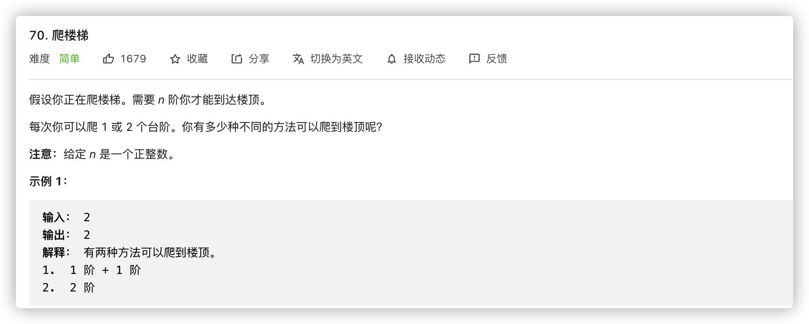

```java
// 直接使用结果暂存
// time: O(n)
// space: O(n)
class Solution {
    public int climbStairs(int n) {
        int[] res = new int[n+1];
        res[0] = 1;
        res[1] = 1;
        for(int i = 2; i <= n; i++){
            res[i] = res[i-1] + res[i-2];
        }
        return res[n];
    }
}

// 因为不涉及大跨度的数据查询，因此可以只维护两个变量即可
// dp中的计算不一定是连贯的，后续条件更新自动忽略dp状态连续
// time: O(n)
// space: O(1)
class Solution {
    public int climbStairs(int n) {
        int last = 1, current = 1, temp;
        for(int i = 2; i <= n; i++){
            temp = current;
            current += last;
            last = temp;
        }
        return current;
    }
}
```

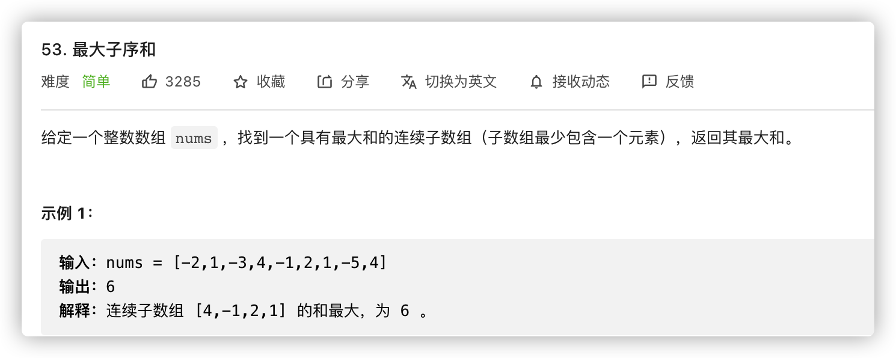

```java
// 这里dp的思想并不突出，更像是条件更新：1. 当累计增益低于当前值，取当前值 2. 更新最大值
// 使用dp的方式理解，更加麻烦，这里略过

// time: O(n)
// space: O(1)
class Solution {
    public int maxSubArray(int[] nums) {
        int max = nums[0], sum = nums[0];
        for(int i = 1; i < nums.length; i++){
            sum = Math.max(nums[i], nums[i] + sum);
            max = Math.max(max, sum);
        }
        return max;
    }
}
```

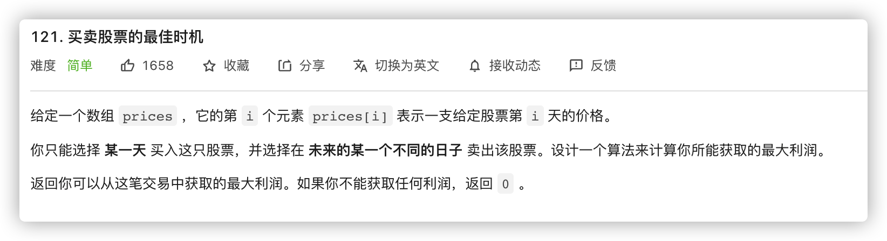

```java
// 同上一道题，都是条件更新，使用dp解释麻烦，这就自行理解了

// time: O(n)
// space: O(1)
class Solution {
    public int maxProfit(int[] prices) {
        int minPrice = prices[0], maxProfit = 0;
        for(int price: prices){
            maxProfit = Math.max(price - minPrice, maxProfit);
            minPrice = Math.min(minPrice, price);
        }
        return maxProfit;
    }
}
```

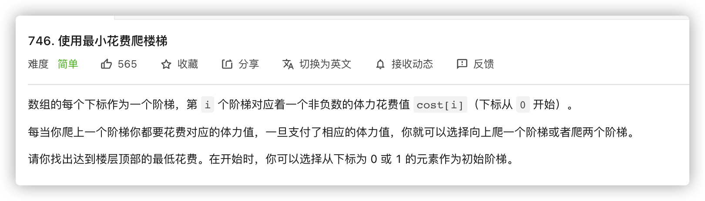

```java
// 一般来说，使用递归常将未知作为已知，依靠递归来代替查表，容易重复计算
// 直接使用结果表查询，要求先计算依赖的数值，单向向后累加，和递归方向相反，但是计算方向清晰简单

// time: O(n)
// space: O(n)
class Solution {
    public int minCostClimbingStairs(int[] cost) {
        int n = cost.length;
        int[] res = new int[n+1];
        res[0] = cost[0];
        res[1] = cost[1];
        for(int i = 2; i < n; i++){
            res[i] = Math.min(res[i-1], res[i-2]) + cost[i] ;
        }
        res[n] = Math.min(res[n-1], res[n-2]);
        return res[n];
    }
}
```


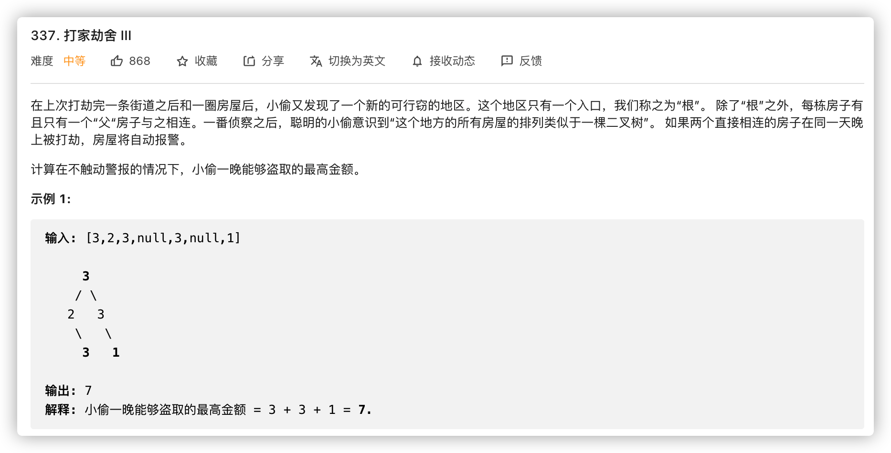

```java
// 非线性的dp不易维护，直接使用递归即可
// 树的递归一般有两种套路: 
//	1. 单节点判断: 每次都是针对单节点，计算不涉及子节点，直接展开递归
// 	2. 子节点对比: 计算涉及子节点，大多是对比形式，这种情况一般需要维护两个节点的递归展开，比如树相等和镜像判断
// 当前题目属于单个节点展开，区别在于选中和不选中的二值状态，但核心还是单节点，涉及多状态返回，而不是多递归展开

// time: O(n)
// space: O(n)
class Solution {
    public int rob(TreeNode root) {
        int[] rootStatus = dfs(root);
        return Math.max(rootStatus[0], rootStatus[1]);
    }

    public int[] dfs(TreeNode node) {
        if (node == null) {
            return new int[]{0, 0};
        }
        int[] l = dfs(node.left);
        int[] r = dfs(node.right);
        int selected = node.val + l[1] + r[1];
        int notSelected = Math.max(l[0], l[1]) + Math.max(r[0], r[1]);
        return new int[]{selected, notSelected};
    }
}
```

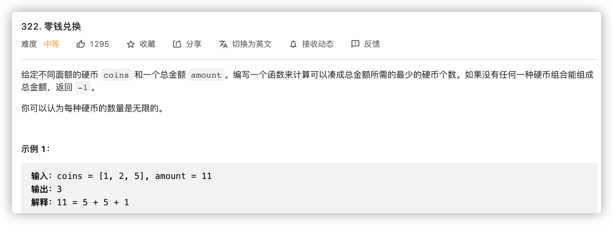

```java
// 使用数组维护dp结果时，有几个要点
// 	1. 可以使用下标作为关键索引记录信息
// 	2. 设计特殊边界值作为非法状态标记
//	3. 关联核心要素，很多非结果要素仅作为计算约束，和结果无关，避免被扰乱视听，如高楼抛鸡蛋

// time: O(CA)
// space: O(A)
public class Solution {
    public int coinChange(int[] coins, int amount) {
        int max = amount + 1;
        int[] dp = new int[amount + 1];
        Arrays.fill(dp, max);
        dp[0] = 0;
        for (int i = 1; i <= amount; i++) {
            for (int j = 0; j < coins.length; j++) {
                if (coins[j] <= i) {
                    dp[i] = Math.min(dp[i], dp[i - coins[j]] + 1);
                }
            }
        }
        return dp[amount] > amount ? -1 : dp[amount];
    }
}
```

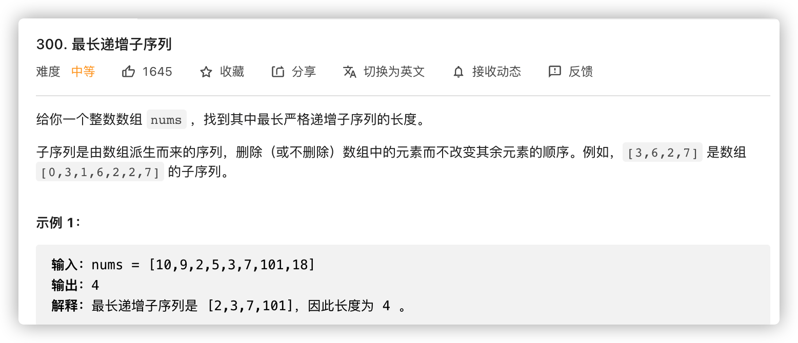

```java
// 乍看和起始点相关，但是前面说了，它只是一种计算约束，和结果无直接关系
// dp的核心在于计算的依赖性，或者说是结果的传递性: 如果当前数比一个数大，那么当前结果就是前面的结果+1,f(m|m>n) = f(n) + 1
// 当然，因为到达的条件多样，还是需要频繁对比更新

// time: O(n^2)
// space: O(n)
class Solution {
    public int lengthOfLIS(int[] nums) {
        if (nums.length == 0) {
            return 0;
        }
        int[] dp = new int[nums.length];
        dp[0] = 1;
        int maxans = 1;
        for (int i = 1; i < nums.length; i++) {
            dp[i] = 1;
            for (int j = 0; j < i; j++) {
                if (nums[i] > nums[j]) {
                    dp[i] = Math.max(dp[i], dp[j] + 1);
                }
            }
            maxans = Math.max(maxans, dp[i]);
        }
        return maxans;
    }
}
```

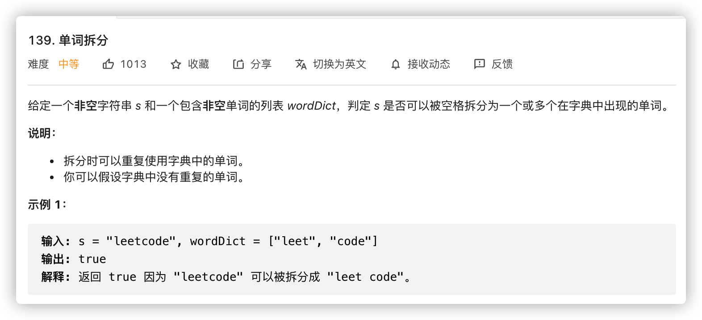

```java
// 抽象出一种检查点的概念: 以某个起点开始，截取到某个终点的子串，这个终点命名为检查点
// 我们核心的问题就在于最后一个检查点的检查结果是否为true，dict.contains()
// 因为内容不定，可能存在多个拼接方式，因此不可能以常数的变量存储，需要维护每一个检查点
// 检查点之间的字串，就是我们的检测标准

// time: O(n ^ 2)
// space: O(n)
public class Solution {
    public boolean wordBreak(String s, List<String> wordDict) {
        Set<String> wordDictSet = new HashSet(wordDict);
        boolean[] dp = new boolean[s.length() + 1];
        dp[0] = true;
        for (int i = 1; i <= s.length(); i++) {
            for (int j = 0; j < i; j++) {
                if (dp[j] && wordDictSet.contains(s.substring(j, i))) {
                    dp[i] = true;
                    break;
                }
            }
        }
        return dp[s.length()];
    }
}
```

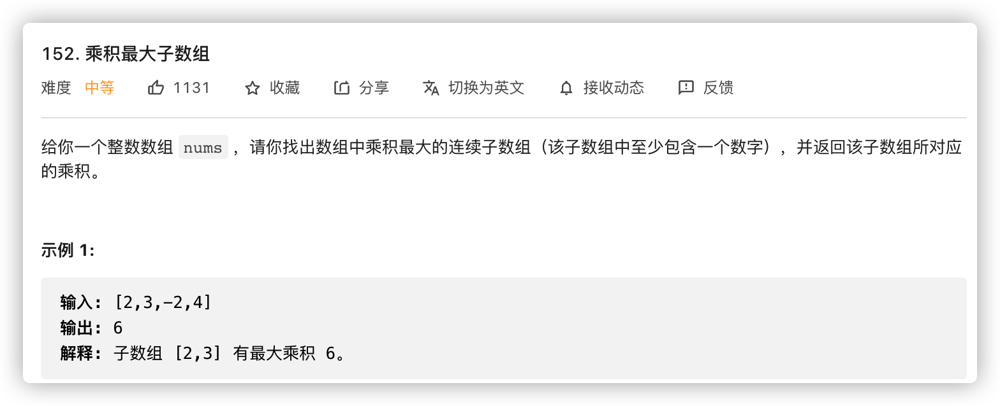

```java
// 这道题的核心在于负数的跳变，因此还需要维护min状态，关注的是其中负数的状态
// 当前最大值: 相乘最大？当前最大？跳变？
// 当前最小值:	相乘最小？当前最小？跳变？
// 然后依次更新全局最大值

// time: O(n)
// space: O(1)
class Solution {
    public int maxProduct(int[] nums) {
        int max = 1, min = 1, _min, _max, res = Integer.MIN_VALUE;
        for(int num: nums){
            _max = max * num;
            _min = min * num;
            max = Math.max(num, Math.max(_min, _max));
            min = Math.min(num, Math.min(_min, _max));
            res = Math.max(res, max);
        }
        return res;
    }
}
```

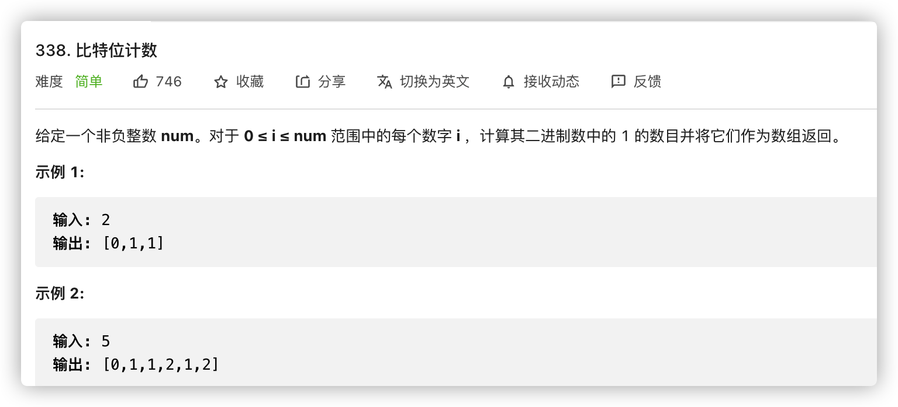

```java
// 位运算中已经说过，这里关注dp结果查询

// time: O(n)
// space: O(1)
class Solution {
    public int[] countBits(int n) {
        int[] res = new int[n+1];
        for(int i = 1; i <=n; i++){
            res[i] = res[(i&(i-1))] + 1;
        }
        return res;
    }
}
```

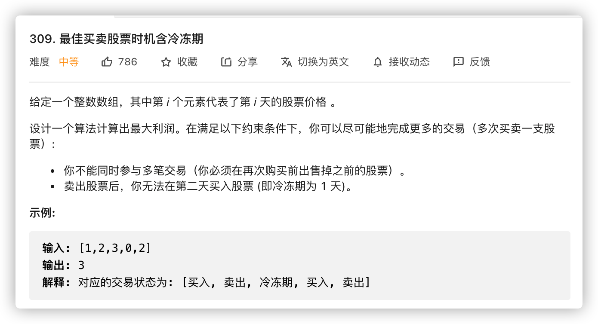

```java
// 递归中会出现if-else分支，多状态dp中，常用多维数组进行表示

// time: O(n)
// space: O(n)
class Solution {
    public int maxProfit(int[] prices) {
        if (prices.length == 0) return 0;
        int n = prices.length;
        int last_hold_profit = -prices[0], today_hold_profit = 0;
        int last_frozen_profit = 0, today_frozen_profit = 0;
        int last_free_profit = 0, today_free_profit = 0;
        for (int price: prices) {
            // 今天最大持有收益: max(继续持有，今天买入)
            today_hold_profit = Math.max(last_hold_profit, last_free_profit - price);
            // 今天最大冻结收益: 昨天持有，今天卖出
            today_frozen_profit = last_hold_profit + price;
            // 今天最大空闲收益: max(昨天冻结，继续持有)
            today_free_profit = Math.max(last_frozen_profit, last_free_profit);
            last_hold_profit = today_hold_profit;
            last_frozen_profit = today_frozen_profit;
            last_free_profit = today_free_profit;
        }
        // 卖出回本是必然的
        return Math.max(today_frozen_profit, today_free_profit);
    }
}
```

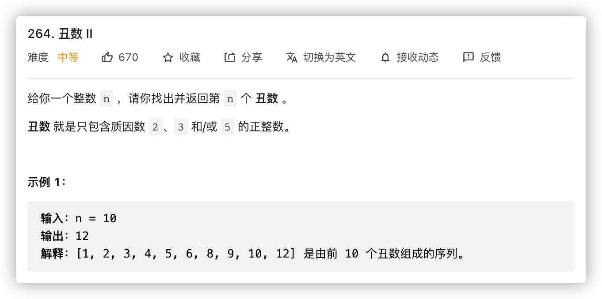

```java
// 多分支，多维护，庆幸的是缓冲公共，维护变量即可
// 注意点: 2 * 3 = 6,存在公共计算值，因此移动时可能多指针移动

// time: O(n)
// space: O(n)
class Solution {
    public int nthUglyNumber(int n) {
        int[] res = new int[n];
        res[0] = 1;
        int p2 = 0, p3 = 0, p5 = 0;
        int r, r2 , r3, r5;
        for(int i = 1; i < n; i++){
            r2 = res[p2] * 2;
            r3 = res[p3] * 3;
            r5 = res[p5] * 5;
            r = Math.min(r2, Math.min(r3, r5));
            if(r == r2) p2 ++;
            if(r == r3) p3 ++;
            if(r == r5) p5 ++;
            res[i] = r;
        }
        return res[n-1];
    }
}
```

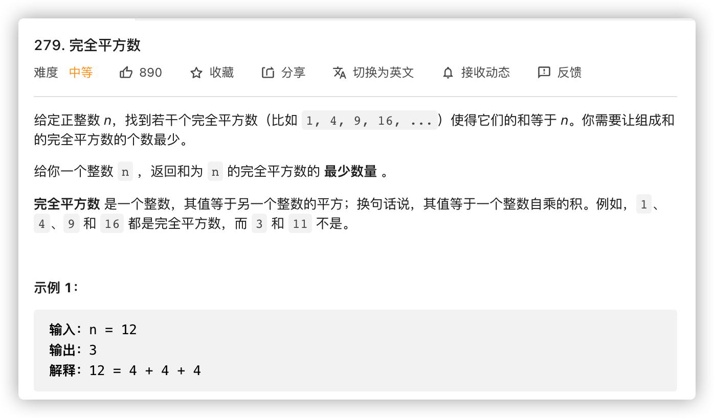

```java
// 这次的dp方程间隔并非简单的-1前向依赖，由于平方会使得后续的间隔加大，导致计算增加，不如维护独立的间隔
// 其他的套路依旧

// time: O(n sqrt(n))
// space: O(n)
class Solution {
  public int numSquares(int n) {
    int dp[] = new int[n + 1];
    Arrays.fill(dp, Integer.MAX_VALUE);
    dp[0] = 0;
    int max_square_index = (int) Math.sqrt(n) + 1;
    int square_nums[] = new int[max_square_index];
    for (int i = 1; i < max_square_index; ++i) {
      square_nums[i] = i * i;
    }

    for (int i = 1; i <= n; ++i) {
      for (int s = 1; s < max_square_index; ++s) {
        if (i < square_nums[s])
          break;
        dp[i] = Math.min(dp[i], dp[i - square_nums[s]] + 1);
      }
    }
    return dp[n];
  }
}
```

