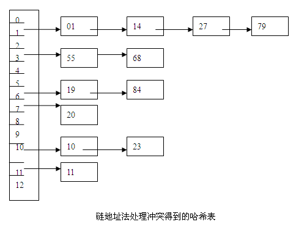
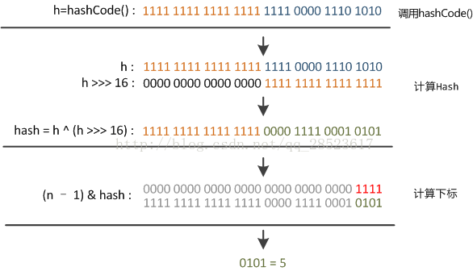

# 哈希碰撞


由于硬件和算法的受限，``hash``碰撞无法避免。

## 链地址法



当``hash``发生碰撞的时候，对于一个槽内的``bin``，复合的存储了多个元素。

- 寻槽：``hashCode % len``
- 找数：
  - ``bin``内单个元素，直接返回
  - 通过``hashCode``对比差异，查找元素
  - 发现相同``hashCode``，进行下一步
- 比较：使用``equals``进行对象比较

> 这就是为什么重写``equals``方法需要重写``hashCode``，否则哈希容器是不会采用到``equals``逻辑的。

---

可以看到，哈希碰撞有两种

- ``hashCode``碰撞
- ``hashCode``取模

---

```java
transient Node<K,V>[] table; // 采用的是链地址法
```

## 开发定址

开发定址原理：越小的数据集，哈希碰撞就越小。

因此，对于上一级碰撞的元素，进行二级的哈希，能够有效减少碰撞。

层级哈希，最后能够得到唯一的哈希。

# 扰动函数

不论是链地址法还是开放定址，的确的解决了碰撞问题，使得碰撞情况下依旧能够进行元素的区分。

根本问题解决了，但是性能并不一定很好：如果大量元素堆积在同一个槽，怎么办。

相对于奇数，`n % 2 == 1`是必然的情况，因此，取模之前，还应该将``hashCode``真正的散列。

```java
    static final int hash(Object key) {
        int h;
        return (key == null) ? 0 : (h = key.hashCode()) ^ (h >>> 16);
    }
```



这样一来，相当于再哈希，它带来两个好处

- 再哈希，进一步降低哈希碰撞
- 避免上层哈希算法导致数据聚集

# 为什么是2的幂

```java
do {
    next = e.next;
    if ((e.hash & oldCap) == 0) {
        if (loTail == null)
            loHead = e;
        else
            loTail.next = e;
        loTail = e;
                            
    } else {
        if (hiTail == null)
            hiHead = e;
        else
            hiTail.next = e;
        hiTail = e;
    }
} while ((e = next) != null);
```

对2的幂次方取余，相当于`(n - 1) & hash`，并且扩容时候存在特殊计算规律

```text
3 % 2 = 1
101
010
---
001

3 % 4 = 3
101
100
---
101
```

也就是说，扩容的时候无需重新取模，原来的位置上只需要计算``hashCode & len``就能够判断它是否应该挪到扩容新区。

避免了全量取模再放入容器的操作。

## 怎么计算2的幂

```java
    // 低位全填充1， +1即可
	static final int tableSizeFor(int cap) {
        int n = cap - 1;
        n |= n >>> 1;
        n |= n >>> 2;
        n |= n >>> 4;
        n |= n >>> 8;
        n |= n >>> 16;
        return (n < 0) ? 1 : (n >= MAXIMUM_CAPACITY) ? MAXIMUM_CAPACITY : n + 1;
    }
```

# 数据查找

```java
    final V putVal(int hash, K key, V value, boolean onlyIfAbsent, boolean evict) {
        Node<K,V>[] tab; Node<K,V> p; int n, i;
        // 0. 初始化不创建容器，第一次放元素才初始化
        if ((tab = table) == null || (n = tab.length) == 0)
            n = (tab = resize()).length;
        // 1. 指定槽无元素，直接初始化
        if ((p = tab[i = (n - 1) & hash]) == null)
            tab[i] = newNode(hash, key, value, null);
        // 2. 如果存在元素，检查
        else {
            Node<K,V> e; K k;
            // 2.1 如果是链表头
            if (p.hash == hash && ((k = p.key) == key || (key != null && key.equals(k))))
                e = p;
            // 2.2 如果是红黑树
            else if (p instanceof TreeNode)
                e = ((TreeNode<K,V>)p).putTreeVal(this, tab, hash, key, value);
            // 2.3 链表查找
            else {
                for (int binCount = 0; ; ++binCount) {
                    // 2.3.1 无匹配，末尾新增
                    if ((e = p.next) == null) { 
                        p.next = newNode(hash, key, value, null);
                        // 达到阈值，转红黑树
                        if (binCount >= TREEIFY_THRESHOLD - 1) // -1 for 1st
                            treeifyBin(tab, hash);
                        break;
                    }
                    // 2.3.2 找到匹配，跳出
                    if (e.hash == hash && ((k = e.key) == key || (key != null && key.equals(k))))
                        break;
                    // 下一位
                    p = e;
                }
            }
            // 找到原来的，返回旧数值
            if (e != null) { 
                V oldValue = e.value;
                if (!onlyIfAbsent || oldValue == null)
                    e.value = value;
                afterNodeAccess(e);
                return oldValue;
            }
        }
        // 新增情况，记录修改数
        ++modCount;
        // 判断扩容
        if (++size > threshold)
            resize();
        afterNodeInsertion(evict);
        return null;
    }
```

# 扩容策略

## 容量计算

```java
    final Node<K,V>[] resize() {
        Node<K,V>[] oldTab = table;
        int oldCap = (oldTab == null) ? 0 : oldTab.length; // 原始容量
        int oldThr = threshold;	// 扩容阈值
        int newCap, newThr = 0;
        // 1. 已初始化
        if (oldCap > 0) {
            // 1.1 达到最大限度(最大限度还要扩容，threshold值不对，设置为最大)
            if (oldCap >= MAXIMUM_CAPACITY) {
                threshold = Integer.MAX_VALUE;
                return oldTab;
            // 1.2 容量翻倍
            } else if ((newCap = oldCap << 1) < MAXIMUM_CAPACITY && oldCap >= DEFAULT_INITIAL_CAPACITY)
                newThr = oldThr << 1; // double threshold
        }
        // 2.1 未初始化，但是指定了容量，默认threshodl = tableSizeFor(initialCapacity)作为初始化容量
        else if (oldThr > 0) 
            newCap = oldThr; 
        // 2.2 未初始化，未指定容量，采用默认容量
        else {  
            newCap = DEFAULT_INITIAL_CAPACITY; 
            newThr = (int)(DEFAULT_LOAD_FACTOR * DEFAULT_INITIAL_CAPACITY);
        }
        // 3. oldCap < DEFAULT_INITIAL_CAPACITY
        if (newThr == 0) { 
            float ft = (float)newCap * loadFactor;
            newThr = (newCap < MAXIMUM_CAPACITY && ft < (float)MAXIMUM_CAPACITY ?
                      (int)ft : Integer.MAX_VALUE);
        }
        threshold = newThr;
    ...
    }
```

## 数据迁移

```java
    final Node<K,V>[] resize() {   
        ...
        @SuppressWarnings({"rawtypes","unchecked"})
        Node<K,V>[] newTab = (Node<K,V>[])new Node[newCap];
        table = newTab;
		if (oldTab != null) {
            for (int j = 0; j < oldCap; ++j) {
                Node<K,V> e;
                // 1. 非空迁移
                if ((e = oldTab[j]) != null) {
                    oldTab[j] = null;
                    // 2.1 唯一数据，直接迁移
                    if (e.next == null)
                        newTab[e.hash & (newCap - 1)] = e;
                    // 2.2 树扩容
                    else if (e instanceof TreeNode)
                        ((TreeNode<K,V>)e).split(this, newTab, j, oldCap);
                    // 2.3 链表迁移
                    else { 
                        // 判断最高位即可，无需remod
                        Node<K,V> loHead = null, loTail = null;
                        Node<K,V> hiHead = null, hiTail = null;
                        Node<K,V> next;
                        do {
                            next = e.next;
                            if ((e.hash & oldCap) == 0) {
                                if (loTail == null)
                                    loHead = e;
                                else
                                    loTail.next = e;
                                loTail = e;
                            } else {
                                if (hiTail == null)
                                    hiHead = e;
                                else
                                    hiTail.next = e;
                                hiTail = e;
                            }
                        } while ((e = next) != null);
                        // 高低位设置
                        if (loTail != null) {
                            loTail.next = null;
                            newTab[j] = loHead;
                        }
                        if (hiTail != null) {
                            hiTail.next = null;
                            newTab[j + oldCap] = hiHead;
                        }
                    }
                }
            }
        }
        return newTab;
    }
```

# 树的转换

- 什么时候链表转树：``bin``数量大于8，数组长度大于64
  - 注意，这里是数组长度，而不是元素 个数
- 什么时候树会退化为链表
  - 扩容时候，如果树元素低于8，转化为链表
  - 不存在树自动退化的情况

## 链表转树

- ``putVal``

```java
	if ((e = p.next) == null) {
        p.next = newNode(hash, key, value, null);
        // 1. 当到达八个元素，尝试转树
        if (binCount >= TREEIFY_THRESHOLD - 1) 
            treeifyBin(tab, hash);
        break;
    }
```

- ``treeifyBin``

```java
    final void treeifyBin(Node<K,V>[] tab, int hash) {
        int n, index; Node<K,V> e;
        // 2.1 元素总量低于64，直接扩容
        if (tab == null || (n = tab.length) < MIN_TREEIFY_CAPACITY)
            resize();
        // 2.2 元素总量高于64，尝试转树
        else if ((e = tab[index = (n - 1) & hash]) != null) {
            TreeNode<K,V> hd = null, tl = null;
            do {
                TreeNode<K,V> p = replacementTreeNode(e, null);
                if (tl == null)
                    hd = p;
                else {
                    p.prev = tl;
                    tl.next = p;
                }
                tl = p;
            } while ((e = e.next) != null);
            if ((tab[index] = hd) != null)
                hd.treeify(tab);
        }
    }
```

## 树转链表

```java
        final void split(HashMap<K,V> map, Node<K,V>[] tab, int index, int bit) {
            TreeNode<K,V> b = this;
            TreeNode<K,V> loHead = null, loTail = null;
            TreeNode<K,V> hiHead = null, hiTail = null;
            int lc = 0, hc = 0;
            // 1. 树元素收集
            for (TreeNode<K,V> e = b, next; e != null; e = next) {
                next = (TreeNode<K,V>)e.next;
                e.next = null;
                // 1.1 低位
                if ((e.hash & bit) == 0) {
                    if ((e.prev = loTail) == null)
                        loHead = e;
                    else
                        loTail.next = e;
                    loTail = e;
                    ++lc;
                } 
                // 1.2 高位
                else {
                    if ((e.prev = hiTail) == null)
                        hiHead = e;
                    else
                        hiTail.next = e;
                    hiTail = e;
                    ++hc;
                }
            }
			// 2.1 低位迁移
            if (loHead != null) {
                if (lc <= UNTREEIFY_THRESHOLD) // 元素低于阈值转链表
                    tab[index] = loHead.untreeify(map);
                else {
                    tab[index] = loHead;
                    if (hiHead != null) 
                        loHead.treeify(tab);
                }
            }
            // 2.2 高位迁移
            if (hiHead != null) {
                if (hc <= UNTREEIFY_THRESHOLD) // 元素低于阈值转链表
                    tab[index + bit] = hiHead.untreeify(map);
                else {
                    tab[index + bit] = hiHead;
                    if (loHead != null)
                        hiHead.treeify(tab);
                }
            }
        }
```

# 版本对比

|          | 1.7                                                          | 1.8                                    |
| -------- | ------------------------------------------------------------ | -------------------------------------- |
| 存储结构 | 数组+链表                                                    | 数组+链表+红黑树                       |
| 添加元素 | 头插法                                                       | 尾插法                                 |
| 扩容哈希 | 二次哈希<br />全量重新计算                                   | 旧哈希<br />提升计算效率，避免二次计算 |
| 扩容转移 | 全量重新插入(头插法)<br />1. 会改变元素顺序<br />2. 并发头插会产生环形链表 | 高位判断分组，转移高位分组             |
| 扩容顺序 | 先扩容，后插入                                               | 先插入，后扩容                         |

