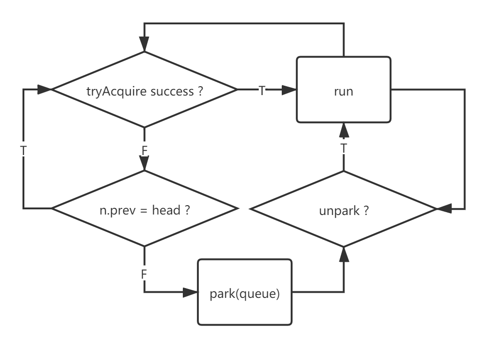
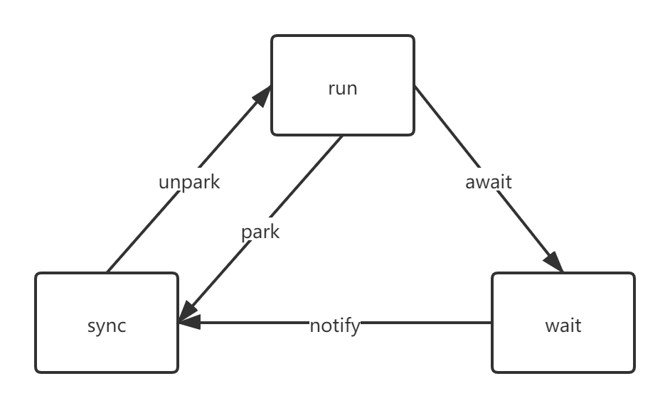

# 状态说明

| status        | value  | description                                                  |
| ------------- | ------ | ------------------------------------------------------------ |
| ``CANCELLED`` | ``1``  | 取消调度                                                     |
| ``SIGNAL``    | ``-1`` | 后继节点等待当前节点唤醒                                     |
| ``CONDITION`` | ``-2`` | ``Condition``等待，``Condition.signal``后从等待队列移到同步队列 |
| ``PROPAGATE`` | ``-3`` | 共享模式，前继节点能够唤起其后继节点，以及后继的后继         |
| ``DEFAULT``   | ``0``  | 新建节点默认值                                               |

> 负数值为有效等待状态，正值和零都是无效等待状态。

# 自旋入队

```java
    // 自旋入队
	private Node enq(final Node node) {
        for (;;) {
            Node t = tail;
            // 1. 初始化头结点
            if (t == null) { 
                if (compareAndSetHead(new Node()))
                    // 此时 head.next = null
                    tail = head;
            // 直接尾节点    
            } else {
                node.prev = t;
                if (compareAndSetTail(t, node)) {
                    t.next = node;
                    return t;
                }
            }
        }
    }
```

# 排他锁

## 获取

```java
    public final void acquire(int arg) {
        // 1. 获取成功
        // 2. 获取不成功入队等待
        if (!tryAcquire(arg) &&
            acquireQueued(addWaiter(Node.EXCLUSIVE), arg))
            // 补充中断
            selfInterrupt();
    }
```

- ``tryAcquire``

```java
    // 子类自己实现资源获取
	// 如果获取成功，则无需入队等待，执行即可
	protected boolean tryAcquire(int arg) {
        throw new UnsupportedOperationException();
    }
```

- ``addWaiter``

```java
    // 入队等待
	private Node addWaiter(Node mode) {
        Node node = new Node(Thread.currentThread(), mode);
        Node pred = tail;
        // 1. 直接CAS添加到队尾
        if (pred != null) {
            node.prev = pred;
            if (compareAndSetTail(pred, node)) {
                pred.next = node;
                return node;
            }
        }
        // 2. 失败则自旋入队
        enq(node);
        return node;
    }
```

- ``acquireQueued``

```java
    // 等锁
	final boolean acquireQueued(final Node node, int arg) {
        boolean failed = true;
        try {
            boolean interrupted = false;
            // 自旋等锁
            for (;;) {
                final Node p = node.predecessor();
                // 1. 头结点正在运行，变成第二则有资格进行资源获取
                //  1.1 头结点进程唤醒
                // 	1.2 头结点中断当前进程竞争
                if (p == head && tryAcquire(arg)) {
                    setHead(node);
                    p.next = null; // help GC
                    failed = false;
                    return interrupted;
                }
                // 2. 等待锁记录状态变化
                if (shouldParkAfterFailedAcquire(p, node) &&
                    parkAndCheckInterrupt())
                    interrupted = true;
            }
        } finally {
            if (failed)
                cancelAcquire(node);
        }
    }
```

> - ``shouldParkAfterFailedAcquire``
>
> ```java
>     private static boolean shouldParkAfterFailedAcquire(Node pred, Node node) {
>         int ws = pred.waitStatus;
>         // 1. 等待前驱节点唤醒
>         if (ws == Node.SIGNAL)
>             return true;
>         // 2. 清理无效状态节点
>         if (ws > 0) {
>             do {
>                 node.prev = pred = pred.prev;
>             } while (pred.waitStatus > 0);
>             pred.next = node;
>         } else {
>             // 3. 设置前驱节点状态，好了通知自己
>             compareAndSetWaitStatus(pred, ws, Node.SIGNAL);
>         }
>         return false;
>     }
> ```
>
> - ``parkAndCheckInterrupt``
>
> ```java
>     // 阻塞
> 	private final boolean parkAndCheckInterrupt() {
>         // 1. 陷入waiting
>         LockSupport.park(this);
>         // 2. 唤醒补充中断
>         //  	a. unpark
>         //		b. interrupt(需反馈)
>         return Thread.interrupted();
>     }
> ```



1. 获取资源直接执行
2. 首次获取失败，混成老二才能争抢
3. 抢失败，非老二，乖乖阻塞等待晋升

## 释放

- ``release``

```java
    // 释放锁
	public final boolean release(int arg) {
        // 1. 资源释放完成
        if (tryRelease(arg)) {
            Node h = head;
            // 2. 唤醒后继节点
            if (h != null && h.waitStatus != 0)
                unparkSuccessor(h);
            return true;
        }
        return false;
    }
```

- ``tryRelease``

```java
    // 子类释放实现
	protected boolean tryRelease(int arg) {
        throw new UnsupportedOperationException();
    }
```

- ``unparkSuccessor``

```java
    private void unparkSuccessor(Node node) {
		// 1. 更新当前节点状态
        int ws = node.waitStatus;
        if (ws < 0)
            compareAndSetWaitStatus(node, ws, 0);
        Node s = node.next;
        // 2. 查找下一个有效节点
        if (s == null || s.waitStatus > 0) {
            s = null;
            for (Node t = tail; t != null && t != node; t = t.prev)
                if (t.waitStatus <= 0)
                    s = t;
        }
        // 3. 唤醒下一个有效节点
        if (s != null)
            LockSupport.unpark(s.thread);
    }
```

# 共享锁

## 获取

```java
    // <0: 获取失败
	// =0: 成功，无资源
	// >0: 成功，有资源
	public final void acquireShared(int arg) {
        if (tryAcquireShared(arg) < 0)
            doAcquireShared(arg);
    }
```

- ``doAcquireShared``

```java
    private void doAcquireShared(int arg) {
        final Node node = addWaiter(Node.SHARED);
        boolean failed = true;
        try {
            boolean interrupted = false;
            // 自旋
            for (;;) {
                final Node p = node.predecessor();
                // 1. 老二抢锁
                if (p == head) {
                    int r = tryAcquireShared(arg);
                    if (r >= 0) {
                        setHeadAndPropagate(node, r);
                        p.next = null; // help GC
                        if (interrupted)
                            selfInterrupt();
                        failed = false;
                        return;
                    }
                }
                // 2. 获取失败waiting
                if (shouldParkAfterFailedAcquire(p, node) &&
                    parkAndCheckInterrupt())
                    interrupted = true;
            }
        } finally {
            if (failed)
                cancelAcquire(node);
        }
    }
```

- ``setHeadAndPropagate``

```java
    private void setHeadAndPropagate(Node node, int propagate) {
        Node h = head; 
        setHead(node);
        // 连续释放共享锁
        if (propagate > 0 || h == null || h.waitStatus < 0 ||
            (h = head) == null || h.waitStatus < 0) {
            Node s = node.next;
            if (s == null || s.isShared())
                doReleaseShared();
        }
    }
```

- ``doReleaseShared``

```java
    private void doReleaseShared() {
        // 自旋
        for (;;) {
            Node h = head;
            if (h != null && h != tail) {
                int ws = h.waitStatus;
                // 1. 需要通知后继节点
                if (ws == Node.SIGNAL) {
                    if (!compareAndSetWaitStatus(h, Node.SIGNAL, 0))
                        continue;      
                    // 1.1 唤醒后继节点
                    unparkSuccessor(h);
                }
                // 2. 新加入节点，标记
                else if (ws == 0 && !compareAndSetWaitStatus(h, 0, Node.PROPAGATE))
                    continue;                
            }
            if (h == head)                   
                break;
        }
    }
```

自己获取锁，需要通知其他的伙伴，共享锁。

## 释放

```java
    public final boolean releaseShared(int arg) {
        if (tryReleaseShared(arg)) {
            doReleaseShared();
            return true;
        }
        return false;
    }
```

# 公平锁

## 获取

```java
	protected final boolean tryAcquire(int acquires) {
            final Thread current = Thread.currentThread();
            int c = getState();
    		// 1. 新建
            if (c == 0) {
                // 是否需要排队
                if (!hasQueuedPredecessors() &&
                    compareAndSetState(0, acquires)) {
                    setExclusiveOwnerThread(current);
                    return true;
                }
            }
        	// 2. 重入
            else if (current == getExclusiveOwnerThread()) {
                int nextc = c + acquires;
                // overflow
                if (nextc < 0)
                    throw new Error("Maximum lock count exceeded");
                // 更新重入
                setState(nextc);
                return true;
            }
            return false;
        }
```

- ``hasQueuedPredecessors``

```java
    // 是否需要排队
	public final boolean hasQueuedPredecessors() {
        Node t = tail; 
        Node h = head;
        Node s;
        return h != t && 
            ((s = h.next) == null || 
             s.thread != Thread.currentThread()); 
    }
```

> - ``true``：需要入队
>   - `` h != t``：队列非空
>     - ``(s = h.next) == null``：``head``正在初始化，有节点正在入队，存在并发竞争，需入队
>     - ``s.thred != Thread.currentThread()``：不是老二，没有争抢资格
> - ``false``：无需入队
>   - ``h == t``：空队列，无阻塞
>   - ``(s = h.next) != null && s.thread = Thread.currentThread()``：老二，具有直接争抢资格

## 释放

```java
        protected final boolean tryRelease(int releases) {
            int c = getState() - releases;
            // 1. 非法状态
            if (Thread.currentThread() != getExclusiveOwnerThread())
                throw new IllegalMonitorStateException();
            boolean free = false;
            // 2. 重入为0，释放
            if (c == 0) {
                free = true;
                setExclusiveOwnerThread(null);
            }
            setState(c);
            return free;
        }
```

# 非公平锁

## 获取

```java
        final boolean nonfairTryAcquire(int acquires) {
            final Thread current = Thread.currentThread();
            int c = getState();
            // 1. 直接竞争，无需判断队列情况
            if (c == 0) {
                if (compareAndSetState(0, acquires)) {
                    setExclusiveOwnerThread(current);
                    return true;
                }
            }
            // 2. 释放
            else if (current == getExclusiveOwnerThread()) {
                int nextc = c + acquires;
                if (nextc < 0) // overflow
                    throw new Error("Maximum lock count exceeded");
                setState(nextc);
                return true;
            }
            return false;
        }
```

# Condition

## 获取

```java
        final ConditionObject newCondition() {
            return new ConditionObject();
        }
```

## 等待

```java
        public final void await() throws InterruptedException {
            if (Thread.interrupted())  throw new InterruptedException();
            // 1. 加入条件队列
            Node node = addConditionWaiter();
            // 2. 释放当前持有锁
            int savedState = fullyRelease(node);
            int interruptMode = 0;
            // 3. 挂起，等待进入阻塞队列
            while (!isOnSyncQueue(node)) {
                LockSupport.park(this);
                if ((interruptMode = checkInterruptWhileWaiting(node)) != 0)
                    break;
            }
            // 3. 进入阻塞队列，自旋抢锁
            if (acquireQueued(node, savedState) && interruptMode != THROW_IE)
                interruptMode = REINTERRUPT;
            if (node.nextWaiter != null) // clean up if cancelled
                unlinkCancelledWaiters();
            if (interruptMode != 0)
                reportInterruptAfterWait(interruptMode);
        }
```

- ``addConditionWaiter``

```java
        private Node addConditionWaiter() {
            Node t = lastWaiter;
            // 1. 溢出非法状态节点
            if (t != null && t.waitStatus != Node.CONDITION) {
                unlinkCancelledWaiters();
                t = lastWaiter;
            }
            // 2. 当前线程添加Condition节点
            Node node = new Node(Thread.currentThread(), Node.CONDITION);
            if (t == null)
                firstWaiter = node;
            else
                t.nextWaiter = node;
            lastWaiter = node;
            return node;
        }
```

## 唤醒

```java
        public final void signal() {
            if (!isHeldExclusively())
                throw new IllegalMonitorStateException();
            Node first = firstWaiter;
            if (first != null)
                doSignal(first);
        }
```

- ``doSignal``

```java
        private void doSignal(Node first) {
            do {
                // 1. 获取头结点，如果没有等待的节点了，lastWaiter = null
                if ( (firstWaiter = first.nextWaiter) == null)
                    lastWaiter = null;
                // 2. 直接切断后续引用
                first.nextWaiter = null;
                // 3. 转移节点到阻塞队列
            } while (!transferForSignal(first) && (first = firstWaiter) != null);
        }
```

- ``transferForSignal``

```java
    final boolean transferForSignal(Node node) {
		// 1. CAS修改，如果修改失败，说明其他线程已经修改，返回继续探测
        if (!compareAndSetWaitStatus(node, Node.CONDITION, 0))
            return false;
        // 2. 修改成功，放入阻塞队列
        Node p = enq(node);
        int ws = p.waitStatus;
        // 3. SIGNAL 等待前驱节点唤醒
        if (ws > 0 || !compareAndSetWaitStatus(p, ws, Node.SIGNAL))
            LockSupport.unpark(node.thread);
        return true;
    }
```



1. ``await``
   - ``park``休眠
   - 移出阻塞队列
   - 移入同步队列
2. ``notify``
   - 唤醒``wait``移入阻塞队列

```java

public class ConditionTest {
	    final int queueSize = 2;
	    final PriorityQueue<Integer> queue = new PriorityQueue<Integer>(queueSize);
	    final Lock lock = new ReentrantLock();
	    final Condition notFull = lock.newCondition();
	    final Condition notEmpty = lock.newCondition();

	    public void producer(){
			while(true){
				lock.lock();
				try {
					while(queue.size() == queueSize){
						System.out.println("队列满，等待有空余空间");
            // 1. 第一次: 让出锁，退出阻塞队列，进入等待队列
            // 2. 第二次: 被唤醒，退出等待队列，进入阻塞队列
            // 3. 第三次: 获取锁，执行后续逻辑
						notFull.await();
					}
					queue.offer(1); 
          // 1. 第一次: 将notEmpty.await唤醒，从等待队列移到阻塞队列
          // 2. 后续: 无waiter，不生效
					notEmpty.signal();
					System.out.println("向队列取中插入一个元素，队列剩余空间："+(queueSize-queue.size()));
					Thread.sleep(1000);
				} catch (Exception e){

				} finally{
					lock.unlock();
				}
			}
		}

		public void consume(){
			while(true){
				lock.lock();
				try {
					while(queue.isEmpty()){
						System.out.println("队列空，等待数据");
            // 1. 第一次: 让出锁，退出阻塞队列，进入等待队列
            // 2. 第二次: 被唤醒，退出等待队列，进入阻塞队列
            // 3. 第三次: 获取锁，执行后续逻辑
						notEmpty.await();
					}
					queue.poll();  
          // 1. 第一次: notFull.await唤醒，从等待队列移到阻塞队列
          // 2. 后续: 无waiter，不生效
					notFull.signal();
					System.out.println("从队列取走一个元素，队列剩余"+queue.size()+"个元素");
					Thread.sleep(1000);
				} catch (Exception e){

				} finally{
					lock.unlock();
				}
			}
		}
	    public static void main(String[] args) throws InterruptedException  {
	    	ConditionTest test = new ConditionTest();
	        new Thread(test::consume).start();
	        new Thread(test::producer).start();
	    }
	}

```

双层逻辑

- 是否参与锁争抢(等待队列)
- 是否抢到独占锁(阻塞队列)

# 调度本质

线程的任务是执行内部逻辑，调度的关键在于不同线程的启动和停止，对应为不同任务的切换，操作系统是如此的调度。

但是非操作系统的中间平台，可以通过填充空白操作，也就是休眠、自旋，来对齐操作。

线程调度

- 操作系统
  - 停止某线程、启动新线程，通过切换完成调度操作
- 中间平台
  - 让能运行的休眠或者等待，从而对齐逻辑执行

```java
public class A {
    static class B extends Thread{
        Thread another;
        public void setAnother(Thread another) {
            this.another = another;
        }
        @Override
        public void run() {
            while(true){
                for(int i = 0; i < 10; i++){
                    System.out.println("B-"+i);
                }
                LockSupport.unpark(another);
                LockSupport.park(this);
            }
        }
    }
    static class C extends Thread{
        Thread another;
        public void setAnother(Thread another) {
            this.another = another;
        }
        @Override
        public void run() {
            while(true){
                for(int i = 0; i < 10; i++){
                    System.out.println("C-"+i);
                }
                LockSupport.unpark(another);
                LockSupport.park(this);
            }
        }
    }
    public static void main(String[] args) {
        B b = new A.B();
        C c = new A.C();
        b.setAnother(c);
        c.setAnother(b);
        c.start();
        b.start();
    }
}
```

结合``Sync``和``Condition``理解更佳

- ``Sync``：仅队头可以运行，仅老二可以争抢(队头因为某些原因丧失锁)
  - 丧失直接执行权(操作系统调度)，等待被调度(晋升、争抢执行权)
- ``Condition``：等待队列不可执行，等待被唤醒(赋权)
  - 剥夺争抢执行权，等待被赋予争抢权
  - 争抢成功执行

就这样，让线程到一定程度无法执行，而到一定程度可以执行，这就是线程调度的本质。

``CountDownLatch``、``Samphore``都是如此，类似``Condition.SignalAll``，组调度而已。

# AQS-Mutex

```java
class Mutex extends AbstractQueuedSynchronizer {
    protected boolean isHeldExclusively() {
        return getState() == 1;
    }

    public boolean tryAcquire(int acquires) {
        assert acquires == 1;
        return compareAndSetState(0, 1);
    }

    protected boolean tryRelease(int releases) {
        assert releases == 1;
        if(compareAndSetState(1, 0)){
            setExclusiveOwnerThread(null);
            return true;
        }
        return false;
    }

    final Queue<Integer> queue = new LinkedList<>();

    volatile int counter = 0;

    public void producer(){
        while(true){
            acquire(1);
            try{
                while(queue.size() < 10){
                    queue.offer(counter);
                    counter += 1;
                }
                counter = 0;
            } catch (Exception e){

            }finally {
                release(1);
            }
        }
    }

    public void consumer(){
        while(true){
            acquire(1);
            try{
                while(!queue.isEmpty()){
                    System.out.println(Thread.currentThread().getName() + ":\t" + queue.poll());
                    Thread.sleep(1000);
                }
            }catch (Exception e){
                
            }finally {
                release(1);
            }
        }
    }

    public static void main(String[] args) {
        Mutex mutex = new Mutex();
        new Thread(mutex::producer).start();
        for(int i = 0; i < 3; i++){
            new Thread("Consumer-"+i){
                @Override
                public void run() {
                    mutex.consumer();
                }
            }.start();
        }
    }
}
```

通过``AQS``自定义锁就是这么简单，基础的``AQS``就是封装了``park、unpark``方法，管理了线程状态。

从一方面而言，它似乎丧失了随机变化的跳脱，但是它仅是提供了基础的变化，核心的变化需要自身进行扩充

- 何时放弃锁
- 锁的重入次数
- 是否具备竞争能力(是否存在于队列中)

独享锁、共享锁，公平锁、非公平锁，``CountDownLatch``、``Samphore``都是在此基础上逐步演化。
