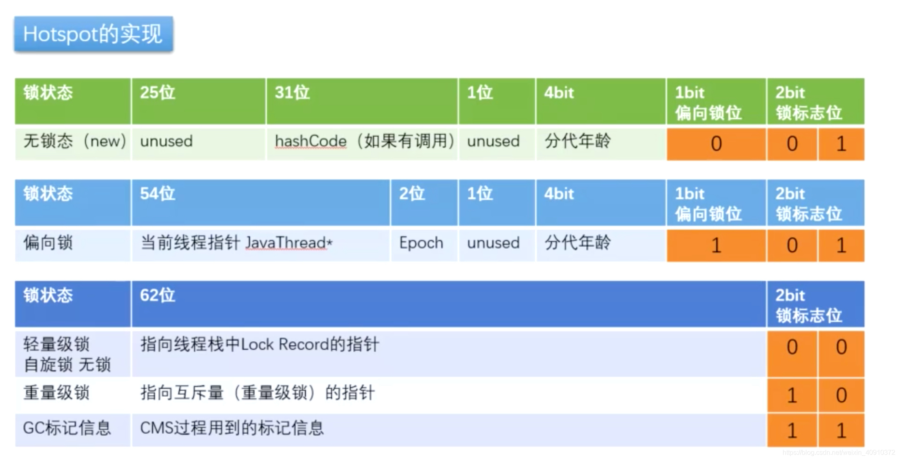
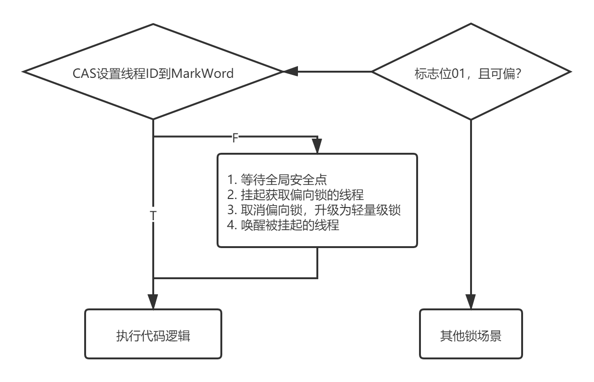
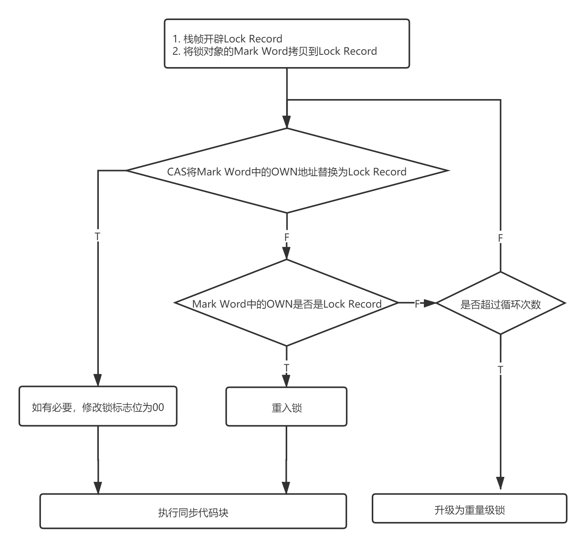
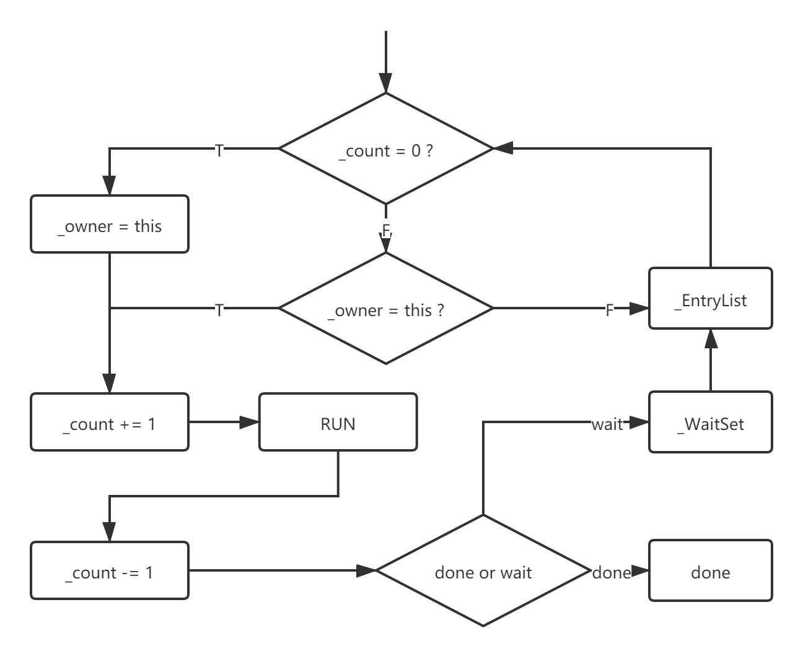

# Mark Word

对象头三部分

- ``Mark word``
- ``Klass``
- ``length``（数组专属）

其中``Mark word``格式如下

锁相关的数据请关注 

| 锁状态   | 是否偏向锁 | 锁标志位 |
| -------- | ---------- | -------- |
| 无锁     | 0          | 01       |
| 偏向锁   | 1          | 01       |
| 轻量级锁 |            | 00       |
| 重量级锁 |            | 10       |

# 偏向锁

- 偏向锁不会自动取消，只有锁升级才能触发
- 偏向锁升级过程会造成``STW``
- ``-XX:-UseBiasedLocking``关闭偏向锁

> 并非竞争失败就一定会面临升级，在全局安全点还会进行一次检查
>
> - 撤销
>   - 线程不存在
>   - 已经退出同步代码块
> - 升级
>   - 线程仍然在执行同步代码块
>
> 因此，并非发生了竞争就一定会出现锁升级。

---

锁对象头``Mark word``记录线程``ID``

# 轻量级锁

---

每条线程栈帧中开辟``Lock Record``记录``Lock Mark Word``

# 重量级锁

## Monitor

| 字段           | 释义                                                         |
| -------------- | ------------------------------------------------------------ |
| ``_count``     | 计数器，实现锁定、重入判断                                   |
| ``_owner``     | 记录当前锁持有线程                                           |
| ``_WaitSet``   | ``wait``队列，释放锁以后将线程移入该队列等待被唤醒，唤醒后移入阻塞队列 |
| ``_EntryList`` | 阻塞队列，保存申请该锁的其他线程                             |

## 申请流程

# 锁重入

| 锁状态   | 重入实现                                         |
| -------- | ------------------------------------------------ |
| 无锁     | 无需实现                                         |
| 偏向锁   | 无需实现                                         |
| 轻量级锁 | 比较``Mark Word``记录的``Lock Record``，确定重入 |
| 重量级锁 | 比较``_owner``，使用``_count``计数               |