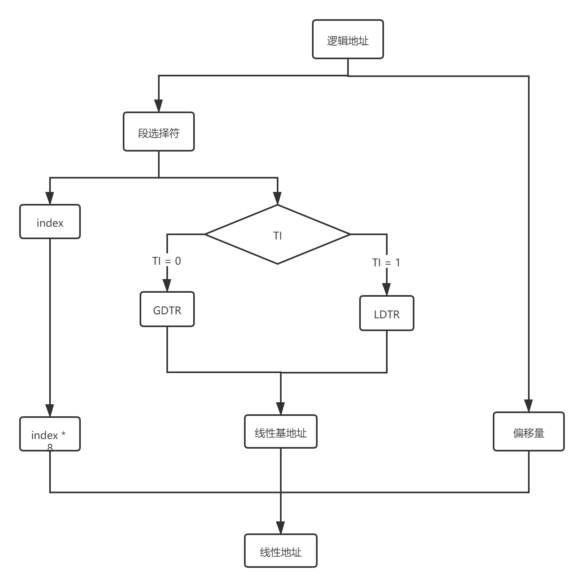

# 虚拟内存

| scope            | description                                                  |
| ---------------- | ------------------------------------------------------------ |
| ``Kernel Space`` | 常驻内存，不允许应用修改                                     |
| ``Stack``        | 1. 函数内部非静态局部变量 2. 调用栈帧 3. 算术表达式部分结果 |
| ``mmap``         | 1. 内存映射区 2. 使用时候初始化 3. 使用后需要回收  |
| ``heap``         | 1. ``brk、sbrk``移动指针 2. 使用完毕不会理解回收，出现空间碎片，但是无需再初始化 |
| ``BSS Segment``  | 1. 未初始化的全局变量和静态局部变量 2. 初始值为0的全局变量和静态局部变量 3. 未定义，且初始值不为0的符号 4. 只占用内存空间，不占用物理文件尺寸 5. 程序读取时转到全零页面，无缺页异常，也不分配内存 |
| ``Data Segment`` | 1. 可读可写 2. 存储已初始化且初值不为0的全局变量和静态局部变量 3. 占用内存空间，也占用物理文件 4. 程序访问时候，发出缺页异常 |
| ``Text Segment`` | 存放程序执行代码                                             |
| ``Reserved``     | 1. 未赋予物理地址，任何引用皆是非法 2. 用于捕捉空指针、小整型值指针引用内存的异常情况 |

# 内存寻址

## 逻辑地址

| 数据              | 长度      |
| ----------------- | --------- |
| 段选择符/段标识符 | ``16bit`` |
| 偏移量            | ``32bit`` |

## 分段单元

### 段寄存器

| 寄存器 | 用途         | 长度      |
| ------ | ------------ | --------- |
| ``cs`` | 代码段寄存器 | ``16bit`` |
| ``ss`` | 栈段寄存器   | -         |
| ``ds`` | 数据段寄存器 | -         |
| ``es`` | 一般用途     | -         |
| ``fs`` | -            | -         |
| ``gs`` | -            | -         |

### 段选择符

> 段选择符指向段描述符

| 数据      | 长度      | 作用                                               |
| --------- | --------- | -------------------------------------------------- |
| ``index`` | ``13bit`` | 段描述符入口                                       |
| ``RPL``   | ``1bit``  | 段描述符存储 ``0``:``GDT`` ``1``:``LDT`` |
| ``TI``    | ``2bit``  | 请求特权级                                         |

### 段描述符

> - ``GDT(Global Descriptor Table)``：全局描述符表
> - ``LDT(Local Descriptor Table)``：局部描述符表

| 段区间         | 映射目标    | 映射区间           |
| -------------- | ----------- | ------------------ |
| ``[B31, B24]`` | 基地址      | ``[bit16, bit23]`` |
| ``[B23, B16]`` | -           | ``[bit24, bit31]`` |
| ``[L19, L16]`` | 段``LIMIT`` | ``[bit10, bit15]`` |
| ``[L15, L0]``  | -           | ``[bit16, bit19]`` |

- ``type``

| 类型               | 存放位置       | S标志位     |
| ------------------ | -------------- | ----------- |
| 代码段描述符       | ``GDT or LDT`` | ``1``       |
| 数据段描述符       | ``GDT or LDT`` | ``1``       |
| 任务状态段描述符   | ``GDT``        | ``9 or 11`` |
| 局部描述符表描述符 | ``GDT``        | ``0``       |

## 线性地址

## 分页机制

### 层级结构

| 元素 | 描述                                 | 其他                                                         |
| ---- | ------------------------------------ | ------------------------------------------------------------ |
| 页   | 线性地址固定长度分组为一页           | 1. 存储线性地址及其数据 2. 连续线性地址映射连续物理地址，方便权限指定 |
| 页框 | ``RAM``固定长度分组为一页框          | 1. 页同也框长度一致 2. 页框是物理内存，是页的物理载体   |
| 页表 | 线性地址映射物理地址数据结构称为页表 |                                                              |

### 常规分页

- 三大域

> 一个分页单元处理``4KB``的页

| 划分区域      | 数据段       |
| ------------- | ------------ |
| ``Directory`` | ``[31, 22]`` |
| ``Table``     | ``[21, 12]`` |
| ``Offset``    | ``[11, 0]``  |

``Directory``和``Table``具有相同的结构，都包含如下域

- ``Present``
- ``Accessed``
- ``Dirty``
- ``Read/Write``
- ``User/Supervisor``
- ``PCD and PWT``
- ``Page Size``
- ``Global``

## 物理地址

> 当前页目录的物理地址存放在控制寄存器``cr3``中

