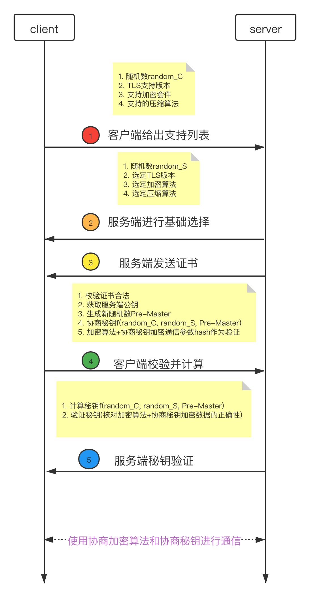

# 响应码

## ``1XX``正在处理

| 响应码 | 英文描述               | 中文描述               |
| ------ | ---------------------- | ---------------------- |
| 100    | ``Continue``           | 客户端继续处理请求     |
| 101    | ``Switching Protocol`` | 根据客户端请求切换协议 |

## ``2XX``处理成功

| 响应码 | 英文描述                          | 中文描述                                        |
| ------ | --------------------------------- | ----------------------------------------------- |
| 200    | ``OK``                            | 成功处理请求并返回                              |
| 201    | ``Created``                       | 请求成功处理并创建了新实体                      |
| 202    | ``Accepted``                      | 请求已经接受，还未完成处理                      |
| 203    | ``Non-Authoritative Information`` | 请求成功，但是资源只是副本                      |
| 204    | ``No Content``                    | 处理成功，无需返回实体                          |
| 205    | ``Reset Content``                 | 重置内容，效果同``204``，但是需要客户端刷新视图 |
| 206    | ``Partial Content``               | 部分请求成功处理                                |

## ``3XX``重定向

| 响应码 | 英文描述               | 中文描述                            |
| ------ | ---------------------- | ----------------------------------- |
| 300    | ``Multiple Choices``   | 多重定向选项，客户端或用户进行选择  |
| 301    | ``Moved Permanently``  | 资源永久移动，返回新地址            |
| 302    | ``Found``              | 资源临时移动，应该使用老地址        |
| 303    | ``See Other``          | 访问其他地址进行查看                |
| 304    | ``Not Modified``       | 未修改(条件GET请求，自上次访问以来) |
| 305    | ``Use Proxy``          | 使用特定代理才能访问                |
| 306    | ``Unused``             | 新版本中已废弃                      |
| 307    | ``Temporary Redirect`` | 临时重定向，同``302``               |

## ``4XX``客户端错误

| 响应码 | 英文描述                            | 中文描述               |
| ------ | ----------------------------------- | ---------------------- |
| 400    | ``Bad Request``                     | 请求格式错误           |
| 401    | ``Unauthorized``                    | 需要身份验证           |
| 403    | ``Forbidden``                       | 请求拒绝处理           |
| 404    | ``Not Found``                       | 资源不存在             |
| 405    | ``Method Not Allowed``              | 请求方法禁止           |
| 407    | ``Proxy Authentication Required``   | 需要代理验证           |
| 408    | ``Request Time-out``                | 请求超时               |
| 411    | ``Length Required``                 | 缺少``Content-Length`` |
| 413    | ``Request Entity Too Large``        | 请求实体过大           |
| 416    | ``Requested range not satisfiable`` | 请求范围错误           |

## ``5XX``服务器错误

| 响应码 | 英文描述                       | 中文描述               |
| ------ | ------------------------------ | ---------------------- |
| 500    | ``Internal Server``            | 服务器内部错误         |
| 501    | ``Not Implemented``            | 请求功能不支持         |
| 502    | ``Bad Gateway``                | 代理服务器收到无效影响 |
| 503    | ``Service Unavailable``        | 服务不可用             |
| 504    | ``Gateway Time-out``           | 代理请求超时           |
| 505    | ``HTTP Version not supported`` | ``HTTP``版本支持       |

# ``HTTPS``握手

# 请求响应流程

1. 浏览器进程

	- 确定访问地址
	- 收集、整理参数
	- 构建完整请求提交到网络进程
2. 网络进程
   - ``DNS``查询确定``IP``
   - ``TCP``三次握手搭建``TCP``通道
   - ``HTTPS``握手搭建传输通道
   - 数据传输处理请求
   - 收集响应提交到浏览器进程
3. 浏览器进程
   - 解析响应格式
   - 提交到渲染进程进行渲染
   - 渲染完毕进行页面刷新展示
