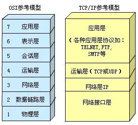
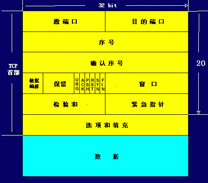
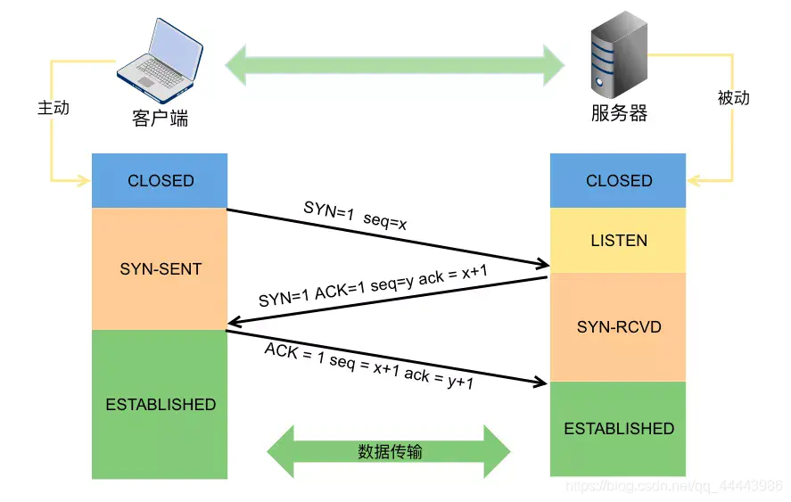
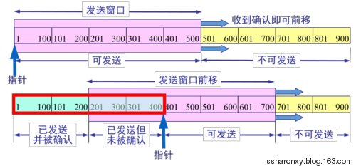
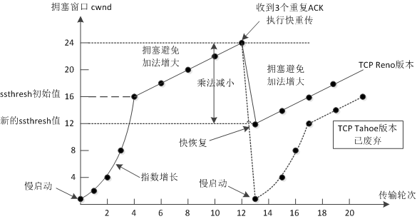
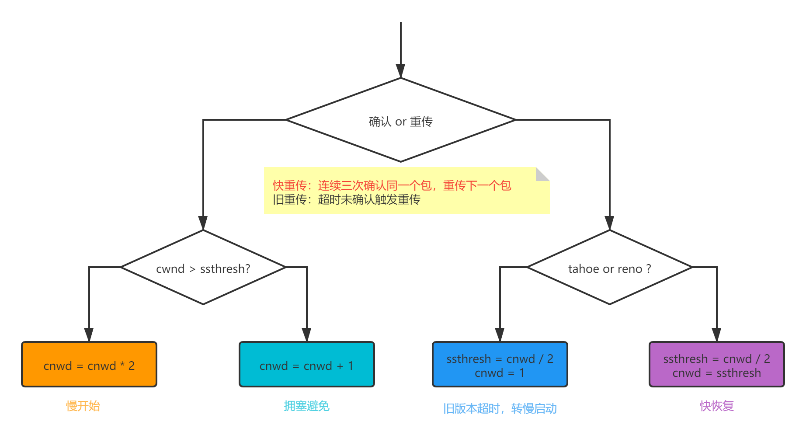
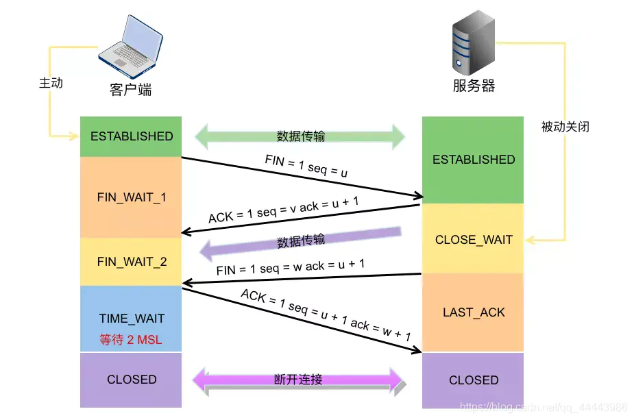

# 网络分层

| OSI        | 职责                                                       | TCP/IP     | 职责             |
| ---------- | ---------------------------------------------------------- | ---------- | ---------------- |
| 物理层     | 物理设备标准，能够收发数据                                 | 网络接口层 | 基础物理设施     |
| 数据链路层 | 基础通信标准，搭建单点对单点传输链路                       | -          | -                |
| 网络层     | 数据路由规范，将单点间的线形链路编制为单点对多点的网络链路 | 网络层     | 点对点(IP)传输   |
| 传输层     | 主机端口区分，能够完成主机端到端的数据传输                 | 传输层     | 端到端(PORT)传输 |
| 会话层     | 传输集合形成会话，并提供管理功能                           | 应用层     | 应用             |
| 表示层     | 数据应用格式和传输格式相互转化                             | -          | -                |
| 应用层     | 基于应用数据提供网络应用                                   | -          | -                |

# 协议格式

# 可靠保障

## ``TCP-UDP``

|          | TCP                              | UDP     |
| -------- | -------------------------------- | ------- |
| 连接特性 | 有连接                           | 无连接  |
| 可靠性   | 可靠                             | 不可靠  |
| 传输内容 | 字节流                           | 报文段  |
| 传输效率 | 一般                             | 高于TCP |
| 流量控制 | 滑动窗口                         | 无      |
| 拥塞控制 | 慢启动、拥塞避免、快重传、快恢复 | 无      |

## 可靠保障

| 措施         | 效果                           |
| ------------ | ------------------------------ |
| 面向连接     | 目标一定可达                   |
| 三次握手     | 具备一定安全性                 |
| ``checkSum`` | 数据校验，错误丢弃             |
| 序列号       | 针对每个数据包都有管理         |
| 响应         | 未确认数据重发                 |
| 滑动窗口     | 前置数据未完整发送，不向后发送 |
| 拥塞控制     | 保证发送通道畅通               |
| 四次挥手     | 保证最后发送数据稳步到达       |

# 三次握手

# 滑动窗口

- 数据发送
  - 发送时设置定时器，超过时间重发数据
  - 发送成功，接收到确认，取消定时器
- 窗口移动
  - 最先数据没有发送成功，不允许窗口移动

# 拥塞控制

# 四次挥手

