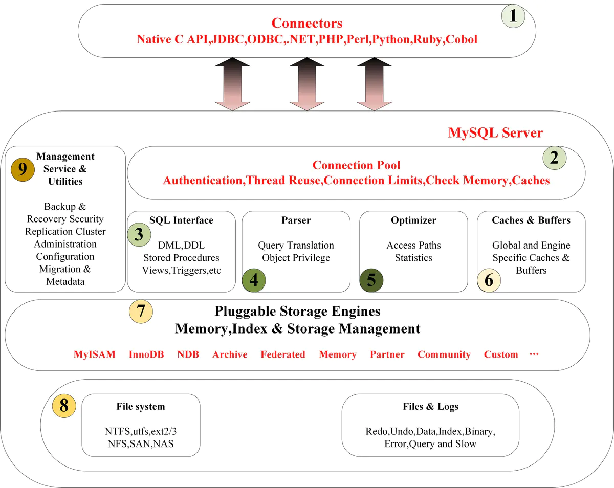

# 整体结构

# 为什么默认InnoDB

|                | Innodb                                         | MyIsam                             |
| -------------- | ---------------------------------------------- | ---------------------------------- |
| 事务           | 支持                                           | 不支持                             |
| 外键           | 支持                                           | 不支持                             |
| 索引和数据绑定 | 绑定，只需查询一次                             | 不绑定，分开存储 查询需要两次 |
| 行数量         | 不绑定，``select(*)``扫描全表                  | 支持，直接读取                     |
| 锁             | 行级别、表级别                                 | 只支持表级别锁                     |
| 其他           | 插入缓冲 二次写 自适应hash 预读 |                                    |

# MVCC

[MVCC.md](2020-05-25\/MVCC.md)

# 索引

[数据库索引.md](2020-05-24\/数据库索引.md)
