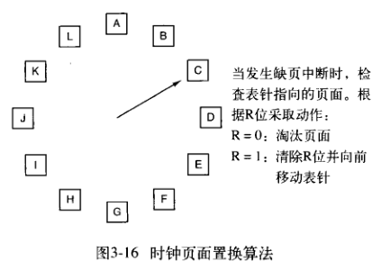
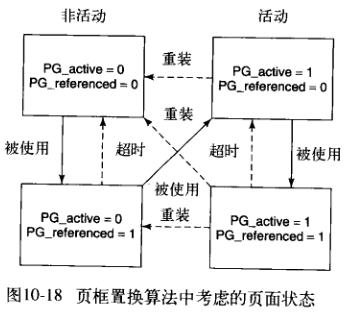

# 页面置换算法

操作系统将内存通过页的方式进行管理，在需要时将数据调入内存，发生缺页中断时需要找一个页进行写入。

如果找到的页在内存中被修改过，变成脏页，换出时还需要刷新到磁盘。

页面置换算法，就是选出一个最合适的页，使得置换效率最高。

## 1. 最优页面置换算法

**核心思想**：置换当前内存中，最远需要使用到的页。

> 但是进程活动无法预知，从而无法确定最远需要使用的页。

## 2. 最近未使用页面置换

对页进行状态标记，并根据优先级进行置换

| 优先级 | 标记状态    |
| ------ | ----------- |
| 1      | ``!R & !M`` |
| 2      | ``!R & M``  |
| 3      | ``R & !M``  |
| 4      | ``R & M``   |

## 3. FIFO页面置换

存储页列表，每次置换队列尾部页面。

### 二次机会算法

给页面添加``R``标记，每次从头节点进行页面筛查

- 如果标记置位，清除并移动到队列末尾。
- 如果``R = 0``，直接替换

## 4. 时钟页面置换

环形 **二次机会页面置换算法** 。

## 5. LRU页面置换

使用``LRU``进行状态管理，但是管理成本较大，一般``NFU``

### ``NFU``最不常用页面置换

仅计数，无关时间，单独统计使用次数。

> 无时间维度相关判断，新老页面一视同仁。

### 老化算法

``NFU``基础上，每次时钟，将计数右移一位，并将``R``标记加到最高位。

## 6. Linux页面置换管理

### 页面状态分类

| 状态     | 描述                                   |
| -------- | -------------------------------------- |
| 不可回收 | 保留、锁定在内存中的页面，以及内核态栈 |
| 可交换   | 回收前必须写入到指定区域               |
| 可同步   | 脏页同步磁盘                           |
| 可丢弃   | 可以直接被回收                         |

## 状态标记和管理

守护进程``kswapd``维护两组标记: 活动标记和引用标记。

通过对标记的监察，进行状态的升级或者降级。

当到达 **可丢弃** 的状态，直接回收到空闲页列表，供缺页异常分配使用。

