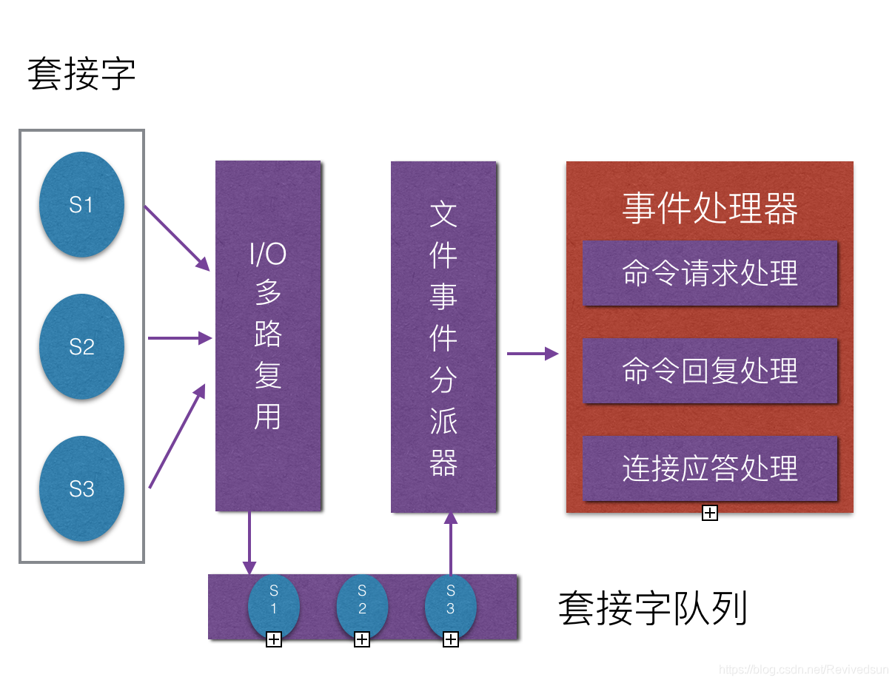
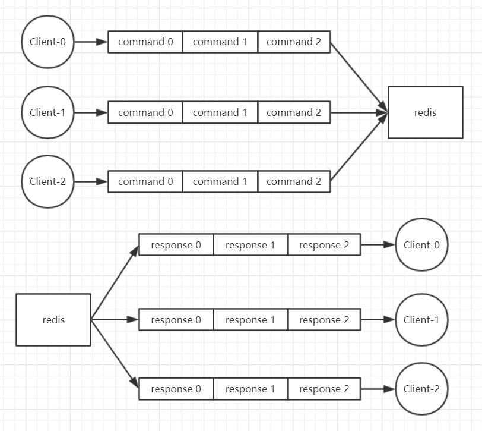

# Redis大Key的含义

因为``redis``中数据本身就是键值对形式，所谓的大Key针对的并不是Key，而是对应存储的Value。

Value较大分为三种情况

- 直接的K-V情况，Value存储的数据较大
- Value是集合类型:hash, set, zset, list，且数据量太大(上万)
- key较多(上亿)

# Redis大Key的影响

## Redis命令处理

redis使用IO多路复用，提升了连接的效率

但是就事件处理而言，它采用的是单线程，这也是面试的高频考点

虽然单线程自身的安全性刨除了并发情况下的锁开销，也能够快速的完成命令的处理。

> ``redis``的瓶颈在于IO而非CPU。

但是，单线程的串行操作，对于阻塞和延时的积累效应是明显的。

## 大Key影响

- 操作超时：数据量大，频繁超时，严重阻塞服务
- 删除阻塞：大Key删除时候，DEL会阻塞服务数十秒，阻塞客户端请求，严重影响Redis集群的可用性

| key类型 | field数量 | 删除耗时 |
| ------- | --------- | -------- |
| Hash    | 100万     | 1000ms   |
| List    | 100万     | 1000ms   |
| Set     | 100万     | 1000ms   |
| ZSet    | 100万     | 1000ms   |

- 带宽占用：大Key的查询获取，每次的响应数据量过大，占据大量带宽，影响其他网络进程和客户端响应
- 空间占用(大量key)
  - 自身空间占用
  - 集群下的slot2key

# 大Key问题解决

## 大Value

- 整存整取
  - 拆分为多个K-V，降低每次请求的消耗和阻塞，通过multiGet进行批量查询
  - 可以分摊到多个Redis实例，降低单个Redis实例的操作压力
- 部分获取
  - 将数据按照不同规则拆分，每次进行关键数据的部分获取，降低无用消耗

## 单Key多数据

- 数据分区，人为的设置key_{mod}，降低单个Key对应的集合数据量

## 大量key

- 关联key(user.name、user.age)：将向关联的数据合并，key+value形式作为集合元素存储
  - user
    - name:name
    - age:22

- 非关联可以
  - 可以采用单key多数据的方式，手动分区+(key:value)，降低key的数量