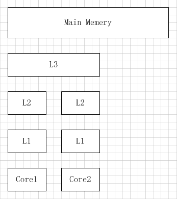

# 缓存布局



``CPU``查询数据的时候总是按照层级进行查询

1. ``L1``
2. ``L2``
3. ``L3``
4. ``Main Memory``

如果缓存未命中，每层的查询耗时大约如下


因此，使用缓存、提升缓存命中率，对于服务的性能提升有着举足轻重的作用。

# 更快速


缓存中的数据并非像我们想象中的那样独立，它是以**缓存行**进行的数据存储，一般为64字节。

也就是说，一个缓存行内会存在多个缓存数据；当它进行数据同步的时候，总是以缓存行为单位进行操作。

有点类似于磁盘IO顺序读中的预读，会同时进行相同缓存行的缓存数据的同步，提升效率。

# 伪共享

缓存行的**预读**行为虽然能够提升效率，但是在某些场景下，确实致命伤。

我们针对数据修改经常会进行加锁以保证数据的安全性，尤其以``volatile``为例。

> ``volatile``使数据具备线程间的可见性，它是基于读写屏障进行的安全性保障。
>
> ``happens-before``原则使得读写之间需要进行主存的同步操作，而本质修改数据的时候，底层存在``lock``操作。
>
> 

如果在同一缓存行中有多个的共享数据，或者说加锁同步

```java
class VolatileLong {
  volatile long v;
}
class FalseSharding {
  VolatileLong[] longs;
}
```

对于``longs``，其中每个元素中都会存在``volatile``字段，并发修改的时候会进行指定缓存的同步操作。

也就是对于一个缓存行而言进行的同步操作。

如果并发的对单个元素进行修改，对于相同缓存行的缓存而言，它并不是一个并发操作，而是在同步缓存行的时候相互阻塞。

这就是所谓的伪共享，这在代码中很难排查，但是在高并发情况下时常出现(大量并发同步数据处于统一缓存行)。

# 解决方案

问题的排查很难，但是解决方案直白明了：让不同线程操作的对象处于不同的缓存行。

从代码上来说

1. 不同线程操作对象处于不同缓存行：这个办法需要精细把控
2. 强制变量对齐：让每一个变量尽量对齐，独占缓存行(会存在空间浪费)


