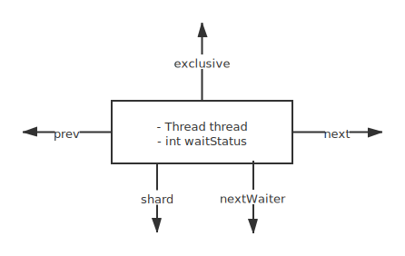

# Node

## 队列
| node           | description             |
| -------------- | ----------------------- |
| ``prev``       | 前向指针                |
| ``next``       | 后向指针                |
| ``exclusive``  | 排他队列                |
| ``shard``      | 共享队列                |
| ``nextWaiter`` | 其他状态(``condition``) |

## 状态

| status        | value  | 标志                |
| ------------- | ------ | ------------------- |
| ``CANCELLED`` | ``1``  | 已经取消            |
| ``SIGNAL``    | ``-1`` | 需要解锁            |
| ``CONDITION`` | ``-2`` | 等待``condition``   |
| ``PROPAGATE`` | ``-3`` | 传播``uncondition`` |

